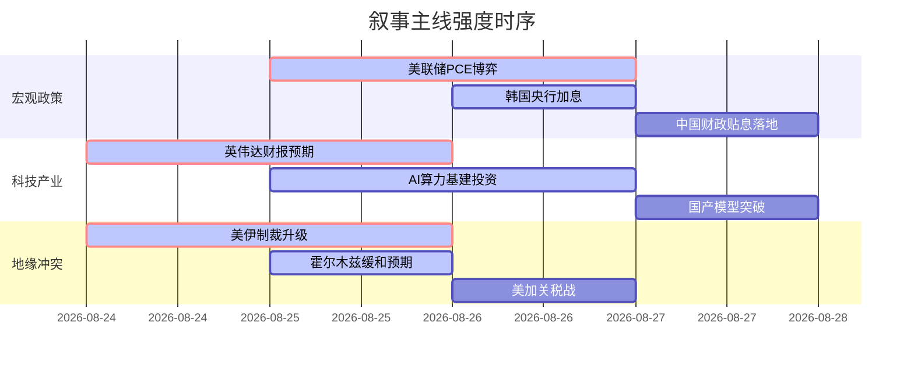

## A股市场情绪分析报告

**数据时段**：最近5日（2026年8月24日-8月27日）  
**生成时间**：2026年8月27日

---

### 🔥 宏观叙事焦点（24小时三级过滤）

#### 📌 叙事主线一：美联储PCE黏性凸显与9月加息博弈 ⭐⭐⭐
**主要事件**：美国核心PCE物价指数高于预期，杰克逊霍尔年会前夕全球央行聚焦政策走向  
**筛选标签**：`国务院政策` `沪深300影响` `路透信源·权重2.0`  
**宏观逻辑**：  
> ① **归类**：货币政策转向  
> ② **历史镜像**：2022年Q3美联储激进加息周期模板  
> ③ **市场传导**：美元指数突破99关口 → 美债收益率上行 → 全球风险资产承压  
> ④ **叙事强度**：通胀黏性超预期，9月加息概率升至39.6%，美联储政策自主性面临财政干预考验  

**行业映射**：银行股、高股息红利资产（情绪评分 **7.5/10**）  
**交易警示**：‼️ 关注沃什杰克逊霍尔首秀措辞，警惕美债流动性冲击外溢A股  

---

#### 📌 叙事主线二：英伟达财报超预期但AI交易信心测试 ⭐⭐⭐  
**主要事件**：英伟达Q2营收962亿美元同比增106%，数据中心营收增117%，但股价盘后反应冷淡  
**筛选标签**：`科技产业` `AI算力基建` `彭博信源·权重1.8`  
**宏观逻辑**：  
> ① **归类**：产业周期拐点验证  
> ② **历史镜像**：2000年互联网泡沫vs 2023年AI浪潮对比  
> ③ **市场传导**：英伟达毛利率75%+供应链支撑2028财年70%增长指引 → 但投资者质疑AI资本开支可持续性 → VIX低位隐含自满风险  
> ④ **叙事强度**：业绩验证"AI算力基建"长期逻辑，但短期交易拥挤度已达临界点  

**行业映射**：A股半导体、CPO概念、国产AI模型链（情绪评分 **8.0/10**）  
**交易警示**：⚠️ 关注长江存储IPO募资330亿元落地节奏，警惕英伟达表外2000亿美元风险敞口暴露  

---

#### 📌 叙事主线三：伊朗-霍尔木兹海峡地缘博弈与能源链重构 ⭐⭐  
**主要事件**：美伊制裁升级与停火预期反复拉锯，霍尔木兹海峡临时联合走廊磋商推进  
**筛选标签**：`地缘风险` `能源安全` `财新信源·权重1.6`  
**宏观逻辑**：  
> ① **归类**：供应链冲击与风险定价  
> ② **历史镜像**：2019年霍尔木兹海峡危机 vs 2022年俄乌能源冲击  
> ③ **市场传导**：美伊停火预期升温 → WTI原油暴跌5%至80美元下方 → 黄金突破4700美元后高位震荡 → 有色板块分化（铜创新高vs锂回调）  
> ④ **叙事强度**：地缘溢价快速回吐但风险未消，能源成本传导至欧洲通胀二次压力  

**行业映射**：原油化工、黄金避险、铜铝有色（情绪评分 **5.8/10**）  
**交易警示**：✓ 关注伊拉克9月巴士拉原油招标装船位置变化，警惕海峡通行风险再定价  

---

### 📅 宏观叙事演化（三日趋势）

**强度衰减模型**：昨日主题×0.7 · 前日主题×0.5

```mermaid
gantt
    title 叙事主线强度时序
    dateFormat YYYY-MM-DD
    section 宏观政策
    美联储PCE博弈   :crit, active, 2026-08-25, 2d
    韩国央行加息    :active, 2026-08-26, 1d
    中国财政贴息落地 :2026-08-27, 1d
    
    section 科技产业
    英伟达财报预期  :crit, active, 2026-08-24, 2d
    AI算力基建投资  :active, 2026-08-25, 2d
    国产模型突破    :2026-08-27, 1d
    
    section 地缘冲突
    美伊制裁升级    :crit, active, 2026-08-24, 2d
    霍尔木兹缓和预期:active, 2026-08-25, 1d
    美加关税战      :2026-08-26, 1d
```

叙事节点关联：
- 08/24：美伊扩大制裁至航空、数字资产、黄金领域 → 触发能源安全叙事
- 08/25：英伟达财报前市场静待，比特币突破8万美元 → 风险偏好分化
- 08/26：英伟达Q2业绩超预期但AI交易信心测试 → A股半导体分化
- 08/27：PCE数据公布推高9月加息预期 + 韩国央行加息 → 全球流动性紧缩叙事强化

🎯 宏观叙事三要素
1️⃣ 政策意图解码
当前顶层叙事从"稳增长"转向"防风险+调结构"双轨并行。产业端：允许短期阵痛换取AI自主可控长期质量；货币端：财政贴息精准滴灌中小微企业，避免大水漫灌。
2️⃣ 市场定价偏差
过度定价：英伟达产业链短期业绩弹性（已充分反映AI算力需求）
定价不足：国产半导体设备替代进度（长江存储IPO催化）+ 银行净息差修复持续性
3️⃣ 跨市场共振
美债收益率高位盘整 + 美元指数维持强势 = A股结构性行情窗口收窄；韩国央行加息打开亚洲紧缩空间，人民币中间价6.7840承压；黄金4700美元底部确立但上行受实际利率抑制

---

---

*生成时间：2026-08-27 11:13:55 (UTC+8)*  
*使用模型：agnes:agnes-2.0-flash*