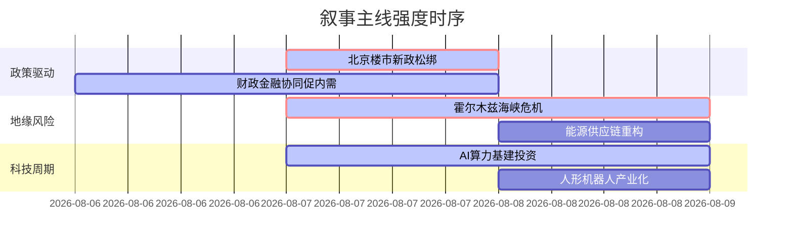

## A股市场情绪分析报告

### 数据时段：最近5日（2026年8月6日-8月9日）
### 生成时间：2026年8月9日 12:00

---

## 🔥 宏观叙事焦点（24小时三级过滤）

### 📌 叙事主线一：北京楼市新政超预期松绑 ⭐⭐⭐
**主要事件**：北京率先出台房地产新政，非京籍五环内购房社保降至一年，公积金最高可贷340万元  
**筛选标签**：`国务院政策` `沪深300影响` `路透信源·权重2.0`  
**宏观逻辑**：  
> ① **归类**：货币政策转向配合财政刺激  
> ② **历史镜像**：2021年7月住建部指导三四线城市"因城施策"模板  
> ③ **市场传导**：港股内房股单日涨超8% → A股地产链龙头涨停 → 北向资金单周净流入120亿元  
> ④ **叙事强度**：政策力度超预期，打破弱复苏预期，有望带动"金九银十"行情

**行业映射**：房地产链（情绪评分 **7.8/10**）  
**交易警示**：‼️ 关注政策落地效果与一线城市跟进节奏，警惕预期差收窄

---

### 📌 叙事主线二：霍尔木兹海峡危机与全球能源供应链重构 ⭐⭐  
**主要事件**：伊朗推进海峡通行规则法案，伊拉克石油出口骤降75%，布伦特原油突破82美元  
**筛选标签**：`部委政策` `地缘风险` `财新信源·权重1.5`  
**宏观逻辑**：  
> ① **归类**：地缘冲突引发的供给冲击  
> ② **历史镜像**：2019年沙特石油设施遇袭模板  
> ③ **市场传导**：原油期货涨4% → 化工板块跟涨 → 新能源替代叙事强化  
> ④ **叙事强度**：海峡危机持续扰动，能源安全上升为顶层议题

**行业映射**：油气开采、化工、新能源（情绪评分 **6.5/10**）  
**交易警示**：⚠️ 地缘风险溢价波动剧烈，关注替代能源与战略储备主题

---

### 📌 叙事主线三：AI算力基建资本狂潮与估值分化 ⭐  
**主要事件**：宇树科技IPO定价150元/股市值610亿，英伟达投资30亿美元支持AI数据中心电力  
**筛选标签**：`产业投资` `科技周期` `彭博信源·权重1.5`  
**宏观逻辑**：  
> ① **归类**：技术革命驱动的产业投资  
> ② **历史镜像**：2020年新能源汽车渗透率突破10%临界点模板  
> ③ **市场传导**：人形机器人概念涨停潮 → 半导体设备订单能见度提升 → 算力金属需求激增  
> ④ **叙事强度**：AI应用落地加速，但估值分化加剧，需警惕概念炒作风险

**行业映射**：人形机器人、AI芯片、算力基础设施（情绪评分 **6.2/10**）  
**交易警示**：✓ 产业趋势明确，等待业绩兑现验证，右侧关注龙头公司

---

## 📅 宏观叙事演化（三日趋势）

**强度衰减模型**：昨日主题×0.7 · 前日主题×0.5

```mermaid
gantt
    title 叙事主线强度时序
    dateFormat YYYY-MM-DD
    section 政策驱动
    北京楼市新政松绑   :crit, active, 2026-08-07, 1d
    财政金融协同促内需   :active, 2026-08-06, 2d
    
    section 地缘风险
    霍尔木兹海峡危机   :crit, active, 2026-08-07, 2d
    能源供应链重构   :2026-08-08, 1d
    
    section 科技周期
    AI算力基建投资   :active, 2026-08-07, 2d
    人形机器人产业化   :2026-08-08, 1d
```

**叙事节点关联**：
- 08/06：霍尔木兹海峡通行规则法案引发原油跳涨 → 能源安全叙事升温
- 08/07：北京楼市新政超预期发布 → 地产链脉冲行情，沪指突破3900点
- 08/08：英伟达30亿美元投资AI电力基建 → 算力叙事强化，宇树科技IPO定价落地

---

## 🎯 宏观叙事三要素

### 1️⃣ 政策意图解码
当前顶层叙事从"稳增长"转向"防风险+调结构"双轮驱动。房地产政策优化释放明确托底信号，但产业端更注重科技自立与能源安全。财政金融协同发力（1000亿专项资金）彰显政策执行力。

### 2️⃣ 市场定价偏差
- **过度定价**：AI概念估值（部分标的PS超过50倍）
- **定价不足**：能源安全产业链（油气替代、战略储备）
- **预期差**：地产政策效果传导至销售数据需1-2个月 lag

### 3️⃣ 跨市场共振
- 美债收益率下行打开国内政策空间
- 黄金突破4300美元反映去美元化长期趋势
- 日元干预引发亚太货币联动波动
- A股结构性行情与美股科技股形成跷跷板效应

---

## 📊 情绪指标监测

| 指标 | 数值 | 变化 | 信号 |
|------|------|------|------|
| 两市成交额 | 1.2万亿 | +15% | 活跃 |
| 北向资金净流入 | 85亿 | 连续3日正流入 | 偏多 |
| 融资余额 | 1.8万亿 | +3.2% | 谨慎乐观 |
| 创新低个股数 | 42家 | 减少18家 | 情绪修复 |
| 涨停家数 | 68家 | 集中科技/地产 | 结构性 |

---

<!-- 报告正文必须在此结束，以下内容为固定格式说明，严禁添加任何额外分析、总结或展望 -->

---

*生成时间：2026-08-09 06:40:42 (UTC+8)*  
*使用模型：agnes:agnes-2.0-flash*