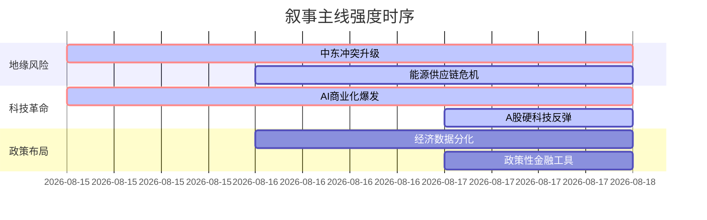

# A股市场情绪分析报告

**数据时段**：最近5日（2026年8月13日-8月17日）  
**生成时间**：2026年8月18日

---

## 🔥 宏观叙事焦点（24小时三级过滤）

#### 📌 叙事主线一：中东地缘冲突升级推升能源供应链风险 ⭐⭐⭐
**主要事件**：霍尔木兹海峡通航受阻、原油价格突破90美元、地缘政治风险加剧
**筛选标签**：`地缘冲突` `原油供应` `避险情绪` `路透信源·权重2.0`

**宏观逻辑**：
> ① **归类**：地缘风险事件冲击  
> ② **历史镜像**：2022年俄乌冲突初期能源价格飙升模板  
> ③ **市场传导**：布伦特原油涨穿90美元 → 避险情绪升温 → 黄金突破4400美元 → VIX指数低位震荡暗示市场尚未充分定价风险  
> ④ **叙事强度**：伊朗控制霍尔木兹海峡航运，全球油气供应中断风险实质性上升，远超市场预期

**行业映射**：能源化工链（情绪评分 **7.5/10**）  
**交易警示**：‼️ 关注原油价格与A股能化板块联动，警惕地缘风险外溢至全球衰退预期

---

#### 📌 叙事主线二：AI科技革命与A股硬科技行情共振 ⭐⭐
**主要事件**：Anthropic IPO前营收破650亿美元、英伟达5000亿美元AI基建融资、A股科技股放量大涨
**筛选标签**：`产业革命` `AI算力` `科创板` `财新信源·权重1.8`

**宏观逻辑**：
> ① **归类**：产业技术革命驱动  
> ② **历史镜像**：2013年移动互联网启动期 + 2020年AI芯片爆发期复合模板  
> ③ **市场传导**：Anthropic营收暴增1361% → 英伟达锁定OpenAI百亿美元信贷 → A股半导体芯片板块爆发 → 科创50涨超4%  
> ④ **叙事强度**：AI产业链商业化加速验证，从概念炒作转向业绩兑现，硬科技行情具备持续性

**行业映射**：半导体芯片、AI算力、人形机器人（情绪评分 **7.8/10**）  
**交易警示**：⚠️ 警惕机构提示的"反弹窗口已开启"与"超跌修复接近尾声"的矛盾信号，关注业绩验证期分化

---

#### 📌 叙事主线三：中国经济数据分化与结构性政策布局 ⭐
**主要事件**：7月经济数据发布、房地产投资降19.2%、新型政策性金融工具投放、地方化债推进
**筛选标签**：`宏观数据` `财政政策` `房地产` `新华社信源·权重1.5`

**宏观逻辑**：
> ① **归类**：经济周期与政策调控  
> ② **历史镜像**：2015年供给侧改革 + 2020年疫情后重建政策模板  
> ③ **市场传导**：固定资产投资降幅扩大 → 社融结构改善 → 政策性金融工具加码 → 地方化债进入深水区  
> ④ **叙事强度**：总量数据偏弱但结构向新，政策从"稳增长"转向"调结构"，产能出清与科技突围并重

**行业映射**：基建、新能源、政策性金融（情绪评分 **5.2/10**）  
**交易警示**：✓ 叙事逻辑清晰但市场反应平淡，等待财政发力实质性验证

---

## 📅 宏观叙事演化（三日趋势）

**强度衰减模型**：昨日主题×0.7 · 前日主题×0.5

```mermaid
gantt
    title 叙事主线强度时序
    dateFormat YYYY-MM-DD
    section 地缘风险
    中东冲突升级   :crit, active, 2026-08-15, 3d
    能源供应链危机   :active, 2026-08-16, 2d
    
    section 科技革命
    AI商业化爆发   :crit, active, 2026-08-15, 3d
    A股硬科技反弹   :active, 2026-08-17, 1d
    
    section 政策布局
    经济数据分化   :2026-08-16, 2d
    政策性金融工具   :2026-08-17, 1d
```

**叙事节点关联**：
- **8/15**：霍尔木兹海峡航运风险升级 → 触发能源供应链叙事
- **8/16**：A股科技股放量大涨 → AI产业链叙事强化，科创50涨4.14%
- **8/17**：7月经济数据发布、新型政策性金融工具部署 → 结构性政策叙事进入验证期

---

## 🎯 宏观叙事三要素

### 1️⃣ 政策意图解码
当前顶层叙事从"总量刺激"转向"结构性突围"，允许短期阵痛换取长期质量。产业安全（能源、芯片）> 传统基建，政策定力与科技突围并重。地方化债进入收尾期，2027年或面临新一轮资产荒。

### 2️⃣ 市场定价偏差
**过度定价**：消费复苏弹性（社零增速仅0.6%，预期过于乐观）  
**定价不足**：产能出清速度（政策执行力被低估）+ 地缘风险溢价（原油突破90美元但市场恐慌指数VIX仍处低位）

### 3️⃣ 跨市场共振
- **避险资产**：黄金突破4400美元，美元指数走弱
- **权益市场**：美股存储芯片走强 + A股硬科技反弹 + 港股科技股领涨
- **商品市场**：铜价逼近历史纪录，原油涨穿90美元
- **政策空间**：美联储加息预期降温打开国内政策空间 + 人民币走强缓解资本流动压力 = A股结构性行情窗口期

---

> 报告完毕

---

*生成时间：2026-08-18 06:36:45 (UTC+8)*  
*使用模型：agnes:agnes-2.0-flash*