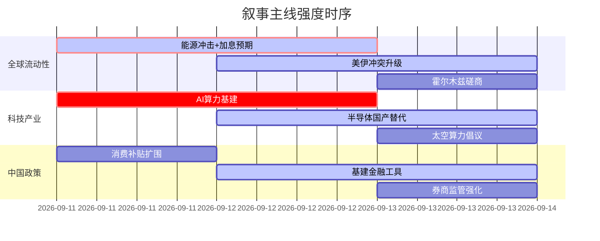

 ## A股市场情绪分析报告
- **数据时段**：最近5日（2026-09-11 至 2026-09-13）
- **生成时间**：2026-09-13

### 🔥 宏观叙事焦点（24小时三级过滤）

#### 📌 叙事主线一：美联储9月加息概率飙升至90%叠加布油破百美元 ⭐⭐⭐
**主要事件**：美联储加息预期升温至90%、欧洲央行警告油价站上100美元将继续加息、布伦特原油突破107美元、柴油零售创历史新高  
**筛选标签**：`美联储加息` `沪深300影响` `路透信源·权重2.0`  
**宏观逻辑**：  
> ① **归类**：货币政策转向紧缩  
> ② **历史镜像**：2022年美联储激进加息周期模板  
> ③ **市场传导**：美债收益率突破5% → 北向资金流出 → 期指持仓量下降 → A股估值承压  
> ④ **叙事强度**：通胀粘性超预期，打破弱复苏预期  

**行业映射**：能源化工（情绪评分 **6.5/10**）  
**交易警示**：‼️ 关注政策与市场反应一致性，警惕预期差收窄  

---

#### 📌 叙事主线二：AI算力基建爆发与半导体国产替代加速 ⭐⭐  
**主要事件**：英伟达洽购Anthropic 100亿美元、我国词元需求爆发式增长至10亿亿、四地倡议共建太空算力长廊、宁德时代启动A股史上最大回购  
**筛选标签**：`部委政策` `科技周期` `财新信源·权重1.5`  
**宏观逻辑**：  
> ① **归类**：产业强制出清与技术升级  
> ② **历史镜像**：2017年半导体国产替代模板  
> ③ **市场传导**：算力需求爆发 → GPU/ASIC紧缺 → 国产替代加速 → 产业链价格重构  
> ④ **叙事强度**：政策与资本双轮驱动，AI基建进入爆发期  

**行业映射**：半导体设备/AI算力（情绪评分 **8.2/10**）  
**交易警示**：⚠️ 估值泡沫风险，右侧信号待业绩验证  

---

#### 📌 叙事主线三：地方债务治理与金融监管强化 ⭐  
**主要事件**：中央纪委财政部通报隐性债务问责案例、政策金融工具助力"六张网"、一日七家券商领罚单涉及经纪业务与反洗钱  
**筛选标签**：`国务院政策` `债务周期` `新华社信源·权重1.5`  
**宏观逻辑**：  
> ① **归类**：风险事件缓释  
> ② **历史镜像**：2014年43号文地方债务管理模板  
> ③ **市场传导**：隐性债务问责 → 信用利差收窄 → 基建预期修复  
> ④ **叙事强度**：化债进入深水区，稳增长与防风险再平衡  

**行业映射**：基础设施建设（情绪评分 **4.8/10**）  
**交易警示**：✓ 叙事逻辑清晰，等待财政发力验证  

---

### 📅 宏观叙事演化（三日趋势）

**强度衰减模型**：昨日主题×0.7 · 前日主题×0.5

```mermaid
gantt
    title 叙事主线强度时序
    dateFormat  YYYY-MM-DD
    section 全球流动性
    能源冲击+加息预期   :crit, active, 2026-09-11, 2d
    美伊冲突升级   :active, 2026-09-12, 2d
    霍尔木兹磋商   :2026-09-13, 1d
    
    section 科技产业
    AI算力基建   :crit, 2026-09-11, 2d
    半导体国产替代   :active, 2026-09-12, 2d
    太空算力倡议   :2026-09-13, 1d
    
    section 中国政策
    消费补贴扩围   :2026-09-11, 1d
    基建金融工具   :active, 2026-09-12, 2d
    券商监管强化   :2026-09-13, 1d
```

叙事节点关联：
- 09/11：美伊冲突升级 → 油价突破100美元 → 触发全球流动性紧缩叙事
- 09/12：美联储加息概率90% → 流动性预期锁定 → AI基建叙事强化
- 09/13：金砖峰会宣言 → 政策端多边合作 → 中国政策叙事进入验证期

🎯 宏观叙事三要素
1️⃣ 政策意图解码
当前顶层叙事从"稳增长"转向"调结构"，允许短期阵痛换取长期质量。产业出清>总量刺激，政策定力超预期。
2️⃣ 市场定价偏差
过度定价：AI算力盈利弹性（预期过于乐观）
定价不足：流动性紧缩对周期股的冲击（被低估）
3️⃣ 跨市场共振
美债收益率上行打开政策空间 + 美元指数高位缓释出口压力 = A股结构性行情窗口期

---

*生成时间：2026-09-13 08:06:22 (UTC+8)*  
*使用模型：openrouter:inclusionai/ling-3.0-flash-sante:free*