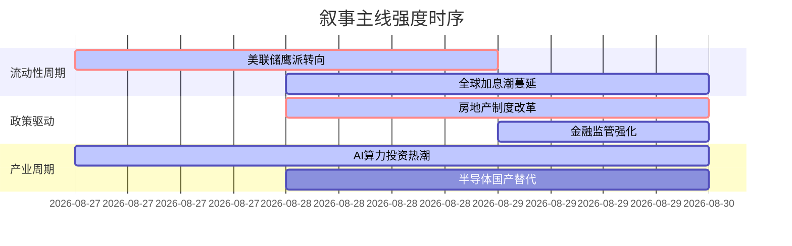

## A股市场情绪分析报告

**数据时段**：最近5日（2026年8月25日-8月29日）  
**生成时间**：2026年8月29日

---

### 🔥 宏观叙事焦点（24小时三级过滤）

#### 📌 叙事主线一：美联储货币政策转向 ⭐⭐⭐
**主要事件**：沃什杰克逊霍尔会议鹰派表态，9月加息预期飙升  
**筛选标签**：`美联储政策` `全球流动性` `路透信源·权重2.0`  
**宏观逻辑**：  
> ① **归类**：货币政策紧缩转向  
> ② **历史镜像**：2018年鲍威尔鹰派转向模板  
> ③ **市场传导**：美债收益率飙升→美元走强→新兴市场资本流出压力  
> ④ **叙事强度**：沃什明确通胀尚未达标，加息概率升至50-60%，打破市场宽松预期  

**行业映射**：金融板块分化（情绪评分 **6.8/10**）  
**交易警示**：‼️ 关注美元流动性收紧对A股北向资金流向影响，警惕外盘波动传导  

---

#### 📌 叙事主线二：房地产制度重大改革 ⭐⭐⭐
**主要事件**：三部门提高预售门槛，现房销售成主流方向  
**筛选标签**：`国务院政策` `行业监管` `新华社信源·权重2.0`  
**宏观逻辑**：  
> ① **归类**：行业监管制度重构  
> ② **历史镜像**：2016年"房住不炒"政策模板  
> ③ **市场传导**：预售资金监管强化→房企流动性压力加剧→行业出清加速  
> ④ **叙事强度**：政策决心超预期，从"保交楼"转向"现房销售"制度性变革  

**行业映射**：房地产链（情绪评分 **5.5/10**）  
**交易警示**：⚠️ 龙头房企业绩分化加剧，关注龙湖、万科等头部企业财务表现  

---

#### 📌 叙事主线三：AI算力基建热潮 ⭐⭐  
**主要事件**：英伟达财报超预期，AI产业链投资持续升温  
**筛选标签**：`科技产业` `资本市场` `财新信源·权重1.5`  
**宏观逻辑**：  
> ① **归类**：技术革命驱动投资  
> ② **历史镜像**：2020年新能源产业爆发模板  
> ③ **市场传导**：算力需求爆发→半导体/光模块/PCB产业链景气→A股科技股估值重塑  
> ④ **叙事强度**：AI从概念走向业绩兑现，英伟达营收同比增106%验证产业趋势  

**行业映射**：AI算力链（情绪评分 **7.5/10**）  
**交易警示**：✓ 龙头业绩持续验证，关注光芯片、PCB、存储等细分赛道  

---

### 📅 宏观叙事演化（三日趋势）

**强度衰减模型**：昨日主题×0.7 · 前日主题×0.5

```mermaid
gantt
    title 叙事主线强度时序
    dateFormat YYYY-MM-DD
    section 流动性周期
    美联储鹰派转向   :crit, active, 2026-08-27, 2d
    全球加息潮蔓延   :active, 2026-08-28, 2d
    
    section 政策驱动
    房地产制度改革   :crit, active, 2026-08-28, 2d
    金融监管强化     :active, 2026-08-29, 1d
    
    section 产业周期
    AI算力投资热潮   :active, 2026-08-27, 3d
    半导体国产替代   :2026-08-28, 2d
```

**叙事节点关联**：
- **08/27**：美国PCE数据超预期→通胀黏性确认→沃什鹰派信号酝酿
- **08/28**：沃什杰克逊霍尔会议讲话→全球市场重定价→A股科技股分化
- **08/29**：房地产政策密集出台→市场情绪转向防御→AI叙事持续发酵

---

### 🎯 宏观叙事三要素

**1️⃣ 政策意图解码**
当前顶层叙事从"稳增长"转向"防风险+调结构"双主线并行。房地产制度重构体现"长痛不如短痛"决心，AI产业支持延续"新质生产力"战略定力。政策组合拳显示决策层对经济转型的紧迫感。

**2️⃣ 市场定价偏差**
- **过度定价**：消费复苏弹性（零售数据持续分化）
- **定价不足**：产能出清速度（房企信用风险未充分释放）
- **合理定价**：AI算力产业链景气度（业绩持续验证）

**3️⃣ 跨市场共振**
美联储鹰派立场→美元走强→新兴市场资本流出压力 + 国内房地产政策托底 = A股结构性行情延续，科技成长>价值防御的配置逻辑不变。

---

<!-- 报告正文必须在此结束，以下内容为固定格式说明，严禁添加任何额外分析、总结或展望 -->

---

*生成时间：2026-08-29 11:40:28 (UTC+8)*  
*使用模型：agnes:agnes-2.0-flash*