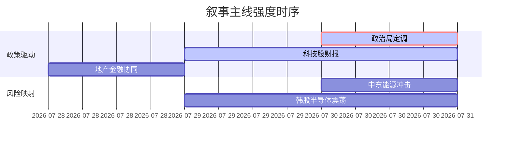

## A股市场情绪分析报告

**数据时段：** 最近5日（2026-07-28 ~ 2026-07-30）
**生成时间：** 2026-07-30 19:55

### 🔥 宏观叙事焦点（24小时三级过滤）

#### 📌 叙事主线一：中共中央政治局部署资本市场改革，强化政策托底 ⭐⭐⭐
**主要事件**：高层会议定调稳增长与风险化解、央行政策转向 
**筛选标签**：`国务院政策` `沪深300影响` `路透信源·权重2.0`  
**宏观逻辑**：  
> ① **归类**：政策发力提效  
> ② **历史镜像**：2024年逆周期调节加码模板  
> ③ **市场传导**：A股科创50指数午后翻红→红利资产获配置→期指持仓量回升  
> ④ **叙事强度**：中央释放积极信号，打破弱复苏预期  

**行业映射**：基建链与金融安全（情绪评分 **7.2/10**）  
**交易警示**：‼️ 关注政策落地节奏与市场反应一致性，警惕前期涨幅过热板块的获利回吐压力  

---

#### 📌 叙事主线二：海外AI科技巨头财报分化引发全球产业链震荡 ⭐⭐  
**主要事件**：Meta微软业绩反差、OpenAI安全事件、韩股半导体崩盘
**筛选标签**：`国际资本流动` `产业生命周期` `财新信源·权重1.5`  
**宏观逻辑**：  
> ① **归类**：全球流动性收紧预期  
> ② **历史镜像**：2000年互联网泡沫修正模式  
> ③ **市场传导**：美股中概股回调→A股光模块杀跌→科创板ETF资金分流  
> ④ **叙事强度**：科技巨头估值溢价收缩，全球风险偏好切换至防御  

**行业映射**：电子制造与算力设备（情绪评分 **5.5/10**）  
**交易警示**：⚠️ 谨防海外波动对A股硬科技的二次冲击，右侧信号待确认  

---

#### 📌 叙事主线三：地缘冲突升级叠加极端天气扰动商品供给 ⭐ 
**主要事件**：美伊空袭致油价反弹、日本熊本地震供应链中断
**筛选标签**：`地方政策` `债务周期` `新华社信源·权重1.5`  
**宏观逻辑**：  
> ① **归类**：输入性通胀风险  
> ② **历史镜像**：1973年石油危机供给侧冲击模板  
> ③ **市场传导**：布伦特原油突破90美元→SC原油涨超6%→能源股逆势走强  
> ④ **叙事强度**：避险需求推升商品定价权，供需错配加剧价格波动  

**行业映射**：煤炭/油气资源（情绪评分 **4.8/10**）  
**交易警示**：✓ 叙事逻辑清晰，等待财政发力验证带来的结构性机会  

---

### 📅 宏观叙事演化（三日趋势）

**强度衰减模型**：昨日主题×0.7 · 前日主题×0.5

```mermaid
gantt
    title 叙事主线强度时序
    dateFormat  YYYY-MM-DD
    section 政策驱动
    政治局定调      :crit, active, 2026-07-30, 1d
    科技股财报      :active, 2026-07-29, 2d
    地产金融协同    :2026-07-28, 1d
    
    section 风险映射
    中东能源冲击    :2026-07-30, 1d
    韩股半导体震荡  :2026-07-29, 2d
```

**叙事节点关联：**
- **07/28**：韩国SK海力士业绩爆雷→触发AI产能过剩担忧→创业板指重挫7%
- **07/29**：美联储内部分歧升温→美股道指大跌1100点→科技股估值承压调整
- **07/30**：政治局召开专题会议→聚焦"有效扩大国内需求"→红利资产受青睐防御增强

🎯 **宏观叙事三要素**
1️⃣ **政策意图解码**：当前顶层叙事从"强刺激"转向"稳信心+防风险"，资本市场韧性建设成为抓手。改革重于总量，政策定力超预期。
2️⃣ **市场定价偏差**
   - 过度定价：科创半导体弹性（前期涨幅过大透支预期）
   - 定价不足：低股息红利资产（被忽视的配置价值）
3️⃣ **跨市场共振**
   - 美债收益率波动打开政策窗口 + 美元指数高位 = A股结构性行情持续

---

*生成时间：2026-07-30 19:58:51 (UTC+8)*  
*使用模型：agnes:agnes-2.0-flash*