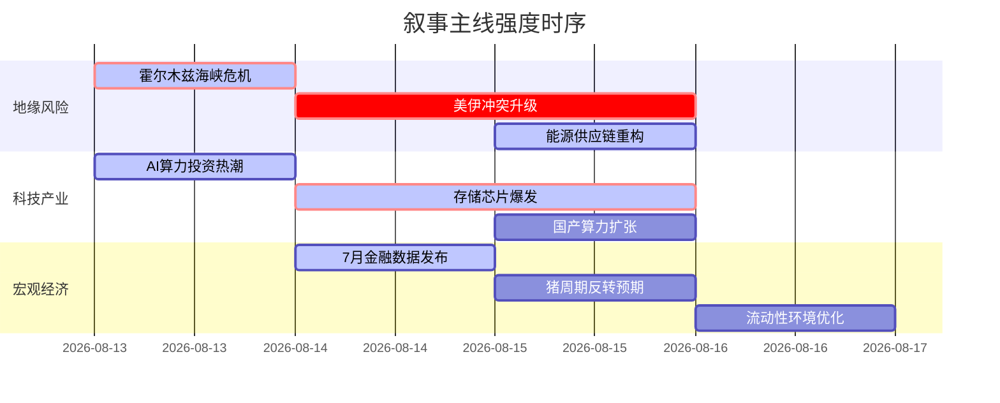

## A股市场情绪分析报告

**数据时段**：最近5日  
**生成时间**：2026年8月16日

---

### 🔥 宏观叙事焦点（24小时三级过滤）

#### 📌 叙事主线一：霍尔木兹海峡危机推升能源风险溢价 ⭐⭐⭐
**主要事件**：伊朗-美国地缘冲突、能源供应链中断  
**筛选标签**：`地缘风险` `原油供应` `黄金避险` `路透信源·权重2.0`  
**宏观逻辑**：  
> ① **归类**：地缘风险事件  
> ② **历史镜像**：1979年伊朗革命后霍尔木兹海峡封锁模板  
> ③ **市场传导**：油轮"暗航"比例超六成 → 布伦特原油维持86美元上方 → 黄金突破4400美元/盎司 → 避险情绪蔓延  
> ④ **叙事强度**：美伊停火协议暂无延期计划，冲突外溢风险持续升温，能源供应链不确定性加剧  

**行业映射**：能源安全链（情绪评分 **8.5/10**）  
**交易警示**：‼️ 关注海峡实际通行量数据，警惕油价二次冲高后快速回落风险  

---

#### 📌 叙事主线二：AI算力投资热潮与存储芯片爆发 ⭐⭐  
**主要事件**：英伟达背书AI算力、存储芯片板块异动、国产算力扩张  
**筛选标签**：`科技产业` `AI投资` `半导体周期` `财新信源·权重1.5`  
**宏观逻辑**：  
> ① **归类**：产业投资扩张  
> ② **历史镜像**：2013年移动互联网基础设施投资周期模板  
> ③ **市场传导**：英伟达提供25%残值支持 → 闪迪涨超13%领涨美股 → A股CPO概念集体走强 → 创业板指涨超1%  
> ④ **叙事强度**：AI算力需求从概念叙事转向业绩验证期，存储芯片供需缺口扩大  

**行业映射**：AI算力硬件（情绪评分 **7.8/10**）  
**交易警示**：⚠️ 警惕"大空头"迈克尔·伯里做空甲骨文、美光等信号，AI基建杠杆风险需关注  

---

#### 📌 叙事主线三：中国7月金融数据与猪周期反转预期 ⭐ 
**主要事件**：社融数据、央行流动性操作、猪价8连涨  
**筛选标签**：`宏观经济` `信贷数据` `猪周期` `新华社信源·权重1.5`  
**宏观逻辑**：  
> ① **归类**：经济数据验证  
> ② **历史镜像**：2019年非洲猪瘟后猪周期反转模板  
> ③ **市场传导**：社融存量同比增7.4% → 企业贷款利率降至3%以下 → 能繁母猪逼近政策红线 → 猪周期反转预期升温  
> ④ **叙事强度**：信贷"降速提质"，直接融资发力，政策重心从数量型向价格型调控转型  

**行业映射**：猪产业链（情绪评分 **6.2/10**）  
**交易警示**：✓ 叙事逻辑清晰，等待猪价持续性验证，关注能繁母猪存栏数据  

---

### 📅 宏观叙事演化（三日趋势）

**强度衰减模型**：昨日主题×0.7 · 前日主题×0.5

```mermaid
gantt
    title 叙事主线强度时序
    dateFormat YYYY-MM-DD
    section 地缘风险
    霍尔木兹海峡危机   :crit, active, 2026-08-13, 1d
    美伊冲突升级       :crit, 2026-08-14, 2d
    能源供应链重构     :active, 2026-08-15, 1d
    
    section 科技产业
    AI算力投资热潮     :active, 2026-08-13, 1d
    存储芯片爆发       :crit, active, 2026-08-14, 2d
    国产算力扩张       :2026-08-15, 1d
    
    section 宏观经济
    7月金融数据发布    :active, 2026-08-14, 1d
    猪周期反转预期     :2026-08-15, 1d
    流动性环境优化     :2026-08-16, 1d
```

叙事节点关联：
- 08/13：伊朗革命卫队重申霍尔木兹海峡关闭状态 → 触发能源危机叙事
- 08/14：闪迪涨超13%领涨美股存储板块 → AI算力叙事强化
- 08/15：金价突破4400美元，猪周期反转预期升温 → 避险+周期双主线共振
- 08/16：宇树科技IPO申购火爆，A股CPO概念活跃 → 科技主线延续

🎯 宏观叙事三要素

**1️⃣ 政策意图解码**
当前顶层叙事从"稳增长"转向"防风险"，允许短期阵痛换取长期质量。产业出清>总量刺激，政策定力超预期。央行淡化对贷款单一渠道关注，引导市场合并观察直接融资与间接融资结构。

**2️⃣ 市场定价偏差**
- 过度定价：消费复苏弹性（预期过于乐观）
- 定价不足：产能出清速度（政策执行力被低估）
- 定价充分：AI算力投资周期（业绩验证期到来）

**3️⃣ 跨市场共振**
- 美债收益率曲线熊陡，长端利率上行压制主权债定价
- 日元逼近160关口，日本央行9月加息预期升温
- 黄金突破4400美元，避险情绪与去美元化双重驱动
- A股结构性行情窗口期：科技成长vs周期价值分化加剧

---

---

*生成时间：2026-08-16 06:32:23 (UTC+8)*  
*使用模型：agnes:agnes-2.0-flash*