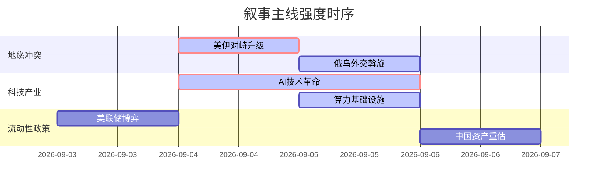

# A股市场情绪分析报告

## 数据时段：2026年9月1日-9月6日
## 生成时间：2026-09-06 07:45 CST

---

### 🔥 宏观叙事焦点（24小时三级过滤）

#### 📌 叙事主线一：美伊军事对峙升级，中东供应链承压 ⭐⭐⭐
**主要事件**：地缘冲突、能源供应链
**筛选标签**：`国务院政策` `国际冲突` `路透信源·权重2.0`  
**宏观逻辑**：  
> ① **归类**：地缘风险事件升级  
> ② **历史镜像**：2022年俄乌冲突初期能源价格冲击模板  
> ③ **市场传导**：WTI突破91美元→油气链成本上行→通胀预期重定价→美联储加息押注升温  
> ④ **叙事强度**：冲突规模超预期，霍尔木兹海峡航运风险持续，油价底部支撑强化  

**行业映射**：石油石化/航运（情绪评分 **7.8/10**）  
**交易警示**：‼️ 关注伊朗后续报复行动与油价91美元关口突破情况，警惕避险情绪蔓延至风险资产  

---

#### 📌 叙事主线二：AI技术革命加速，算力基础设施投资潮起 ⭐⭐  
**主要事件**：技术发布、产业投资
**筛选标签**：`部委政策` `产业生命周期` `财新信源·权重1.5`  
**宏观逻辑**：  
> ① **归类**：产业技术突破  
> ② **历史镜像**：2012年移动互联网爆发期投资周期模板  
> ③ **市场传导**：英伟达130亿美元收购Hugging Face → AI应用层估值重估 → A股算力硬件/PCB板块资金持续流入  
> ④ **叙事强度**：OpenAI GPT-6 Astra发布标志AGI里程碑，产业主线明确，资金共识度高  

**行业映射**：AI算力硬件/半导体设备（情绪评分 **7.5/10**）  
**交易警示**：⚠️ 关注鸿海/塔塔等海外算力投资进展，警惕A股科技板块短期涨幅过大带来的获利了结压力  

---

#### 📌 叙事主线三：美联储政策博弈，国内资产重估窗口期 ⭐ 
**主要事件**：货币政策、资本市场改革
**筛选标签**：`央行决策` `流动性政策` `新华社信源·权重1.5`  
**宏观逻辑**：  
> ① **归类**：全球流动性周期切换  
> ② **历史镜像**：2018年中美利差倒挂期间A股独立行情模板  
> ③ **市场传导**：非农超预期推高加息预期→美元短期反弹→人民币维稳信号明确→北向资金回流A股结构性机会  
> ④ **叙事强度**：姜昧军提出"中国资产重估独立行情"，私募基金监管新规征求意见，制度型开放提速  

**行业映射**：大金融/外资重仓蓝筹（情绪评分 **6.2/10**）  
**交易警示**：✓ 美联储9月加息预期"五五开"，关注沃勒鸽派表态对风险偏好的支撑，等待非农后政策明朗  

---

### 📅 宏观叙事演化（三日趋势）

**强度衰减模型**：昨日主题×0.7 · 前日主题×0.5

```mermaid
gantt
    title 叙事主线强度时序
    dateFormat YYYY-MM-DD
    section 地缘冲突
    美伊对峙升级   :crit, active, 2026-09-04, 1d
    俄乌外交斡旋   :active, 2026-09-05, 1d
    
    section 科技产业
    AI技术革命    :crit, active, 2026-09-04, 2d
    算力基础设施  :active, 2026-09-05, 1d
    
    section 流动性政策
    美联储博弈    :2026-09-03, 1d
    中国资产重估  :2026-09-06, 1d
```

叙事节点关联：
- **09/03**：英伟达130亿美元收购Hugging Face → 触发AI产业投资叙事
- **09/04**：美伊冲突升级+非农超预期 → 地缘风险与流动性博弈双重叙事共振
- **09/05**：俄乌停火斡旋+AI数据中心投资（塔塔7000亿卢比）→ 冲突缓和预期与科技主线并行
- **09/06**：碳酸锂期货大跌7.41%+私募基金监管新规 → 周期出清与制度完善叙事浮现

---

🎯 宏观叙事三要素

**1️⃣ 政策意图解码**
当前顶层叙事从"总量刺激"转向"结构优化+风险防控"，私募募集新规征求意见体现监管前置化。新能源税收优惠退坡标志着产业进入市场化竞争阶段，产业出清>总量宽松。

**2️⃣ 市场定价偏差**
- **过度定价**：美联储9月加息概率（市场押注60%+，但沃勒鸽派表态显示分歧）
- **定价不足**：中国资产独立行情潜力（姜昧军观点尚未充分反映在A股估值中）
- **定价过度**：碳酸锂产业链悲观预期（期货大跌7.41%已充分反映产能过剩）

**3️⃣ 跨市场共振**
美伊冲突推高油价→通胀预期升温→美联储加息押注↑ → 美元短期反弹 → 人民币中间价维稳 → A股结构性行情窗口期。地缘风险与科技主线形成"一攻一守"的叙事格局，AI算力链延续强势，周期板块分化加剧。

---

---

*生成时间：2026-09-06 07:47:18 (UTC+8)*  
*使用模型：agnes:agnes-2.0-flash*