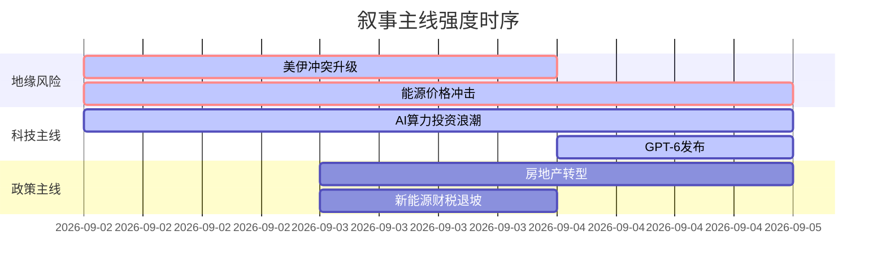

## A股市场情绪分析报告

**数据时段**：2026年9月2日 - 2026年9月4日  
**生成时间**：2026-09-04 22:06

---

### 🔥 宏观叙事焦点（24小时三级过滤）

#### 📌 叙事主线一：美伊冲突升级与能源冲击 ⭐⭐⭐
**主要事件**：地缘冲突、能源价格飙升  
**筛选标签**：`地缘冲突` `能源安全` `路透信源·权重2.0`  
**宏观逻辑**：  
> ① **归类**：地缘风险事件  
> ② **历史镜像**：1973年石油禁运模板  
> ③ **市场传导**：WTI突破90美元→全球债市抛售→美联储加息预期升温→风险资产承压  
> ④ **叙事强度**：霍尔木兹海峡日出口超1700万桶石油受威胁，地缘风险溢价持续扩张  

**行业映射**：能源化工链（情绪评分 **6.8/10**）  
**交易警示**：‼️ 油价波动率飙升，关注能源成本传导与通胀预期二次发酵  

---

#### 📌 叙事主线二：AI算力产业景气度共振 ⭐⭐  
**主要事件**：技术发布、产业投资  
**筛选标签**：`科技产业` `算力基建` `财新信源·权重1.5`  
**宏观逻辑**：  
> ① **归类**：产业技术突破  
> ② **历史镜像**：2010年智能手机产业链爆发模板  
> ③ **市场传导**：OpenAI发布GPT-6 → 英伟达130亿并购Hugging Face → 算力硬件板块涨停潮  
> ④ **叙事强度**：AI产业链从芯片到应用层全面开花，景气度验证加速  

**行业映射**：算力硬件/PCB/CPO（情绪评分 **7.5/10**）  
**交易警示**：⚠️ 板块短期涨幅较大，关注业绩预告与估值匹配度  

---

#### 📌 叙事主线三：中国房地产政策转型 ⭐ 
**主要事件**：行业管理政策发布、监管转型
**筛选标签**：`部委政策` `房地产转型` `新华社信源·权重1.5`  
**宏观逻辑**：  
> ① **归类**：产业政策调整  
> ② **历史镜像**：2015年供给侧改革+棚改货币化模板  
> ③ **市场传导**："好房子"建设推进 → 现房销售制度改革 → 行业从"量"向"质"转型  
> ④ **叙事强度**：政策工具箱持续丰富，市场预期从"托底"转向"结构性改革"  

**行业映射**：房地产/建材（情绪评分 **5.2/10**）  
**交易警示**：✓ 政策底已现，等待销售数据验证，右侧信号待确认  

---

### 📅 宏观叙事演化（三日趋势）

**强度衰减模型**：昨日主题×0.7 · 前日主题×0.5

```mermaid
gantt
    title 叙事主线强度时序
    dateFormat YYYY-MM-DD
    section 地缘风险
    美伊冲突升级     :crit, active, 2026-09-02, 2d
    能源价格冲击     :crit, active, 2026-09-02, 3d
    
    section 科技主线
    AI算力投资浪潮   :active, 2026-09-02, 3d
    GPT-6发布        :active, 2026-09-04, 1d
    
    section 政策主线
    房地产转型       :2026-09-03, 2d
    新能源财税退坡   :2026-09-03, 1d
```

**叙事节点关联**：
- 09/02：美军打击伊朗军事目标 → 霍尔木兹海峡航运风险升温
- 09/03：WTI突破90美元 → 全球债市抛售潮 → 美联储加息预期发酵
- 09/04：OpenAI发布GPT-6 Astra → AI算力板块涨停潮 → 科技叙事强化

---

### 🎯 宏观叙事三要素

**1️⃣ 政策意图解码**  
当前顶层叙事从"稳增长"转向"防风险+调结构"双线并行。地缘冲突推升能源通胀，倒逼央行货币政策更趋谨慎；国内政策聚焦房地产转型与新能源市场化退坡，产业出清加速。

**2️⃣ 市场定价偏差**  
- **过度定价**：地缘风险溢价（油价已反映部分冲突升级预期）  
- **定价不足**：AI算力产业链业绩兑现速度（英伟达并购Hugging Face显示资本开支加速）  
- **预期差**：中国8月PMI 52.1 vs 民间投资-9.4%，结构性分化远超市场定价

**3️⃣ 跨市场共振**  
美债收益率飙升 + 日元避险买盘 → 亚太股市震荡分化 = A股承压但结构性机会凸显。北向资金观望情绪浓厚，国内资金聚焦科技与周期轮动。

---

<!-- 报告正文必须在此结束，以下内容为固定格式说明，严禁添加任何额外分析、总结或展望 -->

---

*生成时间：2026-09-04 22:09:38 (UTC+8)*  
*使用模型：agnes:agnes-2.0-flash*