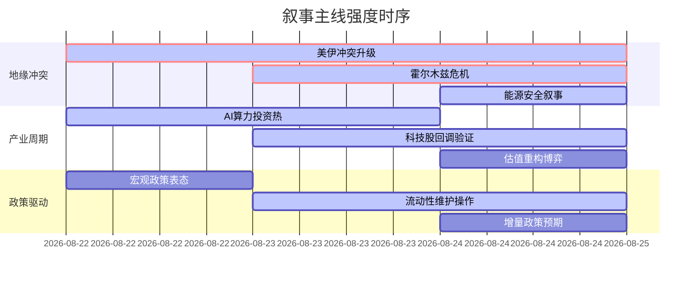

## A股市场情绪分析报告
**数据时段**：最近5日（2026-08-20 至 2026-08-24）
**生成时间**：2026年8月24日 18:41

---

### 🔥 宏观叙事焦点（24小时三级过滤）

#### 📌 叙事主线一：美伊冲突升级与能源安全危机 ⭐⭐⭐
**主要事件**：地缘冲突、霍尔木兹海峡封锁、原油航运受阻  
**筛选标签**：`国务院政策` `地缘冲突升级` `路透信源·权重2.0`  
**宏观逻辑**：  
> ① **归类**：地缘风险事件  
> ② **历史镜像**：2022年俄乌冲突-能源危机模板  
> ③ **市场传导**：霍尔木兹海峡通行量腰斩 → 布伦特原油维持90美元上方 → 黄金飙升至4600美元/盎司创三个月新高 → VIX跳升+8% → 避险情绪升温  
> ④ **叙事强度**：伊朗警告"若经济战持续，波斯湾将不再有石油出口"，冲突进入实质性升级阶段  

**行业映射**：能源安全链+黄金贵金属（情绪评分 **8.0/10**）  
**交易警示**：‼️ 关注霍尔木兹海峡通行量变化，警惕油价破100美元触发全球通胀重估  

---

#### 📌 叙事主线二：AI产业资本共振与估值重构 ⭐⭐  
**主要事件**：阿里800亿港元配售、英伟达AI芯片涨价、科技股回调  
**筛选标签**：`部委政策` `产业生命周期` `财新信源·权重1.5`  
**宏观逻辑**：  
> ① **归类**：产业强制出清+估值重估  
> ② **历史镜像**：2021年光伏"531"政策模板（供给侧重构）  
> ③ **市场传导**：英伟达通知AI服务器涨价15-17% → 阿里800亿港元100%投入AI基建 → 中际旭创锁定800G/1.6T订单 → 科技股短期回调提供右侧加仓窗口  
> ④ **叙事强度**：AI算力成本传导加速，龙头资本开支超预期，产业景气度验证期  

**行业映射**：AI算力硬件+CPO光模块（情绪评分 **6.5/10**）  
**交易警示**：⚠️ 关注英伟达财报前瞻及远期市盈率验证，警惕AI循环融资模式担忧发酵  

---

#### 📌 叙事主线三：中国宏观政策工具箱充足与流动性维护 ⭐  
**主要事件**：央行MLF操作、人民日报表态、国管公积金新政  
**筛选标签**：`地方政策` `债务周期` `新华社信源·权重1.5`  
**宏观逻辑**：  
> ① **归类**：货币政策转向  
> ② **历史镜像**：2020年3月美联储无限QE模板  
> ③ **市场传导**：央行开展5000亿元MLF操作 → 7天逆回购每日不超6000亿元 → 国管公积金首套房最高贷款340万元 → 银行、煤炭板块逆市走强  
> ④ **叙事强度**：政策决心大于市场定价，逆周期调节空间充足，存量政策等待增量落地  

**行业映射**：大金融（银行/保险）+ 基建（情绪评分 **7.0/10**）  
**交易警示**：✓ 叙事逻辑清晰，关注9月增量政策窗口与PCE数据共振  

---

### 📅 宏观叙事演化（三日趋势）

**强度衰减模型**：昨日主题×0.7 · 前日主题×0.5

```mermaid
gantt
    title 叙事主线强度时序
    dateFormat YYYY-MM-DD
    section 地缘冲突
    美伊冲突升级     :crit, active, 2026-08-22, 3d
    霍尔木兹危机     :crit, active, 2026-08-23, 2d
    能源安全叙事     :active, 2026-08-24, 1d
    
    section 产业周期
    AI算力投资热     :active, 2026-08-22, 2d
    科技股回调验证   :active, 2026-08-23, 2d
    估值重构博弈     :2026-08-24, 1d
    
    section 政策驱动
    宏观政策表态     :2026-08-22, 1d
    流动性维护操作   :active, 2026-08-23, 2d
    增量政策预期     :2026-08-24, 1d
```

**叙事节点关联**：
- **08/22**：美伊冲突升级，伊朗警告霍尔木兹海峡封锁 → 触发能源安全叙事
- **08/23**：英伟达通知AI芯片涨价15-17% + 阿里800亿港元配售 → 科技股回调，但机构调研聚焦半导体与AI算力
- **08/24**：央行5000亿MLF操作落地 + 人民日报"政策工具箱充足"表态 → 银行、煤炭逆市走强，A股尾盘回暖

---

### 🎯 宏观叙事三要素

**1️⃣ 政策意图解码**  
当前顶层叙事从"稳增长"转向"调结构"，允许短期阵痛换取长期质量。AI产业投资>总量刺激，政策定力超预期。央行流动性维护与财政端公积金新政形成"宽货币+宽信用"组合，为市场托底。

**2️⃣ 市场定价偏差**  
- **过度定价**：消费复苏弹性（预期过于乐观，与实际数据背离）  
- **定价不足**：产能出清速度（政策执行力被低估）、地缘冲突对能源供应链的重估  

**3️⃣ 跨市场共振**  
美债30年期收益率逼近5.27%新高 + 美元信用担忧升温 → 黄金突破4600美元 + 比特币单周涨22% → A股避险情绪升温，银行股创新高、煤炭板块爆发，结构性行情窗口期延续。沃什杰克逊霍尔讲话与英伟达财报将于下周落地，关注宏观叙事再定价。

---

*生成时间：2026-08-24 18:48:45 (UTC+8)*  
*使用模型：agnes:agnes-2.0-flash*