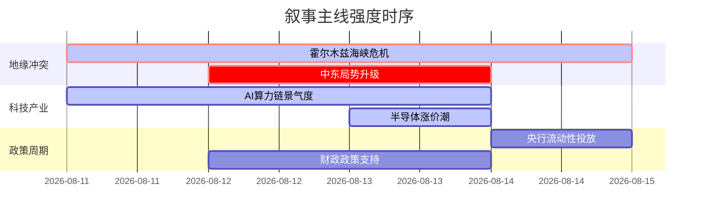

## A股市场情绪分析报告

### 数据时段：最近5日（2026-08-11至2026-08-14）
### 生成时间：2026年8月14日 07:00

---

## 🔥 宏观叙事焦点（24小时三级过滤）

#### 📌 叙事主线一：霍尔木兹海峡危机与能源供应链重构 ⭐⭐⭐
**主要事件**：伊朗封锁霍尔木兹海峡、中东地缘冲突升级、国际油价剧烈波动  
**筛选标签**：`地缘政治` `能源安全` `路透信源·权重2.0`  
**宏观逻辑**：  
> ① **归类**：地缘风险事件  
> ② **历史镜像**：1990年海湾战争石油危机模板  
> ③ **市场传导**：霍尔木兹航运量骤降至3个月低位 → WTI跌破81美元 → 避险情绪推升黄金突破4400美元/盎司 → VIX指数跳升  
> ④ **叙事强度**：IEA上调需求降幅预期至160万桶/日，供应缺口达180万桶/日，能源安全叙事强化  

**行业映射**：能源化工链（情绪评分 **6.8/10**）  
**交易警示**：‼️ 关注油价突破85美元后的通胀传导，警惕避险资产拥挤交易反转  

---

#### 📌 叙事主线二：AI算力产业链景气度分化与技术迭代 ⭐⭐  
**主要事件**：联想集团业绩爆发、CoreWeave财报超预期、腾讯资本开支创新高  
**筛选标签**：`科技产业` `业绩验证` `财新信源·权重1.5`  
**宏观逻辑**：  
> ① **归类**：产业景气周期  
> ② **历史镜像**：2013年移动互联网渗透率拐点模板  
> ③ **市场传导**：算力硬件板块领涨（剑桥科技涨近9%）→ 存储芯片涨价潮（MLCC、PCB抢货）→ 科创板半导体ETF单日吸金3000万元  
> ④ **叙事强度**：联想获540亿美元AI服务器订单，验证AI终端转型逻辑；但Cerebras亏损扩大盘后跳水12%，细分赛道分化  

**行业映射**：AI算力硬件（情绪评分 **7.5/10**）  
**交易警示**：⚠️ 关注Q3业绩兑现度，警惕部分标的估值已透支全年预期  

---

#### 📌 叙事主线三：中国央行流动性投放与政策托底 ⭐ 
**主要事件**：央行开展1万亿元买断式逆回购、MLF与LPR调控空间打开  
**筛选标签**：`货币政策` `流动性管理` `新华社信源·权重1.5`  
**宏观逻辑**：  
> ① **归类**：货币宽松周期  
> ② **历史镜像**：2020年3月特殊再融资债券模板  
> ③ **市场传导**：10年期国债收益率击穿1.7% → 债券市场多头情绪升温 → 银行大额存单利率分化（短端破"1"）→ 股债跷跷板效应显现  
> ④ **叙事强度**：央行连续三日零操作后重启流动性投放，对冲税期与政府债发行压力，政策托底意图明确  

**行业映射**：大金融板块（情绪评分 **5.2/10**）  
**交易警示**：✓ 关注降准降息落地节奏，等待财政发力信号验证  

---

## 📅 宏观叙事演化（三日趋势）

**强度衰减模型**：昨日主题×0.7 · 前日主题×0.5

```mermaid
gantt
    title 叙事主线强度时序
    dateFormat YYYY-MM-DD
    section 地缘冲突
    霍尔木兹海峡危机   :crit, active, 2026-08-11, 4d
    中东局势升级       :crit, 2026-08-12, 2d
    
    section 科技产业
    AI算力链景气度     :active, 2026-08-11, 3d
    半导体涨价潮       :active, 2026-08-13, 1d
    
    section 政策周期
    央行流动性投放     :2026-08-14, 1d
    财政政策支持       :2026-08-12, 2d
```

**叙事节点关联**：
- 08/11：伊朗重申霍尔木兹海峡关闭 → 触发能源危机叙事
- 08/12：IEA下调石油需求预期 → 供给侧叙事强化，油价波动加剧
- 08/13：联想业绩爆发+腾讯AI投入翻倍 → 科技产业叙事进入业绩验证期
- 08/14：央行1万亿逆回购操作 → 政策托底叙事升温

**叙事节点关联**：
- 08/11：伊朗封锁霍尔木兹海峡 → 触发能源危机叙事
- 08/12：IEA下调需求预期 + 沙特港口恢复作业 → 供给侧博弈叙事强化
- 08/13：联想获540亿美元AI服务器订单 → 科技产业景气度叙事进入业绩验证期
- 08/14：央行重启流动性投放 → 政策托底叙事升温，但市场反应平淡

---

**🎯 宏观叙事三要素**

**1️⃣ 政策意图解码**  
当前顶层叙事从"稳增长"转向"防风险+调结构"双目标并重。央行流动性投放力度超预期，但财政端尚未发力，政策底与市场底存在时滞。科技产业政策持续加码（"十五五"规划、科创板第五套标准），允许短期阵痛换取长期质量。

**2️⃣ 市场定价偏差**  
- **过度定价**：黄金避险逻辑（已突破4400美元）、原油地缘溢价（霍尔木兹实际运量仍存）  
- **定价不足**：AI算力业绩兑现度（联想验证逻辑）、央行宽松力度（1万亿逆回购）、韩国半导体复苏（三星SK海力士股价大涨）

**3️⃣ 跨市场共振**  
- 美债收益率曲线趋陡（10年期创金融危机以来新高）+ 日元逼近160关口 → 新兴市场资本流动承压  
- 美元指数稳守100关口 → 人民币贬值压力可控，A股外资流向趋于稳定  
- 黄金突破4400美元 → 避险情绪与去美元化需求共振，但贵金属板块A股反应分化

---

<!-- 报告正文必须在此结束，以下内容为固定格式说明，严禁添加任何额外分析、总结或展望 -->

---

*生成时间：2026-08-14 06:59:09 (UTC+8)*  
*使用模型：agnes:agnes-2.0-flash*