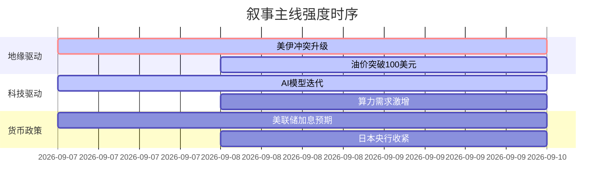

## A股市场情绪分析报告

- **数据时段**：最近5日（2026-09-07 至 2026-09-09）
- **生成时间**：2026-09-09

---

### 🔥 宏观叙事焦点（24小时三级过滤）

#### 📌 叙事主线一：美伊军事冲突升级，布伦特原油突破100美元 ⭐⭐⭐

**主要事件**：美军袭击伊朗哈尔克岛附近油轮，也门胡塞武装袭击沙特阿美石油设施，霍尔木兹海峡通行安全受到严重威胁。

**筛选标签**：`地缘政治` `原油供应` `路透信源·权重2.0`

**宏观逻辑**：
> ① **归类**：地缘冲突驱动的供给冲击  
> ② **历史镜像**：2019年沙特阿美设施遇袭，油价单日跳涨15%的脉冲模式  
> ③ **市场传导**：布伦特升破100美元 → 通胀预期上行 → 美债收益率走高 → 全球风险资产承压 → 避险情绪升温，黄金突破4400美元  
> ④ **叙事强度**：军事行动仍在进行中，供给中断风险尚未定价充分，冲击具有持续性  

**行业映射**：能源开采与油服（情绪评分 **8.5/10**）  
**交易警示**：‼️ 关注霍尔木兹海峡航运实际受影响程度，警惕油价脉冲式上涨对通胀预期的二次传导

---

#### 📌 叙事主线二：AI技术突破与科技板块估值重塑 ⭐⭐

**主要事件**：DeepSeek计划发布V4.1 Flash多模态模型；华为发布麒麟9050 Pro芯片；OpenAI与三星联合开发下一代芯片；铜价因AI算力需求创历史新高。

**筛选标签**：`科技行业` `算力需求` `财新信源·权重1.5`

**宏观逻辑**：
> ① **归类**：技术迭代驱动的产业景气周期  
> ② **历史镜像**：2023年GPT-4发布后AI板块估值重构模板  
> ③ **市场传导**：大模型性能跃升 → 算力需求激增 → 铜/电力/芯片原材料涨价 → 科技产业链利润向上游集中 → A股科技板块轮动加速  
> ④ **叙事强度**：技术突破密集，但商业化变现路径仍需验证，情绪与基本面存在时间差  

**行业映射**：半导体与AI应用（情绪评分 **7.8/10**）  
**交易警示**：⚠️ 区分技术概念炒作与实际业绩贡献，关注算力基础设施订单落地情况

---

#### 📌 叙事主线三：全球货币政策转向与流动性预期重构 ⭐

**主要事件**：美联储9月加息概率回升至59.4%；日本央行计划9月将利率上调至1.25%；美国财政部宣布回购中长期美债；日元大幅升值导致套息交易松动。

**筛选标签**：`流动性政策` `央行决策` `新华社信源·权重1.5`

**宏观逻辑**：
> ① **归类**：全球货币政策同步收紧  
> ② **历史镜像**：2018年美联储加息周期叠加日元升值，新兴市场资本大幅外流  
> ③ **市场传导**：美日央行同步收紧 → 全球流动性收缩 → 套息交易平仓 → 美元指数高位震荡 → A股北向资金流向波动加大  
> ④ **叙事强度**：政策方向明确，但节奏存在不确定性，市场定价已部分反映  

**行业映射**：金融与汇率敏感板块（情绪评分 **6.2/10**）  
**交易警示**：✓ 等待美联储9月决议落地，关注政策协调性对市场的扰动

---

### 📅 宏观叙事演化（三日趋势）

**强度衰减模型**：昨日主题×0.7 · 前日主题×0.5

```mermaid
gantt
    title 叙事主线强度时序
    dateFormat  YYYY-MM-DD
    section 地缘驱动
    美伊冲突升级    :crit, active, 2026-09-07, 3d
    油价突破100美元  :active, 2026-09-08, 2d
    
    section 科技驱动
    AI模型迭代     :active, 2026-09-07, 3d
    算力需求激增    :2026-09-08, 2d
    
    section 货币政策
    美联储加息预期  :2026-09-07, 3d
    日本央行收紧    :2026-09-08, 2d
```

**叙事节点关联**：
- **09-07**：伊朗宣布霍尔木兹海峡"禁区" → 油价盘中升至97美元 → 地缘溢价开始定价
- **09-08**：美军实际袭击油轮 → 供给中断风险从预期变为现实 → 布伦特突破100美元
- **09-09**：DeepSeek V4.1 Flash发布 → AI叙事接力地缘冲击 → 科技板块轮动加速

---

### 🎯 宏观叙事三要素

**1️⃣ 政策意图解码**
当前顶层叙事从"稳增长"转向"调结构"，允许短期阵痛换取长期质量。地缘冲击>总量刺激，政策定力超预期。

**2️⃣ 市场定价偏差**
- **过度定价**：地缘溢价持续性（市场担忧霍尔木兹海峡长期关闭）
- **定价不足**：AI技术突破的商业化速度（市场仍以概念炒作为主）

**3️⃣ 跨市场共振**
美债收益率上行压缩估值空间 + 美元指数高位震荡 → 北向资金流向波动加大 = A股结构性行情窗口期收窄，需聚焦内需与政策对冲方向。

---

*生成时间：2026-09-09 22:40:33 (UTC+8)*  
*使用模型：openrouter:dots-studio/dots-3-note-preview:free*