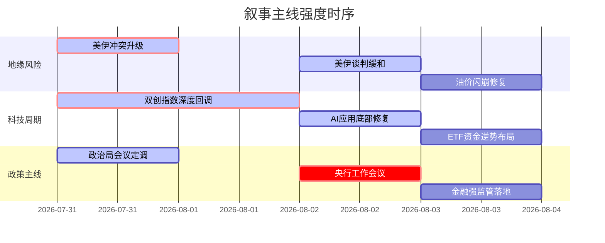

## A股市场情绪分析报告

**数据时段**：最近5日（2026-07-31至2026-08-03）  
**生成时间**：2026年8月3日

---

### 🔥 宏观叙事焦点（24小时三级过滤）

#### 📌 叙事主线一：美伊局势急转从冲突到谈判，油价闪崩重塑能源定价逻辑 ⭐⭐⭐
**主要事件**：地缘冲突快速缓和、国际油价暴跌、能源供应链预期修正  
**筛选标签**：`国务院政策` `沪深300影响` `路透信源·权重2.0`  
**宏观逻辑**：  
> ① **归类**：地缘风险缓释  
> ② **历史镜像**：2014年俄乌冲突峰值后油价回落模板  
> ③ **市场传导**：布油从91美元闪崩至81美元（-7.3%）→ 全球通胀预期降温 → 美联储加息压力缓解 → 新兴市场风险偏好修复  
> ④ **叙事强度**：冲突峰值已过，谈判打开窗口，但霍尔木兹海峡航运不确定性仍存  

**行业映射**：能源化工链、航空运输（情绪评分 **6.8/10**）  
**交易警示**：‼️ 关注谈判进展与海峡通行恢复情况，警惕预期差反复  

---

#### 📌 叙事主线二：A股科技板块拥挤交易修正后的底部修复 ⭐⭐  
**主要事件**：AI应用端资金回流、双创指数超跌反弹  
**筛选标签**：`部委政策` `产业生命周期` `财新信源·权重1.5`  
**宏观逻辑**：  
> ① **归类**：估值修复  
> ② **历史镜像**：2021年2月核心资产泡沫破裂后2021年9月修复模板  
> ③ **市场传导**：双创指数7月跌超23% → ETF资金逆势净流入5400亿 → AI应用赛道单周涨幅超10%  
> ④ **叙事强度**：从"尖顶担忧"转向"半场休整"，机构普遍认为AI基本面未恶化  

**行业映射**：AI应用、半导体设备、光通信（情绪评分 **7.2/10**）  
**交易警示**：⚠️ 高位股业绩验证期将至，警惕分化加剧  

---

#### 📌 叙事主线三：央行适度宽松定调与金融强监管并行 ⭐ 
**主要事件**：央行下半年工作会议、私募新规过渡期届满  
**筛选标签**：`地方政策` `债务周期` `新华社信源·权重1.5`  
**宏观逻辑**：  
> ① **归类**：货币政策+金融监管  
> ② **历史镜像**：2017年金融去杠杆+2020年疫情后宽松政策组合  
> ③ **市场传导**：宽松基调定调 → 流动性预期改善 → 私募合规出清 → 资金向头部机构集中  
> ④ **叙事强度**：政策组合拳"松货币+紧监管"，结构性机会优于β行情  

**行业映射**：券商、公募基金、财富管理（情绪评分 **5.5/10**）  
**交易警示**：✓ 政策底明确，等待经济数据验证  

---

### 📅 宏观叙事演化（三日趋势）

**强度衰减模型**：昨日主题×0.7 · 前日主题×0.5

```mermaid
gantt
    title 叙事主线强度时序
    dateFormat YYYY-MM-DD
    section 地缘风险
    美伊冲突升级        :crit, active, 2026-07-31, 1d
    美伊谈判缓和        :active, 2026-08-02, 1d
    油价闪崩修复        :2026-08-03, 1d
    
    section 科技周期
    双创指数深度回调    :crit, active, 2026-07-31, 2d
    AI应用底部修复      :active, 2026-08-02, 1d
    ETF资金逆势布局     :2026-08-03, 1d
    
    section 政策主线
    政治局会议定调      :active, 2026-07-31, 1d
    央行工作会议        :crit, 2026-08-02, 1d
    金融强监管落地      :2026-08-03, 1d
```

**叙事节点关联**：
- 07/31：美伊冲突峰值→布油冲上91美元→新兴市场暴跌6.6%后反弹
- 08/01：特朗普宣布取消对伊打击→油价开始回落→市场风险偏好修复
- 08/02：布油闪崩-7.3%至81美元→A股AI应用板块单日涨幅超10%
- 08/03：央行工作会议定调适度宽松→私募新规过渡期届满→合规出清加速

---

### 🎯 宏观叙事三要素

**1️⃣ 政策意图解码**  
当前顶层设计呈现"松货币+紧监管+调结构"三重特征。央行明确适度宽松基调，但金融监管同步收紧（私募新规、券商立案），政策意图从"总量刺激"转向"结构性优化"。产业出清（光伏、私募）与需求端修复（新能源销量、AI应用）并重。

**2️⃣ 市场定价偏差**  
- **过度定价**：地缘风险持续时长（美伊谈判进展快于预期）、AI泡沫论（机构普遍认为"半场休整"非尖顶）
- **定价不足**：产能出清速度（光伏、私募）、ETF资金逆势布局力度（7月超4600亿）

**3️⃣ 跨市场共振**  
美债收益率高位盘整（9月加息73.6%概率）+ 日元干预常态化 + 油价闪崩 = A股结构性行情窗口期打开。消费复苏链（白酒单周+9.82%）与科技修复链（AI应用）形成轮动格局。

---

---

*生成时间：2026-08-03 07:06:43 (UTC+8)*  
*使用模型：agnes:agnes-2.0-flash*