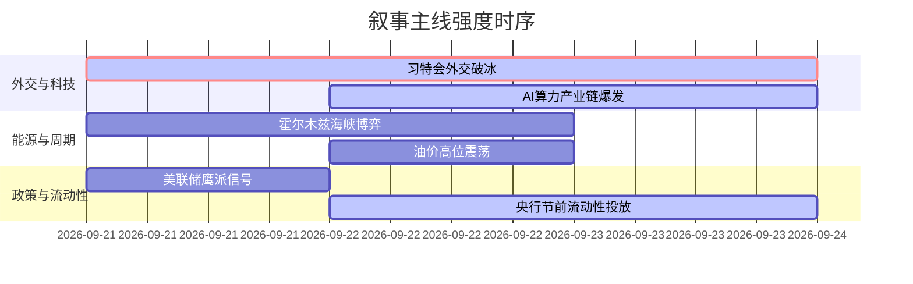

# A股市场情绪分析报告

**数据时段**：2026年9月21日 - 2026年9月23日  
**生成时间**：2026年9月23日 22:49

---

### 🔥 宏观叙事焦点（24小时三级过滤）

#### 📌 叙事主线一：习特会外交破冰与AI安全机制构建 ⭐⭐⭐
**主要事件**：元首外交、中美经贸磋商、AI治理对话  
**筛选标签**：`国务院政策` `中美关系` `路透信源·权重2.0`  
**宏观逻辑**：  
> ① **归类**：地缘政治风险缓释  
> ② **历史镜像**：2017年11月习特会贸易协议模板  
> ③ **市场传导**：中美经贸磋商举行 → AI安全通报机制提议 → 科技股风险溢价下降 → A股风险偏好回升  
> ④ **叙事强度**：元首互访叠加AI对话，双边关系进入"有限稳定"窗口期，为科技产业合作提供政策庇护  

**行业映射**：AI产业链、半导体（情绪评分 **8.5/10**）  
**交易警示**：‼️ 关注磋商成果落地节奏，警惕预期差收窄；美方芯片出口管制未纳入议程，结构性博弈未解  

---

#### 📌 叙事主线二：AI算力军备竞赛与市值突破 ⭐⭐  
**主要事件**：AMD市值破万亿、AI芯片7连阳、开源模型竞争  
**筛选标签**：`产业投资` `科技革命` `财新信源·权重1.5`  
**宏观逻辑**：  
> ① **归类**：技术革命周期  
> ② **历史镜像**：2023年英伟达算力牛市启动模板  
> ③ **市场传导**：Meta Muse引爆AI应用端 → AMD市值首破1万亿美元 → 费城半导体指数涨4.3% → A股AI芯片7连阳  
> ④ **叙事强度**：AI从概念验证进入业绩兑现期，40家公司预告Q3业绩全面预增  

**行业映射**：AI芯片、算力基建、人形机器人（情绪评分 **7.8/10**）  
**交易警示**：⚠️ 美股科技股估值已处于高位，大摩预警美股短期7%回调风险；A股需警惕情绪过热后的获利回吐  

---

#### 📌 叙事主线三：霍尔木兹海峡地缘博弈与能源价格波动 ⭐ 
**主要事件**：美伊直接接触、海峡通航风险、油价高位震荡  
**筛选标签**：`地缘冲突` `能源安全` `新华社信源·权重1.5`  
**宏观逻辑**：  
> ① **归类**：地缘风险事件  
> ② **历史镜像**：2019年霍尔木兹海峡危机模板  
> ③ **市场传导**：美伊联大接触 → 伊朗提议7天重开海峡 → 布伦特原油回落至97美元 → 供应风险溢价消退  
> ④ **叙事强度**：外交缓和信号与海上袭扰并存，能源市场多空博弈加剧  

**行业映射**：能源化工、航运物流（情绪评分 **5.2/10**）  
**交易警示**：✓ 地缘风险边际缓解，油价回调利好下游；但胡塞武装袭击沙特首都，供应中断风险仍存  

---

### 📅 宏观叙事演化（三日趋势）

**强度衰减模型**：昨日主题×0.7 · 前日主题×0.5

```mermaid
gantt
    title 叙事主线强度时序
    dateFormat YYYY-MM-DD
    section 外交与科技
    习特会外交破冰     :crit, active, 2026-09-21, 3d
    AI算力产业链爆发   :active, 2026-09-22, 2d
    
    section 能源与周期
    霍尔木兹海峡博弈   :2026-09-21, 2d
    油价高位震荡       :2026-09-22, 1d
    
    section 政策与流动性
    美联储鹰派信号     :2026-09-21, 1d
    央行节前流动性投放 :active, 2026-09-22, 2d
```

**叙事节点关联**：
- 09/21：习近平主席访美安排公布 → 中美关系稳定预期升温
- 09/22：中美经贸磋商在纽约举行 → AI安全通报机制提议释放合作信号
- 09/23：美联储鹰派表态 + 央行逆回购操作 → 流动性双轨博弈

---

### 🎯 宏观叙事三要素

**1️⃣ 政策意图解码**  
当前顶层叙事从"稳增长"转向"防风险+促创新"双轮驱动。外交层面通过元首互动稳定外部环境，科技层面加速AI算力自主可控。产业政策的"新型举国体制"特征明显，政策定力聚焦长期竞争力。

**2️⃣ 市场定价偏差**  
- **过度定价**：美联储加息预期的持续性（官员言论与市场定价存在分歧）  
- **定价不足**：中美AI合作的实质性突破空间（技术脱钩风险被过度放大）  
- **合理定价**：能源地缘风险的波动性溢价（油价已反映大部分缓和预期）

**3️⃣ 跨市场共振**  
美债收益率5%关口 vs A股风险偏好回升 = 资金分流效应显现；美元指数突破101压制新兴市场，但A股通过"特色估值体系"构建防御壁垒。AI产业链成为跨市场共振的核心枢纽。

---

### 📊 市场情绪指标速览

| 维度 | 指标 | 评分 | 趋势 |
|------|------|------|------|
| 风险偏好 | 沪指涨幅 | 0.97% | ↑ |
| 板块轮动 | 房地产领涨 | +3.95% | ↑ |
| 科技情绪 | AI芯片7连阳 | 强势 | → |
| 外部扰动 | 美联储鹰派 | 中性 | ↓ |
| 地缘风险 | 霍尔木兹海峡 | 缓和 | ↑ |
| 流动性 | 央行净投放 | 充裕 | → |

**整体情绪**：中性偏积极（市场风险偏好回升，但需警惕外部扰动）

---

*生成时间：2026-09-23 22:54:31 (UTC+8)*  
*使用模型：agnes:agnes-2.0-flash*