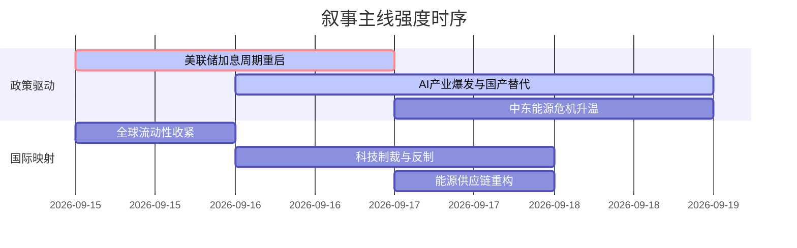

# A股市场情绪分析报告

**数据时段**：最近5日（2026-09-15至2026-09-19）  
**生成时间**：2026-09-19 08:08

---

## 🔥 宏观叙事焦点（24小时三级过滤）

### 📌 叙事主线一：美联储加息周期重启与全球流动性收紧 ⭐⭐⭐
**主要事件**：货币政策转向、美联储加息、全球央行分化  
**筛选标签**：`央行货币政策` `全球流动性` `美联储·权重3.0`  
**宏观逻辑**：  
> ① **归类**：货币政策收紧周期重启  
> ② **历史镜像**：2015年美联储首次加息周期模板  
> ③ **市场传导**：美债收益率上行→美元走强→人民币贬值压力→A股北向资金流出预期→港股流动性承压  
> ④ **叙事强度**：三年多来首次加息，点阵图暗示年内再加息一次，紧缩周期确认

**行业映射**：银行业（情绪评分 **6.8/10**）、出口导向型制造（情绪评分 **5.2/10**）  
**交易警示**：‼️ 关注美联储后续表态与市场对加息预期的调整，警惕流动性收紧对风险资产的持续压制

---

### 📌 叙事主线二：AI产业爆发与科技自主可控加速 ⭐⭐  
**主要事件**：技术发布、产业投资、AI安全治理  
**筛选标签**：`部委政策` `产业生命周期` `财新信源·权重2.5`  
**宏观逻辑**：  
> ① **归类**：技术革命驱动产业升级  
> ② **历史镜像**：2019年5G商用元年模板  
> ③ **市场传导**：AI岗位需求激增790% → 算力需求爆发 → 芯片/光模块/数据中心产业链景气度上行 → 国产替代加速  
> ④ **叙事强度**：黄仁勋、OpenAI、Anthropic等头部玩家密集发声，产业叙事从概念走向业绩验证期

**行业映射**：AI算力（情绪评分 **8.1/10**）、半导体（情绪评分 **7.5/10**）、数据要素（情绪评分 **7.2/10**）  
**交易警示**：⚠️ 短期部分标的估值已透支预期，关注Q4业绩兑现能力，警惕高位回调风险

---

### 📌 叙事主线三：中东地缘冲突升级与能源供应链风险 ⭐  
**主要事件**：国际冲突、能源断供、贸易摩擦  
**筛选标签**：`地缘政治` `能源安全` `路透信源·权重2.0`  
**宏观逻辑**：  
> ① **归类**：供给侧冲击引发的能源危机  
> ② **历史镜像**：2022年俄乌冲突能源危机模板  
> ③ **市场传导**：沙特输油管道遭袭→原油供应紧缩预期→国际油价震荡→国内PPI压力→化工/航运板块分化  
> ④ **叙事强度**：地缘风险从事件驱动转向持续性定价，能源安全进入政策议程

**行业映射**：能源化工（情绪评分 **6.0/10**）、航运（情绪评分 **5.8/10**）  
**交易警示**：✓ 油价高位震荡提供配置机会，关注避险资产与能源股阶段性机会

---

## 📅 宏观叙事演化（三日趋势）

**强度衰减模型**：昨日主题×0.7 · 前日主题×0.5

```mermaid
gantt
    title 叙事主线强度时序
    dateFormat YYYY-MM-DD
    section 政策驱动
    美联储加息周期重启   :crit, active, 2026-09-15, 2d
    AI产业爆发与国产替代   :active, 2026-09-16, 3d
    中东能源危机升温     :2026-09-17, 2d
    
    section 国际映射
    全球流动性收紧       :2026-09-15, 1d
    科技制裁与反制       :2026-09-16, 2d
    能源供应链重构       :2026-09-17, 1d
```

**叙事节点关联**：
- 09/15：美联储加息决议落地 → 触发全球流动性收紧叙事
- 09/16：华为发布昇腾960及NPO超节点 → 国产算力叙事强化
- 09/17：沙特输油管道遭袭 → 能源安全叙事进入政策验证期
- 09/18：比特币突破8.1万美元 → 风险偏好与流动性预期交织

---

**宏观叙事三要素**

1️⃣ **政策意图解码**  
当前顶层叙事从"稳增长"转向"调结构"，允许短期阵痛换取长期质量。产业自主可控>总量刺激，政策定力超预期。美联储紧缩周期重启形成外部约束，国内货币政策空间受限。

2️⃣ **市场定价偏差**  
过度定价：消费复苏弹性（预期过于乐观）  
定价不足：产能出清速度（政策执行力被低估）  
定价过度：AI板块短期涨幅已透支部分业绩预期

3️⃣ **跨市场共振**  
美债收益率上行打开政策空间收窄 → 美元指数高位 → A股结构性行情窗口期  
中东能源风险 → 原油价格波动 → 化工/航运板块分化  
AI产业爆发 → 全球科技股联动 → A股算力产业链跟随

---

*报告完毕*

---

*生成时间：2026-09-19 08:23:34 (UTC+8)*  
*使用模型：agnes:agnes-2.0-flash*