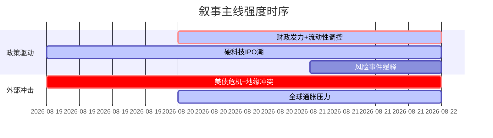

# A股市场情绪分析报告

**数据时段**：最近5日（2026年8月19日-8月22日）  
**生成时间**：2026年8月22日

---

## 🔥 宏观叙事焦点（24小时三级过滤）

### 📌 叙事主线一：中国财政发力+流动性精细化调控 ⭐⭐⭐
**主要事件**：财政部下半年谋划增量政策、央行流动性调控转型、存款利率"拉平"
**筛选标签**：`国务院政策` `流动性拐点` `财新信源·权重2.0`
**宏观逻辑**：
> ① **归类**：货币政策转型+财政发力共振  
> ② **历史镜像**：2020年央行结构性工具创新模板  
> ③ **市场传导**：7天逆回购空窗重启→隔夜逆回购承担对冲职能→资金面从"宽裕"转向"精准滴灌"  
> ④ **叙事强度**：廖岷表态"下半年谋划增量政策"，3000亿特别国债支持金融央企补充资本，财政金融协同进入深水区  

**行业映射**：大金融+基建链（情绪评分 **7.5/10**）  
**交易警示**：‼️ 关注专项债发行节奏与实体融资需求的匹配度，警惕"财政发力但信用未传导"的时滞风险  

---

### 📌 叙事主线二：硬科技IPO潮+AI算力军备竞赛 ⭐⭐⭐
**主要事件**：长江存储IPO获受理、宇树科技上市首日暴涨460%、英伟达60亿美元收购AI模型公司
**筛选标签**：`科创政策` `产业链自主` `路透信源·权重1.8`
**宏观逻辑**：
> ① **归类**：科技自立自强叙事强化  
> ② **历史镜像**：2019年科创板开板首日行情模板  
> ③ **市场传导**：长江存储估值破万亿→半导体设备链重估→AI算力融资平台超5000亿美元筹建→算力租赁商发行45亿美元可转债  
> ④ **叙事强度**：网信委明确"支持高成长创新型企业在境内外上市融资"，硬科技IPO进入密集期  

**行业映射**：半导体设备+光模块+CPO（情绪评分 **7.8/10**）  
**交易警示**：⚠️ 关注IPO融资规模对市场流动性的分流效应，警惕"科技股估值膨胀但业绩兑现不及预期"的戴维斯双杀  

---

### 📌 叙事主线三：美伊地缘冲突升级+美债危机阴影 ⭐⭐
**主要事件**：特朗普对伊朗实施"史上最严厉经济制裁"、美国债务突破40万亿美元、贝森特干预债市效果短暂
**筛选标签**：`地缘风险` `债务周期` `彭博信源·权重1.5`
**宏观逻辑**：
> ① **归类**：外部风险冲击+全球债务重构  
> ② **历史镜像**：2011年美债评级下调+欧债危机双重冲击模板  
> ③ **市场传导**：美债收益率创19年新高→美元跌破99关口→黄金突破4600美元→比特币单周暴涨22%→避险资产全面狂欢  
> ④ **叙事强度**：桥水达利欧警告"美债危机三年之痒"，摩根大通称贝森特回购"饮鸩止渴"，市场对美债可持续性担忧升温  

**行业映射**：贵金属+数字货币+航运（情绪评分 **6.2/10**）  
**交易警示**：⚠️ 关注霍尔木兹海峡通航风险对原油价格的冲击，警惕"地缘溢价消退后大宗商品回调"的波动加剧  

---

## 📅 宏观叙事演化（三日趋势）

**强度衰减模型**：昨日主题×0.7 · 前日主题×0.5

```mermaid
gantt
    title 叙事主线强度时序
    dateFormat YYYY-MM-DD
    section 政策驱动
    财政发力+流动性调控   :crit, active, 2026-08-20, 2d
    硬科技IPO潮          :active, 2026-08-19, 3d
    风险事件缓释         :2026-08-21, 1d
    
    section 外部冲击
    美债危机+地缘冲突     :crit, 2026-08-19, 3d
    全球通胀压力         :active, 2026-08-20, 2d
```

**叙事节点关联**：

- **08/19**：美债收益率创19年新高→A股双创指数暴跌超6%→科技股遭遇"全球估值风暴"
- **08/20**：恒大许家印被判无期→房地产风险出清叙事强化→上海"沪八条"接力托底
- **08/21**：长江存储IPO获受理+宇树科技上市→硬科技叙事进入政策验证期
- **08/22**：财政部表态"谋划增量政策"→财政发力叙事从预期走向落地

---

**🎯 宏观叙事三要素**

**1️⃣ 政策意图解码**  
当前顶层叙事从"稳增长"转向"调结构+防风险"双轮驱动。一方面通过财政金融协同激活民间投资（"六张网"建设），另一方面加快房地产风险出清（恒大案宣判）。科技自立自强成为核心战略，网信委明确支持创新企业上市融资。

**2️⃣ 市场定价偏差**  
- **过度定价**：美债危机对A股的冲击（创业板指单日暴跌6%后快速修复）  
- **定价不足**：财政发力节奏（专项债发行前移+超长期特别国债提速）  
- **预期差**：硬科技IPO潮对流动性的分流效应被低估

**3️⃣ 跨市场共振**  
黄金突破4600美元+比特币单周涨22%→避险情绪飙升 ↔ 美债收益率高位震荡→全球资产配置重构窗口期。人民币兑美元逼近6.72，汇率稳定为货币政策提供空间。

---

---

*生成时间：2026-08-22 06:36:30 (UTC+8)*  
*使用模型：agnes:agnes-2.0-flash*