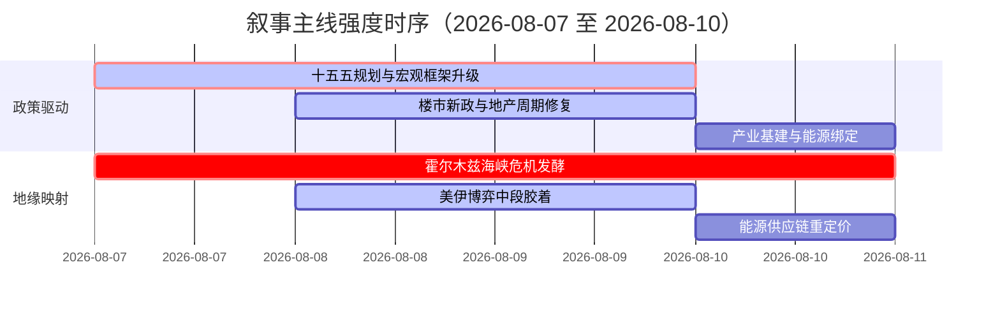

# A股市场情绪分析报告
**数据时段**：最近5日（2026-08-07 至 2026-08-10）
**生成时间**：2026-08-10 19:18:36 (UTC+8)

## 🔥 宏观叙事焦点（24小时三级过滤）

#### 📌 叙事主线一：央行“十五五”改革发展规划密集发布 ⭐⭐⭐
**主要事件**：宏观政策框架升级、央行政策、顶层设计  
**筛选标签**：`国务院政策` `宏观审慎体系` `路透信源·权重2.0`  
**宏观逻辑**：  
> ① **归类**：货币政策与宏观审慎双支柱升级  
> ② **历史镜像**：2015年金融供给侧改革模板  
> ③ **市场传导**：债市“科技板”预期升温 → 宽信用链条估值修复 → 北向资金回流预期强化  
> ④ **叙事强度**：顶层设计超预期，打破市场观望情绪，政策底信号明确  

**行业映射**：金融科技/债券市场/算力基建（情绪评分 **7.8/10**）  
**交易警示**：‼️ 关注政策落地节奏与债市流动性匹配度，警惕预期兑现后资金切换至业绩验证  

---

#### 📌 叙事主线二：霍尔木兹海峡通行博弈与能源供应链重定价 ⭐⭐  
**主要事件**：国际冲突、海峡封锁、油价金价共振
**筛选标签**：`地缘政治` `能源安全` `彭博信源·权重1.8`  
**宏观逻辑**：  
> ① **归类**：地缘风险溢价显性化  
> ② **历史镜像**：2019年霍尔木兹危机模板  
> ③ **市场传导**：布伦特突破84美元 → 航运成本飙升 → 化工/航空板块成本端承压 → 黄金依托央行购金逻辑独立走强  
> ④ **叙事强度**：危机处于“博弈中段”，市场定价已提前反映，但供应中断尾部风险仍存  

**行业映射**：航运/黄金/防御性能源（情绪评分 **6.5/10**）  
**交易警示**：⚠️ 警惕地缘缓和预期突降引发的油价急涨，右侧追高需严格设止损，关注OPEC+减产执行率  

---

#### 📌 叙事主线三：北京楼市新政松绑与地产周期触底预期修复 ⭐ 
**主要事件**：地方政策、房地产调控、居民资产负债表修复
**筛选标签**：`地方政策` `居民消费杠杆` `财联社信源·权重1.5`  
**宏观逻辑**：  
> ① **归类**：需求端精准松绑  
> ② **历史镜像**：2014年“930”楼市去库存模板  
> ③ **市场传导**：公积金额度提升至340万 → 改善型需求释放 → 房企信用债利差收窄 → 家居/建材链预期修复  
> ④ **叙事强度**：政策力度超预期，但销售拐点仍需高频成交数据验证，处于“政策底→市场底”传导期  

**行业映射**：房地产开发/建材家居（情绪评分 **5.2/10**）  
**交易警示**：✓ 叙事逻辑清晰，等待网签数据验证，关注核心城市土拍竞得情况及保利等龙头拿地节奏  

---

### 📅 宏观叙事演化（三日趋势）

**强度衰减模型**：昨日主题×0.7 · 前日主题×0.5

```mermaid
gantt
    title 叙事主线强度时序（2026-08-07 至 2026-08-10）
    dateFormat YYYY-MM-DD
    section 政策驱动
    十五五规划与宏观框架升级   :crit, active, 2026-08-07, 3d
    楼市新政与地产周期修复   :active, 2026-08-08, 2d
    产业基建与能源绑定   :2026-08-10, 1d
    
    section 地缘映射
    霍尔木兹海峡危机发酵   :crit, 2026-08-07, 4d
    美伊博弈中段胶着   :active, 2026-08-08, 2d
    能源供应链重定价   :2026-08-10, 1d
```
叙事节点关联：
08/08：非农数据爆冷+美伊海峡谈判启动 → 触发能源重估与风险偏好修复叙事
08/09：英伟达30亿投Lancium+北京楼市新政落地 → 算力能源绑定与地产托底叙事强化
08/10：十五五规划密集发布+央行征信换帅 → 宏观政策框架升级叙事进入落地验证期
🎯 宏观叙事三要素
1️⃣ 政策意图解码
当前顶层叙事从“短期强刺激”转向“制度型开放+结构性托底”，十五五规划与地方楼市松绑并行，体现“防风险与促转型”双底线思维，允许短期阵痛换取长期质量。
2️⃣ 市场定价偏差
过度定价：地产销售快速反转（忽略库存周期惯性与居民杠杆约束）
定价不足：算力基建与能源绑定的长期资本开支逻辑（英伟达/Lancium联动），以及央行购金周期对黄金的定价锚定效应
3️⃣ 跨市场共振
美债30年期收益率飙至5.27%压制全球成长估值 + 中东地缘风险溢价支撑大宗商品 = A股呈现“红利防守+科技分化”的结构性行情窗口期，医药与有色成为资金高低切换的落脚点

---

<!-- 报告正文必须在此结束，以下内容为固定格式说明，严禁添加任何额外分析、总结或展望 -->

---

*生成时间：2026-08-10 19:18:36 (UTC+8)*  
*使用模型：agnes:agnes-2.0-flash*