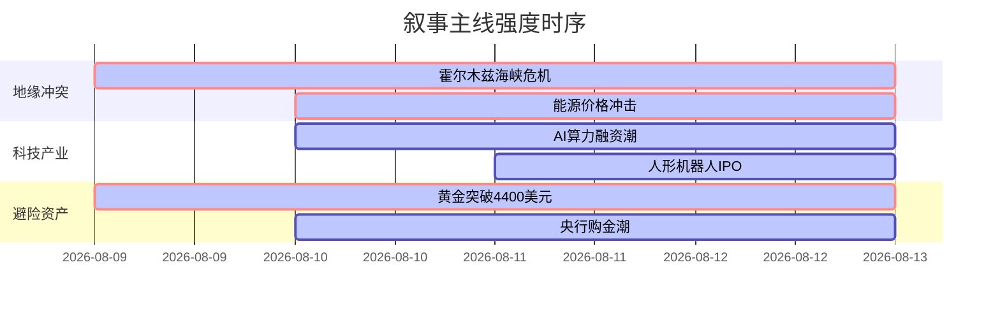

# A股市场情绪分析报告

**数据时段**：最近5日（2026-08-09 至 2026-08-12）  
**生成时间**：2026-08-12 06:52

---

### 🔥 宏观叙事焦点（24小时三级过滤）

#### 📌 叙事主线一：霍尔木兹海峡危机与能源价格冲击 ⭐⭐⭐
**主要事件**：地缘冲突、能源供应中断  
**筛选标签**：`地缘政治` `原油价格` `路透信源·权重2.0`  
**宏观逻辑**：  
> ① **归类**：地缘风险事件  
> ② **历史镜像**：2022年俄乌冲突能源危机模板  
> ③ **市场传导**：布伦特原油突破90美元/桶 → 欧洲天然气暴涨10%+ → 通胀预期升温 → 美债收益率上行  
> ④ **叙事强度**：霍尔木兹海峡协议前景渺茫，分析师警告第四季度油价或飙升至120-140美元  

**行业映射**：能源板块、化工板块（情绪评分 **8.1/10**）  
**交易警示**：‼️ 关注海峡谈判进展与油价波动，警惕能源成本冲击传导至中游制造业  

---

#### 📌 叙事主线二：AI算力融资潮与科技产业重估 ⭐⭐⭐
**主要事件**：英伟达5000亿美元AI基建融资、宇树科技IPO  
**筛选标签**：`科技产业` `AI算力` `财新信源·权重1.5`  
**宏观逻辑**：  
> ① **归类**：产业资本开支周期  
> ② **历史镜像**：2017年互联网基建投资模板  
> ③ **市场传导**：英伟达联手华尔街六大机构敲定5000亿美元AI融资 → 存储芯片、MLCC涨价 → 半导体板块分化（科创半导体ETF领涨4.12% vs AI ETF领跌3.13%）  
> ④ **叙事强度**：AI基建从概念验证进入资本密集型阶段，产业周期明确，宇树科技获两大能源央企参投锁定"具身智能第一股"  

**行业映射**：半导体、人形机器人、AI算力（情绪评分 **7.8/10**）  
**交易警示**：⚠️ 板块分化加剧，警惕概念炒作退潮，关注业绩验证期  

---

#### 📌 叙事主线三：黄金避险与央行购金潮 ⭐⭐
**主要事件**：黄金突破4400美元创新高、亚洲央行连续21个月购金  
**筛选标签**：`黄金价格` `央行储备` `新华社信源·权重1.5`  
**宏观逻辑**：  
> ① **归类**：避险资产配置  
> ② **历史镜像**：2020年3月黄金避险+央行购金双重驱动模板  
> ③ **市场传导**：亚洲大国央行连续21个月增持黄金（7月增持20吨创阶段新高）→ 现货黄金突破4400美元/盎司 → 黄金ETF连续18个交易日净流入超126亿元  
> ④ **叙事强度**：去美元化趋势下黄金战略价值重估，美债收益率高企与实际利率见顶预期形成博弈  

**行业映射**：贵金属、黄金ETF（情绪评分 **7.2/10**）  
**交易警示**：✓ 主权债务扩张与储备多元化逻辑支撑金价，短期超买但趋势未改  

---

### 📅 宏观叙事演化（三日趋势）

**强度衰减模型**：昨日主题×0.7 · 前日主题×0.5

```mermaid
gantt
    title 叙事主线强度时序
    dateFormat YYYY-MM-DD
    section 地缘冲突
    霍尔木兹海峡危机   :crit, active, 2026-08-09, 4d
    能源价格冲击       :crit, active, 2026-08-10, 3d
    
    section 科技产业
    AI算力融资潮       :active, 2026-08-10, 3d
    人形机器人IPO      :active, 2026-08-11, 2d
    
    section 避险资产
    黄金突破4400美元   :crit, active, 2026-08-09, 4d
    央行购金潮         :active, 2026-08-10, 3d
```

**叙事节点关联**：
- **08/09**：伊朗单方面公布海峡通行草案 → 触发地缘风险叙事
- **08/10**：特朗普称美军已"100%控制"霍尔木兹海峡 → 地缘叙事强化，油价单日涨5%
- **08/11**：英伟达5000亿美元AI融资官宣 → 科技叙事与地缘叙事共振，黄金同步突破4400美元
- **08/12**：宇树科技IPO申购爆火（中签率0.018%）→ 人形机器人叙事进入资金追捧期

**🎯 宏观叙事三要素**

1️⃣ **政策意图解码**  
当前顶层叙事从"稳增长"转向"调结构+防风险"，产业政策聚焦硬科技（AI、半导体、机器人），货币政策保持稳健但关注外部冲击。央行"十五五"规划定调"双支柱调控框架"，允许短期阵痛换取长期质量。

2️⃣ **市场定价偏差**  
- **过度定价**：AI应用端估值（创业板人工智能ETF领跌3.13%）  
- **定价不足**：能源供应中断持续性（油价突破90美元但未充分反映Q4风险）  
- **定价充分**：黄金避险逻辑（央行购金+ETF流入双重验证）

3️⃣ **跨市场共振**  
- 美债3年期拍卖中标收益率4.291%创2025年2月以来新高 → 全球利率重定价压力  
- 日元跌至159关口，干预效果消退 → 东亚资本流动扰动  
- 美元指数高位徘徊（99.8）→ 新兴市场货币承压，A股结构性行情窗口期  

---

<!-- 报告正文必须在此结束，以下内容为固定格式说明，严禁添加任何额外分析、总结或展望 -->

---

*生成时间：2026-08-12 06:57:26 (UTC+8)*  
*使用模型：agnes:agnes-2.0-flash*