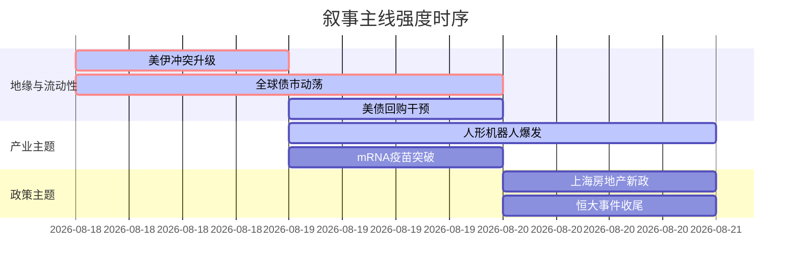

## A股市场情绪分析报告

**数据时段**：最近5日（2026年8月18日-8月20日）  
**生成时间**：2026-08-20

---

### 🔥 宏观叙事焦点（24小时三级过滤）

#### 📌 叙事主线一：美伊冲突升级与全球债市动荡 ⭐⭐⭐
**主要事件**：中东地缘冲突、美债收益率飙升、全球风险资产调整  
**筛选标签**：`地缘冲突` `全球债市` `路透信源·权重2.0`  
**宏观逻辑**：  
> ① **归类**：地缘风险事件+流动性冲击  
> ② **历史镜像**：2022年俄乌冲突初期全球股债双杀模板  
> ③ **市场传导**：美30年期国债收益率创19年新高→全球长债抛售潮→A股双创指数单日暴跌超6%→避险资产（黄金突破4500美元）领涨  
> ④ **叙事强度**：地缘冲突与债务危机共振，市场风险偏好急剧收缩  

**行业映射**：贵金属/能源/防御性板块（情绪评分 **7.2/10**）  
**交易警示**：‼️ 关注美债收益率走势与霍尔木兹海峡局势，警惕风险资产继续承压  

---

#### 📌 叙事主线二：人形机器人产业爆发与商业化加速 ⭐⭐  
**主要事件**：宇树科技上市首日暴涨460%、2026世界机器人大会开幕  
**筛选标签**：`工信部政策` `产业生命周期` `财新信源·权重1.5`  
**宏观逻辑**：  
> ① **归类**：产业技术突破与商业化落地  
> ② **历史镜像**：2015年新能源汽车政策驱动模板  
> ③ **市场传导**：宇树科技上市引发险资布局硬科技→机器人ETF受关注→具身智能产业链估值重估  
> ④ **叙事强度**：政策定位"全球标杆"，产业资本密集进场，商业化进程加速  

**行业映射**：机器人/人工智能/高端制造（情绪评分 **6.8/10**）  
**交易警示**：⚠️ 关注商业化落地进度与估值消化节奏，警惕短期炒作回调  

---

#### 📌 叙事主线三：房地产政策优化与恒大事件收尾 ⭐  
**主要事件**：上海优化房地产政策、许家印案宣判  
**筛选标签**：`地方政策` `债务周期` `新华社信源·权重1.5`  
**宏观逻辑**：  
> ① **归类**：房地产风险出清与政策托底  
> ② **历史镜像**：2014年棚改货币化+2020年"三道红线"政策模板  
> ③ **市场传导**：上海二套房贷优化→城中村改造启动→许家印无期徒刑宣判→万科债务展期完成→房企风险逐步出清  
> ④ **叙事强度**：政策意图明确，但市场底仍需验证  

**行业映射**：房地产/银行/基建（情绪评分 **5.0/10**）  
**交易警示**：✓ 叙事逻辑清晰，等待销售数据验证政策效果  

---

### 📅 宏观叙事演化（三日趋势）

**强度衰减模型**：昨日主题×0.7 · 前日主题×0.5

```mermaid
gantt
    title 叙事主线强度时序
    dateFormat YYYY-MM-DD
    section 地缘与流动性
    美伊冲突升级     :crit, active, 2026-08-18, 1d
    全球债市动荡     :crit, active, 2026-08-18, 2d
    美债回购干预     :active, 2026-08-19, 1d
    
    section 产业主题
    人形机器人爆发   :active, 2026-08-19, 2d
    mRNA疫苗突破     :2026-08-19, 1d
    
    section 政策主题
    上海房地产新政   :2026-08-20, 1d
    恒大事件收尾     :2026-08-20, 1d
```

**叙事节点关联**：
- 08/18：美伊60天谈判期满破裂→伊朗发射弹道导弹→全球债市收益率飙升
- 08/19：美债30年期收益率创19年新高→A股双创指数暴跌超6%→宇树科技上市引爆机器人概念
- 08/20：美财政部扩大国债回购干预→上海出台房地产新政→许家印案宣判

🎯 宏观叙事三要素

1️⃣ **政策意图解码**  
当前顶层叙事从"稳增长"转向"防风险+调结构"并行。美伊冲突推升地缘风险溢价，国内政策着力于房地产风险出清与科技创新产业培育，政策定力与结构性支持并重。

2️⃣ **市场定价偏差**  
过度定价：科技股估值回调压力（美债收益率冲击）  
定价不足：贵金属避险属性（黄金突破4500美元）、机器人产业化进度

3️⃣ **跨市场共振**  
美债收益率飙升→全球风险资产调整→A股科技股领跌+防御板块逆势→黄金/原油因地缘风险走强→比特币突破7万美元创6月以来新高

---

<!-- 报告正文必须在此结束，以下内容为固定格式说明，严禁添加任何额外分析、总结或展望 -->

---

*生成时间：2026-08-20 18:46:08 (UTC+8)*  
*使用模型：agnes:agnes-2.0-flash*