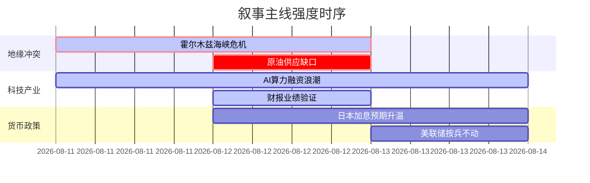

## A股市场情绪分析报告

**数据时段**：最近5日（2026-08-11 至 2026-08-13）  
**生成时间**：2026年8月13日 19:03 CST

---

### 🔥 宏观叙事焦点（24小时三级过滤）

#### 📌 叙事主线一：霍尔木兹海峡地缘冲突与能源航运冲击 ⭐⭐⭐
**主要事件**：伊朗否认美国"完全控制"霍尔木兹说法，海峡航运量降至三个月低位  
**筛选标签**：`地缘政治` `原油价格飙升` `IEA预警` `路透信源·权重2.0`  
**宏观逻辑**：  
> ① **归类**：地缘风险事件冲击  
> ② **历史镜像**：2022年俄乌冲突后能源危机模板  
> ③ **市场传导**：布伦特原油突破90美元 → 黄金突破4440美元 → VIX指数跳升 → 避险情绪蔓延  
> ④ **叙事强度**：供应缺口预计达180万桶/日，特朗普要求伊朗赔偿加剧谈判不确定性  

**行业映射**：航运/能源/黄金（情绪评分 **7.8/10**）  
**交易警示**：‼️ 关注油价突破90美元后对通胀预期的二次冲击，警惕避险资产高位回调风险  

---

#### 📌 叙事主线二：AI算力军备竞赛与产业链爆发 ⭐⭐⭐
**主要事件**：英伟达联手六大机构敲定5000亿美元AI基建融资，CoreWeave财报超预期  
**筛选标签**：`科技产业` `AI算力` `财新信源·权重1.8`  
**宏观逻辑**：  
> ① **归类**：产业投资浪潮  
> ② **历史镜像**：2010年移动互联网基建投资周期模板  
> ③ **市场传导**：算力期货推出 → A股CPO/算力股爆发 → 联想涨超21% → 腾讯资本开支528亿元创新高  
> ④ **叙事强度**：AI基建进入资本密集期，产业链景气度验证期  

**行业映射**：算力硬件/CPO/半导体（情绪评分 **7.5/10**）  
**交易警示**：⚠️ 关注算力板块估值分化，部分个股已过度定价，警惕业绩验证期波动  

---

#### 📌 叙事主线三：日本央行加息预期升温与汇率干预博弈 ⭐⭐
**主要事件**：日本政府支持央行加快加息步伐，9月紧缩概率达74%  
**筛选标签**：`央行货币政策` `日元汇率` `新华社信源·权重1.5`  
**宏观逻辑**：  
> ① **归类**：货币政策转向  
> ② **历史镜像**：2000年日本央行首次加息周期模板  
> ③ **市场传导**：日元逼近160关口 → 美日联合干预效果消退 → 日韩股市分化 → 跨境资金流动扰动  
> ④ **叙事强度**：日元贬值结构性问题凸显，政策温差令干预震慑力大打折扣  

**行业映射**：出口导向型制造业/银行股（情绪评分 **6.2/10**）  
**交易警示**：✓ 美联储9月加息概率降至40%，中美政策错位窗口期，关注北向资金流向变化  

---

### 📅 宏观叙事演化（三日趋势）

**强度衰减模型**：昨日主题×0.7 · 前日主题×0.5

```mermaid
gantt
    title 叙事主线强度时序
    dateFormat YYYY-MM-DD
    section 地缘冲突
    霍尔木兹海峡危机   :crit, active, 2026-08-11, 2d
    原油供应缺口       :crit, 2026-08-12, 1d
    
    section 科技产业
    AI算力融资浪潮     :active, 2026-08-11, 3d
    财报业绩验证       :active, 2026-08-12, 1d
    
    section 货币政策
    日本加息预期升温   :2026-08-12, 2d
    美联储按兵不动     :2026-08-13, 1d
```

**叙事节点关联**：
- 08/11：布伦特原油突破90美元 → 触发能源危机叙事
- 08/12：IEA下调需求预期，供应缺口180万桶/日 → 地缘叙事强化
- 08/13：英伟达5000亿美元AI融资落地 → 科技叙事进入政策验证期
- 08/13：日本9月加息概率达74% → 货币政策叙事升温

---

### 🎯 宏观叙事三要素

**1️⃣ 政策意图解码**  
当前全球政策呈现"东紧西松"格局：日本央行加速加息步伐，美联储维持观望态度，中国央行适度宽松延续。地缘冲突成为干扰政策传导的核心变量。

**2️⃣ 市场定价偏差**  
- 过度定价：消费复苏弹性（预期过于乐观，实际汽车零售下降20.9%）  
- 定价不足：AI算力资本开支强度（5000亿美元融资规模被低估）  
- 定价过度：日元干预效果（市场低估日本政策转向决心）

**3️⃣ 跨市场共振**  
地缘冲突推升能源价格 → 通胀预期升温 → 黄金突破4440美元 → 美债收益率高位 → 新兴市场流动性承压 = A股结构性行情窗口期，关注科技成长与避险资产双主线

---

---

*生成时间：2026-08-13 19:12:27 (UTC+8)*  
*使用模型：agnes:agnes-2.0-flash*