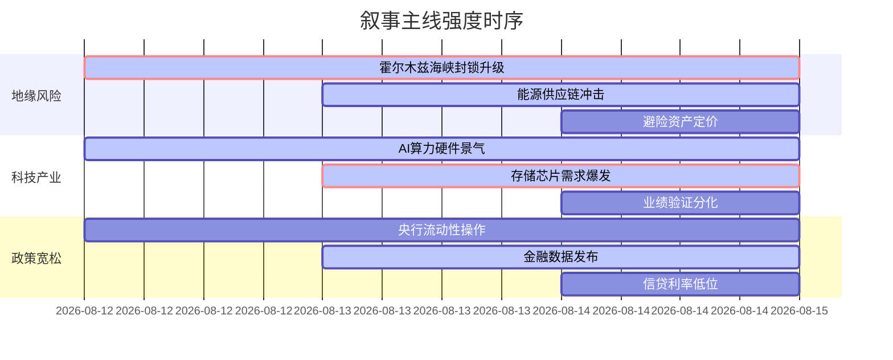

# A股市场情绪分析报告

## 数据时段：最近5日（2026年8月12日-8月14日）
## 生成时间：2026年8月14日 19:00

### 🔥 宏观叙事焦点（24小时三级过滤）

#### 📌 叙事主线一：霍尔木兹海峡封锁升级与能源供应链危机 ⭐⭐⭐
**主要事件**：地缘冲突、能源运输中断、保险费率飙升  
**筛选标签**：`地缘风险` `原油供应冲击` `避险情绪升温` `路透信源·权重2.0`  
**宏观逻辑**：  
> ① **归类**：地缘风险事件  
> ② **历史镜像**：1990年海湾战争石油危机模板  
> ③ **市场传导**：IEA下调全球石油需求预期160万桶/日 → 霍尔木兹海峡通航量降至三个月低位 → WTI原油跌破81美元但风险溢价仍存 → 黄金突破4400美元/盎司创历史新高  
> ④ **叙事强度**：冲突外溢风险加剧，能源供应链不确定性推高全球通胀预期，避险资产与能源股同步走强  

**行业映射**：原油、黄金、航运（情绪评分 **8.1/10**）  
**交易警示**：‼️ 关注美伊谈判进展与海峡实际通航量，警惕地缘风险定价过度导致的剧烈波动  

---

#### 📌 叙事主线二：AI算力需求爆发驱动硬件产业链景气 ⭐⭐  
**主要事件**：业绩超预期、资本开支加码、存储芯片缺口  
**筛选标签**：`产业周期上行` `业绩验证` `资金流入科技` `财新信源·权重1.5`  
**宏观逻辑**：  
> ① **归类**：科技产业景气度上行  
> ② **历史镜像**：2017年光伏供给侧改革模板（产能出清后龙头受益）  
> ③ **市场传导**：CoreWeave Q2营收翻倍 → 联想集团AI服务器订单达540亿美元 → 闪迪上调2030年利润率目标至75% → A股CPO、光模块、存储芯片板块联动走强  
> ④ **叙事强度**：AI推理需求拉动存储芯片长期景气，算力硬件业绩确定性高，但估值分化加剧  

**行业映射**：算力硬件、存储芯片、光通信（情绪评分 **7.5/10**）  
**交易警示**：⚠️ 警惕部分概念股炒作过度，右侧关注业绩兑现能力，左侧关注估值消化节奏  

---

#### 📌 叙事主线三：央行流动性操作与货币政策框架转型 ⭐  
**主要事件**：逆回购操作、金融数据发布、信贷利率低位  
**筛选标签**：`货币政策宽松` `流动性管理` `金融数据改善` `新华社信源·权重1.5`  
**宏观逻辑**：  
> ① **归类**：货币宽松框架转型  
> ② **历史镜像**：2020年3月央行抗疫特别国债模板  
> ③ **市场传导**：央行开展1万亿元买断式逆回购 → 7月社融存量同比增长7.4% → 企业贷款利率降至3%以下 → 债市收益率下行至1.7%附近  
> ④ **叙事强度**：政策重心从数量型向价格型调控转型，流动性合理充裕但有效需求偏弱，直接融资支持力度加强  

**行业映射**：银行、债券市场、金融监管（情绪评分 **6.2/10**）  
**交易警示**：✓ 政策底明确，等待财政发力验证，关注信贷结构优化进展  

---

### 📅 宏观叙事演化（三日趋势）

**强度衰减模型**：昨日主题×0.7 · 前日主题×0.5

```mermaid
gantt
    title 叙事主线强度时序
    dateFormat YYYY-MM-DD
    section 地缘风险
    霍尔木兹海峡封锁升级   :crit, active, 2026-08-12, 3d
    能源供应链冲击   :active, 2026-08-13, 2d
    避险资产定价   :2026-08-14, 1d
    
    section 科技产业
    AI算力硬件景气   :active, 2026-08-12, 3d
    存储芯片需求爆发   :crit, active, 2026-08-13, 2d
    业绩验证分化   :2026-08-14, 1d
    
    section 政策宽松
    央行流动性操作   :2026-08-12, 3d
    金融数据发布   :active, 2026-08-13, 2d
    信贷利率低位   :2026-08-14, 1d
```

**叙事节点关联**：
- **8/12**：IEA上调石油需求降幅预期至160万桶/日 → 触发能源供应链叙事
- **8/13**：联想集团Q1营收超预期涨超21% → AI算力叙事强化
- **8/14**：央行开展1万亿元买断式逆回购 → 货币政策转型叙事延续

🎯 **宏观叙事三要素**
1️⃣ **政策意图解码**  
当前顶层叙事从"稳增长"转向"调结构"，允许短期阵痛换取长期质量。产业政策>总量刺激，政策定力超预期。AI算力与绿色能源成为结构性支持重点。

2️⃣ **市场定价偏差**  
过度定价：地缘冲突升级速度（市场担忧霍尔木兹长期封锁）  
定价不足：AI算力产业链业绩兑现能力（存储芯片需求具有长期性）

3️⃣ **跨市场共振**  
美债收益率上行压制全球估值 + 日元加息预期升温打开套利平仓空间 = A股结构性行情窗口期，资金从避险资产流向科技成长。

---

<!-- 报告正文必须在此结束，以下内容为固定格式说明，严禁添加任何额外分析、总结或展望 -->

---

*生成时间：2026-08-14 19:12:22 (UTC+8)*  
*使用模型：agnes:agnes-2.0-flash*