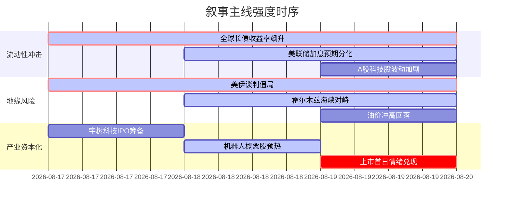

## A股市场情绪分析报告

**数据时段**：最近5日（2026年8月15日-8月19日）  
**生成时间**：2026年8月19日

---

### 🔥 宏观叙事焦点（24小时三级过滤）

#### 📌 叙事主线一：全球长债收益率飙升引发科技股重挫 ⭐⭐⭐
**主要事件**：美国30年期国债收益率创2007年来新高，A股与全球科技股共振下跌  
**筛选标签**：`美联储政策` `全球债市风暴` `路透信源·权重2.0`  
**宏观逻辑**：  
> ① **归类**：流动性紧缩预期  
> ② **历史镜像**：2013年"缩减恐慌"模板，美债收益率快速上行压制风险资产估值  
> ③ **市场传导**：30年期美债收益率突破5.33% → VIX跳升+18% → A股双创指数跌超6% → 半导体板块重挫  
> ④ **叙事强度**：AI基建融资需求与通胀黏性双重绞杀，全球长债遭遇系统性抛售  

**行业映射**：半导体/AI算力（情绪评分 **4.2/10**）  
**交易警示**：‼️ 美债收益率若持续上行，成长股估值压力未消，关注央行公开市场操作信号

---

#### 📌 叙事主线二：美伊地缘冲突升级推升能源成本 ⭐⭐⭐
**主要事件**：阿联酋暂停与伊朗贸易金融往来，霍尔木兹海峡对峙持续，油价触及三周高位  
**筛选标签**：`地缘政治` `能源供应链` `新华社信源·权重1.5`  
**宏观逻辑**：  
> ① **归类**：供给侧冲击  
> ② **历史镜像**：2019年霍尔木兹海峡危机模板，油价短期冲高后震荡分化  
> ③ **市场传导**：布伦特原油维持91美元/桶上方 → 能源成本推升通胀预期 → 全球债市承压  
> ④ **叙事强度**：60天谈判窗口期满未续，伊朗威胁升级，地缘风险溢价显著  

**行业映射**：油气/航运（情绪评分 **6.8/10**），化工/农产品（情绪评分 **5.5/10**）  
**交易警示**：⚠️ 油价对A股影响分化，能源链受益但成本端承压，关注OPEC+产能弹性

---

#### 📌 叙事主线三：机器人产业资本化加速 ⭐⭐
**主要事件**：宇树科技科创板上市首日飙涨486%，银河通用实现规模商用落地  
**筛选标签**：`产业资本化` `人形机器人` `财新信源·权重1.5`  
**宏观逻辑**：  
> ① **归类**：新技术商业化拐点  
> ② **历史镜像**：2020年新能源汽车渗透率突破10%临界点模板，产业资本化加速期  
> ③ **市场传导**：宇树科技市值突破3400亿元 → 机器人概念集体回调（利好兑现） → 资金流向应用端  
> ④ **叙事强度**：国产人形机器人出货量占全球超97%，北京亦庄成产业集聚区，政策"大力推动"定调  

**行业映射**：人形机器人/具身智能（情绪评分 **7.5/10**）  
**交易警示**：✓ 短期炒作兑现，关注后续商用订单与业绩验证，右侧配置看应用端

---

### 📅 宏观叙事演化（三日趋势）

**强度衰减模型**：昨日主题×0.7 · 前日主题×0.5

```mermaid
gantt
    title 叙事主线强度时序
    dateFormat YYYY-MM-DD
    section 流动性冲击
    全球长债收益率飙升   :crit, active, 2026-08-17, 3d
    美联储加息预期分化   :active, 2026-08-18, 2d
    A股科技股波动加剧   :2026-08-19, 1d
    
    section 地缘风险
    美伊谈判僵局   :crit, active, 2026-08-17, 3d
    霍尔木兹海峡对峙   :active, 2026-08-18, 2d
    油价冲高回落   :2026-08-19, 1d
    
    section 产业资本化
    宇树科技IPO筹备   :2026-08-17, 1d
    机器人概念股预热   :active, 2026-08-18, 1d
    上市首日情绪兑现   :crit, 2026-08-19, 1d
```

**叙事节点关联**：
- **08/17**：美债30年期收益率突破5.31% → 触发全球债市抛售叙事；宇树科技IPO前路演，机器人概念预热
- **08/18**：A股V型反弹但半导体承压 → 流动性博弈加剧；美伊60天窗口期满，地缘叙事强化
- **08/19**：宇树科技上市首日飙涨 → 产业资本化叙事达到情绪高潮；双创指数跌超6% → 长债冲击传导至权益市场

---

**🎯 宏观叙事三要素**

**1️⃣ 政策意图解码**  
当前顶层叙事从"稳增长"转向"调结构"，允许短期阵痛换取长期质量。产业资本化（机器人/AI）> 总量刺激，政策定力超预期。公积金条例大修、县域商业提档升级释放结构性信号。

**2️⃣ 市场定价偏差**  
- **过度定价**：科技股估值弹性（美债收益率上行压制未充分反映）  
- **定价不足**：机器人产业商业化速度（宇树上市只是起点，商用落地加速期）  
- **定价过度**：地缘风险持续性（油价冲高后震荡，供应链韧性被低估）

**3️⃣ 跨市场共振**  
美债收益率飙升打开美元流动性收紧预期 + 人民币升值至6.74 + 韩元破1400关口 = 新兴市场资金分化，A股结构性行情窗口期。黄金突破4400美元但受长债压制，呈现"避险与流动性博弈"特征。

---

*生成时间：2026-08-19 18:46:25 (UTC+8)*  
*使用模型：agnes:agnes-2.0-flash*