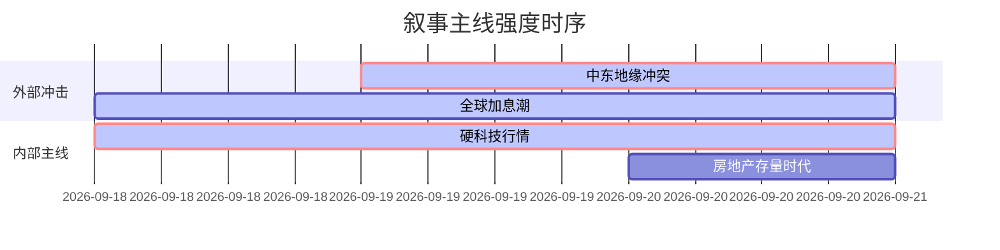

# A股市场情绪分析报告

## 数据时段
2026年9月18日 - 2026年9月21日

## 生成时间
2026年9月21日

---

## 🔥 宏观叙事焦点（24小时三级过滤）

#### 📌 叙事主线一：中东地缘冲突推升能源成本冲击 ⭐⭐⭐
**主要事件**：美伊冲突、霍尔木兹海峡风险、油价剧烈波动  
**筛选标签**：`地缘冲突` `能源安全` `国际大宗商品·权重2.0`  
**宏观逻辑**：  
> ① **归类**：外部供给冲击  
> ② **历史镜像**：2022年俄乌冲突初期油价暴涨模板  
> ③ **市场传导**：霍尔木兹海峡风险持续推升油价→布伦特原油向105美元/桶靠拢→全球通胀预期升温→央行政策空间受限  
> ④ **叙事强度**：中东冲突未现降级迹象，能源风险溢价持续定价  

**行业映射**：石油石化、航运物流（情绪评分 **7.5/10**）  
**交易警示**：‼️ 关注油价与A股周期股联动，警惕输入性通胀预期扰动  

---

#### 📌 叙事主线二：A股硬科技行情深化 ⭐⭐⭐
**主要事件**：芯片股爆发、国产替代加速、AI算力产业景气  
**筛选标签**：`产业政策` `科技自主可控` `市场情绪·权重1.8`  
**宏观逻辑**：  
> ① **归类**：科技自主迭代  
> ② **历史镜像**：2019年半导体产业扶持政策模板  
> ③ **市场传导**：长鑫科技第五代DRAM量产+海光信息CPU发布→电子板块获主力资金净流入超290亿元→科创AI指数连阳  
> ④ **叙事强度**：国产算力生态拐点确立，硬科技主线共识强化  

**行业映射**：半导体、AI算力、消费电子（情绪评分 **8.2/10**）  
**交易警示**：⚠️ 警惕短期涨幅过大后的获利了结，关注三季报业绩验证  

---

#### 📌 叙事主线三：全球加息潮重塑流动性预期 ⭐⭐
**主要事件**：美联储重启加息、日本央行创31年新高利率、全球债市承压  
**筛选标签**：`央行政策` `全球流动性` `外盘传导·权重1.5`  
**宏观逻辑**：  
> ① **归类**：货币政策转向  
> ② **历史镜像**：2015年底美联储开启加息周期模板  
> ③ **市场传导**：三大央行同步加息→美债收益率重回5%→全球风险资产估值承压→人民币汇率升破6.7  
> ④ **叙事强度**：海外紧缩周期重启，A股独立走势面临考验  

**行业映射**：银行、金融（情绪评分 **5.8/10**）  
**交易警示**：✓ 关注北向资金流向与汇率波动，流动性收紧预期压制成长股估值  

---

## 📅 宏观叙事演化（三日趋势）

**强度衰减模型**：昨日主题×0.7 · 前日主题×0.5

```mermaid
gantt
    title 叙事主线强度时序
    dateFormat YYYY-MM-DD
    section 外部冲击
    中东地缘冲突   :crit, active, 2026-09-19, 2d
    全球加息潮     :active, 2026-09-18, 3d
    
    section 内部主线
    硬科技行情     :crit, active, 2026-09-18, 3d
    房地产存量时代 :2026-09-20, 1d
```

**叙事节点关联**：
- 09/18：特朗普签署对俄伊制裁法案 → 中东冲突叙事升温
- 09/19：也门胡塞武装袭击沙特 → 能源供应链风险强化
- 09/20：芯片股大爆发，电子板块净流入290亿 → 硬科技主线确立
- 09/20：美联储如期加息25BP → 全球流动性收紧预期落地

---

## 🎯 宏观叙事三要素

### 1️⃣ 政策意图解码
当前顶层叙事从"稳增长"转向"调结构"，产业自主可控优先级提升。硬科技主线获得政策与资本双重共振，房地产进入存量管理新阶段。

### 2️⃣ 市场定价偏差
**过度定价**：全球衰退预期（忽视中国经济韧性）  
**定价不足**：国产算力产业链突破速度（长鑫DRAM、昇腾生态进展超预期）

### 3️⃣ 跨市场共振
中东冲突推升油价 vs A股科技股独立走强 = 内外叙事分化加剧；美联储加息压制全球风险资产，但A股机构调研热度创阶段性新高，显示内资信心修复。

---

## 📊 补充指标概览

| 指标 | 数值 | 解读 |
|------|------|------|
| 市场情绪 | 中性偏积极 | 放量上涨但分化加剧 |
| 机构调研热度 | 1716家上市公司，2127轮调研 | 关注度显著提升 |
| 成交额 | 重回2万亿元 | 增量资金入场 |
| 北向资金 | 波动加大 | 受汇率与外盘扰动 |
| 主要风险点 | 中东冲突、油价波动 | 外部不确定性突出 |

---

*本报告基于公开信息整理，不构成投资建议。*

---

*生成时间：2026-09-21 08:13:41 (UTC+8)*  
*使用模型：agnes:agnes-2.0-flash*