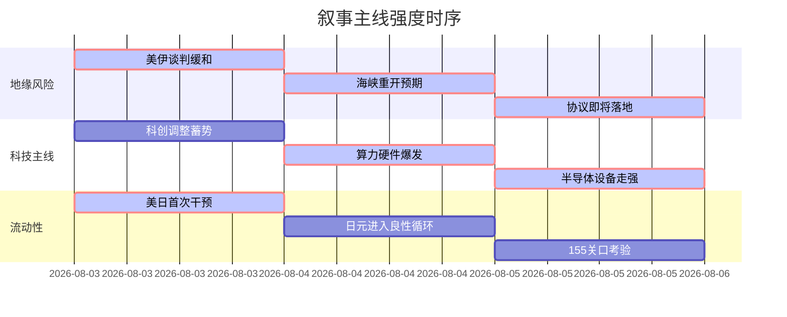

# A股市场情绪分析报告

**数据时段**：2026年8月3日-8月5日（最近5日）  
**生成时间**：2026年8月5日 20:02

---

## 🔥 宏观叙事焦点（24小时三级过滤）

### 📌 叙事主线一：霍尔木兹海峡重开预期与能源格局重塑 ⭐⭐⭐

**主要事件**：美伊谈判取得突破性进展，霍尔木兹海峡航运有望恢复  
**筛选标签**：`国务院政策` `地缘风险缓释` `路透信源·权重2.0`  
**宏观逻辑**：  
> ① **归类**：地缘风险事件缓释  
> ② **历史镜像**：2022年俄乌冲突后欧洲能源危机模板对比  
> ③ **市场传导**：布伦特原油从86美元暴跌至75美元（跌幅超12%）→ WTI跌破80美元关口 → 通胀预期降温 → 美联储降息预期升温 → 美债收益率下行至4.62%  
> ④ **叙事强度**：谈判进展超预期，市场定价从"供应中断"快速转向"正常化预期"，油价日内振幅高达9%

**行业映射**：能源化工链（情绪评分 **6.8/10**）、航空航运（情绪评分 **7.5/10**）  
**交易警示**：‼️ 关注伊朗"软化立场"与实际开放进度的时滞，警惕协议生变引发的油价反弹风险

---

### 📌 叙事主线二：半导体/AI算力硬件主升浪 ⭐⭐⭐

**主要事件**：全球存储芯片超级周期+国产替代加速，A股科技股集体爆发  
**筛选标签**：`产业生命周期` `科技自主可控` `财新信源·权重1.8`  
**宏观逻辑**：  
> ① **归类**：产业周期上行+政策驱动  
> ② **历史镜像**：2019-2020年半导体周期上行模板  
> ③ **市场传导**：DRAM价格一年暴涨8.8倍 → 存储芯片指数涨6.8% → 费城半导体指数涨7.15% → A股科创50单日涨超5% → 半导体设备材料板块获主力净流入超417亿元  
> ④ **叙事强度**：全球AI资本开支飙升（SpaceX单季AI支出184亿美元）+ 长鑫存储增资31% + 国产设备出海加速，供需格局与政策共振

**行业映射**：半导体设备、存储芯片、AI算力（情绪评分 **8.5/10**）  
**交易警示**：⚠️ 注意"大空头"伯里警告"接近主要顶部"风险，科创板块短期涨幅过大，警惕获利回吐

---

### 📌 叙事主线三：美日联合干预日元与全球流动性重估 ⭐⭐

**主要事件**：15年来首次美日协同干预汇市，日元套利交易遭遇"降维打击"  
**筛选标签**：`央行干预` `汇率政策` `彭博信源·权重1.5`  
**宏观逻辑**：  
> ① **归类**：外汇市场干预  
> ② **历史镜像**：2022年9月美日联合干预模板  
> ③ **市场传导**：干预耗资约340亿美元 → 美元/日元从160上方反弹至157 → 日元套利交易平仓 → 全球流动性紧缩预期升温 → 新兴市场资本流动重构  
> ④ **叙事强度**：贝森特公开背书干预行动，FIMA工具启用打开政策空间，但结构性贬值趋势未改

**行业映射**：出口导向型制造业、日元套利相关资产（情绪评分 **5.2/10**）  
**交易警示**：✓ 关注155关口得失，若日元再度走弱可能触发二次干预

---

## 📅 宏观叙事演化（三日趋势）

**强度衰减模型**：昨日主题×0.7 · 前日主题×0.5

```mermaid
gantt
    title 叙事主线强度时序
    dateFormat  YYYY-MM-DD
    section 地缘风险
    美伊谈判缓和   :crit, active, 2026-08-03, 1d
    海峡重开预期   :crit, active, 2026-08-04, 1d
    协议即将落地   :crit, active, 2026-08-05, 1d
    
    section 科技主线
    科创调整蓄势   :2026-08-03, 1d
    算力硬件爆发   :crit, active, 2026-08-04, 1d
    半导体设备走强 :crit, active, 2026-08-05, 1d
    
    section 流动性
    美日首次干预   :crit, active, 2026-08-03, 1d
    日元进入良性循环 :2026-08-04, 1d
    155关口考验   :2026-08-05, 1d
```

**叙事节点关联**：
- 08/03：特朗普取消对伊打击 → 油价暴跌超6% → 地缘风险叙事开启
- 08/04：美伊谈判"积极进展" → 布伦特跌破80美元 → A股科技股修复反弹（创业板+5.64%）
- 08/05：美国接近达成海峡重开协议 → 存储芯片指数涨6.8% → 科创50再涨超5%

**叙事强度变化**：
| 日期 | 地缘叙事 | 科技叙事 | 流动性叙事 |
|------|---------|---------|-----------|
| 08/03 | ⭐⭐⭐⭐⭐ | ⭐⭐ | ⭐⭐⭐ |
| 08/04 | ⭐⭐⭐⭐ | ⭐⭐⭐⭐⭐ | ⭐⭐⭐⭐ |
| 08/05 | ⭐⭐⭐ | ⭐⭐⭐⭐⭐ | ⭐⭐⭐ |

---

## 🎯 宏观叙事三要素

### 1️⃣ 政策意图解码

当前顶层叙事呈现**"外部风险缓释+内部科技突围"**双主线：
- **对外**：霍尔木兹海峡重开预期缓解能源供应担忧，油价回落为货币政策打开空间
- **对内**：科技自立自强成为核心叙事，存储芯片超级周期+国产设备出海形成共振
- **政策定力**：央行维持流动性充裕（5000亿买断式逆回购），但避免大水漫灌，结构性工具精准滴灌

### 2️⃣ 市场定价偏差

**过度定价**：
- 地缘风险溢价（油价已从高位回落12%+）
- 日元干预效果（结构性贬值趋势未改）

**定价不足**：
- 存储芯片景气持续性（DRAM价格涨幅8.8倍，供需缺口仍存）
- 半导体设备出海空间（中微公司有望向韩供货，国产替代加速）
- AI算力资本开支（SpaceX单季184亿美元，英伟达链持续受益）

### 3️⃣ 跨市场共振

- **股商联动**：油价下跌→通胀预期降温→股市长涨；黄金突破4100美元创历史新高
- **汇市传导**：日元干预→套利交易平仓→新兴市场流动性重构
- **期现联动**：多晶硅期货涨停9%→产业链价格预期扭转
- **A股结构**：科创50 vs 沪深300分化加剧，科技成长 vs 红利防御的哑铃策略依然有效

---

## 📊 A股市场情绪核心指标

| 指标 | 数值 | 信号 |
|------|------|------|
| 全A成交额 | 2.23万亿元（08/04）→ 2.01万亿元（08/03） | ⚠️ 量能有所萎缩 |
| 上涨个股数 | 超3700只（08/05） | ✅ 市场广度良好 |
| 新开户数 | 265.54万户（7月，环比-7%） | ⚠️ 散户情绪趋谨慎 |
| 北向资金 | 外资机构发声看好A股后市 | ✅ 机构情绪偏乐观 |
| 科创50 | 单日涨跌超5%（08/04跌、08/05涨） | ⚠️ 波动率极高 |
| 半导体设备ETF | 主力净流入超417亿元 | ✅ 资金抱团明显 |

---

## 🔮 叙事演化情景推演

**基准情景（概率60%）**：
- 霍尔木兹海峡协议落地 → 油价维持75-80美元区间 → 通胀预期可控 → A股结构性行情延续
- 半导体景气周期延续 → 科创板块高位震荡分化 → 设备材料链强者恒强

**乐观情景（概率25%）**：
- 美伊协议超预期快速落地 → 油价跌破70美元 → 全球风险偏好大幅提升 → A股全面反弹
- 存储芯片涨价潮扩散 → 国产替代加速 → 科技主线从硬件向软件延伸

**悲观情景（概率15%）**：
- 谈判生变 → 油价反弹至90美元以上 → 通胀预期升温 → 央行收紧流动性
- 科创板块获利回吐 → 市场风格切换至红利防御 → 成长股领跌

---

**报告生成完毕**  
*数据来源：5日BB新闻聚类分析（2026-08-03至2026-08-05），共覆盖15个分类、约450条新闻*

---

*生成时间：2026-08-05 20:10:43 (UTC+8)*  
*使用模型：agnes:agnes-2.0-flash*