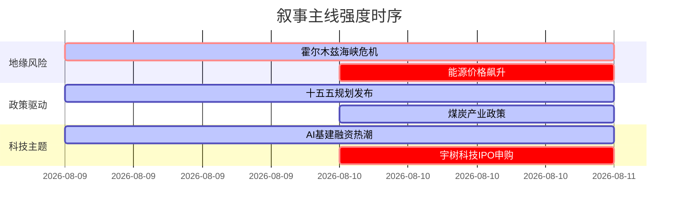

# A股市场情绪分析报告

**数据时段**：最近5日（2026-08-07 至 2026-08-11）  
**生成时间**：2026年8月11日

---

## 🔥 宏观叙事焦点（24小时三级过滤）

### 📌 叙事主线一：霍尔木兹海峡危机与全球能源供应震荡 ⭐⭐⭐
**主要事件**：地缘冲突、能源危机  
**筛选标签**：`地缘政治` `原油价格冲击` `路透信源·权重2.0`  
**宏观逻辑**：  
> ① **归类**：地缘风险事件升级  
> ② **历史镜像**：1979年伊朗革命后霍尔木兹海峡封锁模板  
> ③ **市场传导**：布伦特原油突破87美元/桶 → 欧洲天然气单日暴涨12.5% → 美战略石油储备跌破3亿桶创40年新低 → 能源通胀预期升温  
> ④ **叙事强度**：美伊博弈进入"博弈中段"，海峡协议前景渺茫，地缘溢价持续推升  

**行业映射**：能源化工链（情绪评分 **8.1/10**）  
**交易警示**：‼️ 关注油价突破90美元后的供需再平衡，警惕地缘缓和预期突发性反转  

---

### 📌 叙事主线二：中国"十五五"规划政策密集落地 ⭐⭐  
**主要事件**：产业政策、央行改革  
**筛选标签**：`国务院政策` `十五五规划` `新华社信源·权重1.5`  
**宏观逻辑**：  
> ① **归类**：产业政策强化  
> ② **历史镜像**：2016年供给侧改革政策组合拳模板  
> ③ **市场传导**：央行"十五五"规划部署五大核心任务 → 煤炭产能集中度提升目标87% → 科技创新金融配套加速  
> ④ **叙事强度**：顶层设计从"稳增长"转向"调结构"，产业主线明确，政策定力超预期  

**行业映射**：煤炭、科技金融、生态保护（情绪评分 **6.8/10**）  
**交易警示**：⚠️ 关注政策落地节奏与市场反应的时间差，警惕预期充分定价后的获利回吐  

---

### 📌 叙事主线三：AI基建融资热潮与半导体板块分化 ⭐  
**主要事件**：科技融资、产业投资  
**筛选标签**：`科技产业` `英伟达融资` `财新信源·权重1.5`  
**宏观逻辑**：  
> ① **归类**：科技资本扩张  
> ② **历史镜像**：2000年互联网基建投资潮模板  
> ③ **市场传导**：英伟达联手华尔街六大巨头筹划5000亿美元AI基建融资 → 英特尔150亿美元增发引发担忧 → 科创半导体ETF领涨4.12%vs AI ETF领跌3.13%  
> ④ **叙事强度**：AI算力需求持续爆发，但估值分歧加剧，板块内部分化显著  

**行业映射**：半导体、人形机器人（情绪评分 **6.2/10**）  
**交易警示**：✓ 宇树科技IPO申购爆火（5526倍认购）验证赛道热度，但需注意"预期博弈"向"现实验证"切换风险  

---

## 📅 宏观叙事演化（三日趋势）

**强度衰减模型**：昨日主题×0.7 · 前日主题×0.5

```mermaid
gantt
    title 叙事主线强度时序
    dateFormat YYYY-MM-DD
    section 地缘风险
    霍尔木兹海峡危机   :crit, active, 2026-08-09, 2d
    能源价格飙升       :crit, 2026-08-10, 1d
    
    section 政策驱动
    十五五规划发布     :active, 2026-08-09, 2d
    煤炭产业政策       :active, 2026-08-10, 1d
    
    section 科技主题
    AI基建融资热潮     :active, 2026-08-09, 2d
    宇树科技IPO申购    :crit, 2026-08-10, 1d
```

**叙事节点关联**：
- **08/09**：美伊"博弈中段"表态 → 原油破82美元 → 地缘叙事升温
- **08/10**：霍尔木兹海峡通行草案公布 → 欧洲天然气单日暴涨12% → 能源危机叙事强化
- **08/10**：宇树科技申购爆火+半导体板块分化 → 科技叙事进入验证期
- **08/11**：央行"十五五"规划落地+煤炭政策发布 → 政策叙事进入发酵期

---

**叙事三要素**

**1️⃣ 政策意图解码**  
当前顶层叙事从"总量刺激"转向"结构优化"，十五五规划密集发布体现政策定力。产业出清（煤炭产能集中）> 总量扩张，科技创新与能源安全并重。

**2️⃣ 市场定价偏差**  
- **过度定价**：AI概念整体估值（创业板AI ETF领跌3.13%反映分歧）
- **定价不足**：能源供应风险溢价（地缘冲突对油气产业链影响持续性被低估）
- **定价充分**：医药板块反弹（创新药链周涨6.27%已充分反映预期）

**3️⃣ 跨市场共振**  
美债收益率曲线陡峭化（30年期飙至5.27%）+ 日元干预红利消退 + 黄金单周暴涨7%重返4400美元 = 全球风险资产重定价窗口期，A股结构性行情分化加剧。

---

---

*生成时间：2026-08-11 06:52:01 (UTC+8)*  
*使用模型：agnes:agnes-2.0-flash*