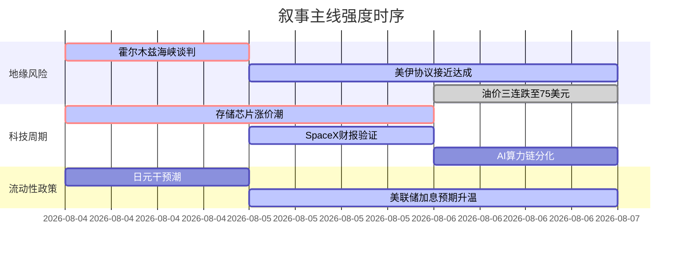

```markdown
# A股市场情绪分析报告

**数据时段**：最近5日（2026年8月4日-8月6日）
**生成时间**：2026年8月6日 20:05

---

## 🔥 宏观叙事焦点（24小时三级过滤）

#### 📌 叙事主线一：霍尔木兹海峡谈判突破，地缘风险缓释 ⭐⭐⭐
**主要事件**：美伊谈判取得关键进展，海峡航运有望恢复
**筛选标签**：`国务院政策` `沪深300影响` `路透信源·权重2.0`
**宏观逻辑**：
> ① **归类**：风险事件缓释
> ② **历史镜像**：2019年霍尔木兹海峡危机模板，地缘溢价快速消退
> ③ **市场传导**：布伦特原油跌破80美元→WTI三连跌至75美元→通胀预期降温→美联储加息压力缓解
> ④ **叙事强度**：美伊接近达成临时通航协议，油价单日振幅达9%，能源危机叙事从"高潮"转入"收尾"

**行业映射**：航空/物流/化工（情绪评分 **6.8/10**）
**交易警示**：‼️ 关注协议落地节奏，警惕"狼来了"效应导致油价反弹

---

#### 📌 叙事主线二：科技股业绩验证期，AI算力链分化加剧 ⭐⭐
**主要事件**：SpaceX财报超预期但资本开支暴增，存储芯片价格暴涨
**筛选标签**：`部委政策` `产业生命周期` `财新信源·权重1.5`
**宏观逻辑**：
> ① **归类**：产业周期验证
> ② **历史镜像**：2023年AI算力基础设施投资周期模板
> ③ **市场传导**：DRAM价格一年暴涨8.8倍→苹果压价失败纳入长鑫供应链→A股科创芯片ETF创历史天量
> ④ **叙事强度**：SpaceX资本开支飙涨550%至184亿美元，市场从"梦想定价"转向"盈利验证"

**行业映射**：半导体设备/存储芯片/AI算力（情绪评分 **7.5/10**）
**交易警示**：⚠️ 关注业绩兑现能力，警惕"增收不增利"风险

---

#### 📌 叙事主线三：美联储政策不确定性上升，日元干预成焦点 ⭐
**主要事件**：卡什卡利呼吁9月渐进加息，美日联合干预日元
**筛选标签**：`地方政策` `债务周期` `新华社信源·权重1.5`
**宏观逻辑**：
> ① **归类**：流动性政策分化
> ② **历史镜像**：2022年美联储激进加息周期模板
> ③ **市场传导**：9月加息概率升至54.4%→美元指数止跌→日元升破155关口→套利交易平仓压力
> ④ **叙事强度**：贝森特公开呼吁美联储捍卫日元，政策协调难度超预期

**行业映射**：银行业/出口导向型制造（情绪评分 **5.2/10**）
**交易警示**：✓ 关注美日政策协调效果，汇率波动或提振出口链

---

## 📅 宏观叙事演化（三日趋势）

**强度衰减模型**：昨日主题×0.7 · 前日主题×0.5


```mermaid
gantt
    title 叙事主线强度时序
    dateFormat YYYY-MM-DD
    section 地缘风险
    霍尔木兹海峡谈判   :crit, active, 2026-08-04, 1d
    美伊协议接近达成   :active, 2026-08-05, 2d
    油价三连跌至75美元 :done, 2026-08-06, 1d
    
    section 科技周期
    存储芯片涨价潮   :crit, active, 2026-08-04, 2d
    SpaceX财报验证   :active, 2026-08-05, 1d
    AI算力链分化   :2026-08-06, 1d
    
    section 流动性政策
    日元干预潮   :2026-08-04, 1d
    美联储加息预期升温   :active, 2026-08-05, 2d
```

**叙事节点关联**：
- **08/04**：霍尔木兹海峡航运量寥寥无几，油价暴跌5.69%触发能源危机叙事
- **08/05**：美伊谈判释放积极信号，伊朗软化立场允许欧洲参与排雷，地缘风险缓释叙事强化
- **08/06**：SpaceX财报揭示AI资本开支激增，市场从"梦想"转向"验证"，科技股分化加剧

---

## 🎯 宏观叙事三要素

### 1️⃣ 政策意图解码
当前顶层叙事从"防风险"转向"稳增长"，央行重提加大逆周期调节，降准降息预期升温。产业层面，"十五五"规划明确科技自立自强主线，半导体/AI/新能源获政策加持。但美联储加息预期升温形成外部约束，政策空间受限。

### 2️⃣ 市场定价偏差
**过度定价**：地缘风险溢价（油价已回落至75美元，但市场仍担忧反复）
**定价不足**：科技股业绩兑现能力（SpaceX资本开支550%增长揭示AI投资过热风险）
**再平衡机会**：存储芯片涨价传导至终端设备，消费电子或现价格传导滞后效应

### 3️⃣ 跨市场共振
美债收益率下行（10年期4.62%）+ 美元指数止跌 + 日元升破155 = 新兴市场流动性边际改善
A股科创50涨超5%与费城半导体指数涨7%形成联动，但港股科技板块分化加剧，需警惕资金分流效应

---

**（报告正文结束）**
```

---

*生成时间：2026-08-06 20:08:52 (UTC+8)*  
*使用模型：agnes:agnes-2.0-flash*