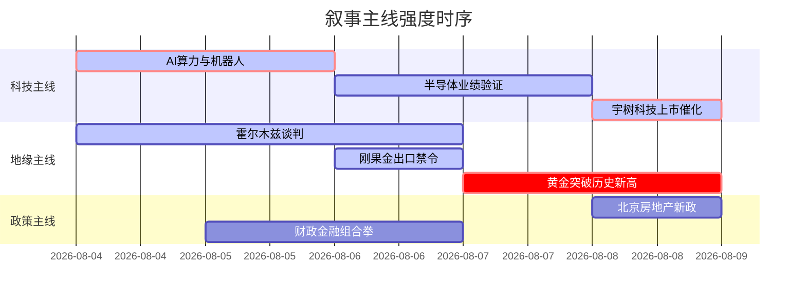

# A股市场情绪分析报告

**数据时段**：2026-08-04 至 2026-08-08（最近5日）
**生成时间**：2026-08-08 06:52:18 (UTC+8)

### 🔥 宏观叙事焦点（24小时三级过滤）

#### 📌 叙事主线一：AI算力革命与人形机器人产业化加速 ⭐⭐⭐
**主要事件**：宇树科技IPO定价150元、寒武纪业绩大增、SpaceX市值突破1.67万亿美元、SK海力士巨额投资
**筛选标签**：`产业生命周期` `科技龙头业绩` `资本狂欢` `信源·权重2.0`
**宏观逻辑**：
> ① **归类**：科技成长主线强化
> ② **历史镜像**：2023年全球AI应用爆发期（Sora/ChatGPT发布）
> ③ **市场传导**：宇树科技高估值上市 → 机器人产业链情绪升温 → 寒武纪业绩验证AI芯片景气度 → 北向资金回流科技板块
> ④ **叙事强度**：从概念炒作转向业绩兑现，人形机器人进入产业化元年，科技牛市逻辑清晰

**行业映射**：AI算力链、人形机器人、半导体（情绪评分 **8.5/10**）
**交易警示**：‼️ 关注宇树科技上市后对机器人板块的估值锚定效应，警惕短期获利回吐

---

#### 📌 叙事主线二：地缘风险溢价与能源供给重构 ⭐⭐
**主要事件**：霍尔木兹海峡谈判进展、美国对俄能源制裁、刚果（金）禁止铜钴出口
**筛选标签**：`地缘冲突` `供应链中断` `大宗商品` `信源·权重1.8`
**宏观逻辑**：
> ① **归类**：供给侧冲击与避险情绪
> ② **历史镜像**：2022年俄乌冲突引发的能源危机
> ③ **市场传导**：海峡谈判不确定性 → 油价维持83美元高位 → 有色板块因供应中断暴涨 → 黄金突破4300美元
> ④ **叙事强度**：地缘风险未完全消退，新能源金属供应链重塑带来结构性机会

**行业映射**：有色金属、黄金、油气（情绪评分 **7.0/10**）
**交易警示**：⚠️ 霍尔木兹海峡协议进展将直接影响油价波动，注意避险资产与周期股的轮动

---

#### 📌 叙事主线三：房地产政策优化与经济温和修复 ⭐
**主要事件**：北京出台房地产新政、财政金融打出"组合拳"、7月进出口数据高位放缓
**筛选标签**：`宏观政策` `内需刺激` `经济数据` `信源·权重1.5`
**宏观逻辑**：
> ① **归类**：政策托底与结构性修复
> ② **历史镜像**：2020年疫情后房地产政策宽松周期
> ③ **市场传导**：北京降社保年限 → 改善型需求释放 → 深圳豪宅成交回暖 → 房地产链预期修复
> ④ **叙事强度**：政策力度超预期，但经济数据显示价格驱动效应明显，复苏基础尚不牢固

**行业映射**：房地产、建材、消费（情绪评分 **6.2/10**）
**交易警示**：✓ 政策底已现，但市场底仍需数据验证，关注后续财政发力节奏

---

### 📅 宏观叙事演化（三日趋势）

**强度衰减模型**：昨日主题×0.7 · 前日主题×0.5

```mermaid
gantt
    title 叙事主线强度时序
    dateFormat YYYY-MM-DD
    section 科技主线
    AI算力与机器人   :crit, active, 2026-08-04, 2d
    半导体业绩验证   :active, 2026-08-06, 2d
    宇树科技上市催化 :crit, active, 2026-08-08, 1d
    
    section 地缘主线
    霍尔木兹谈判     :active, 2026-08-04, 3d
    刚果金出口禁令   :active, 2026-08-06, 1d
    黄金突破历史新高 :crit, 2026-08-07, 2d
    
    section 政策主线
    北京房地产新政   :2026-08-08, 1d
    财政金融组合拳   :2026-08-05, 2d
```

**叙事节点关联**：
- **08/04-05**：SpaceX财报引爆AI算力投资担忧，同时谷歌AI部门大调整，科技板块内部出现分歧
- **08/06**：刚果（金）禁止铜钴出口，有色金属板块异动，新能源金属供应链叙事强化
- **08/07**：寒武纪业绩大增验证AI芯片景气度，宇树科技IPO定价150元，人形机器人产业化叙事确立
- **08/08**：北京房地产新政出台，政策托底预期升温，市场情绪由科技单核向"科技+政策"双核演化

**🎯 宏观叙事三要素**

1️⃣ **政策意图解码**
当前政策组合呈现"科技扶持+地产托底+监管规范"三角稳定结构。顶层叙事从"强刺激"转向"精准滴灌"，允许科技板块高估值演绎，同时对房地产风险进行有序化解。

2️⃣ **市场定价偏差**
**过度定价**：传统消费复苏弹性（预期过于乐观，数据尚未验证）
**定价不足**：AI产业化落地速度（宇树科技IPO后机器人产业链有望重估）
**定价充分**：黄金避险属性（4300美元已反映降息预期与地缘风险）

3️⃣ **跨市场共振**
美债收益率下行打开全球流动性空间 + 人民币重回三年半高位 = A股科技板块获得估值支撑 + 北向资金持续流入科技龙头

---

---

*生成时间：2026-08-08 06:52:18 (UTC+8)*  
*使用模型：agnes:agnes-2.0-flash*