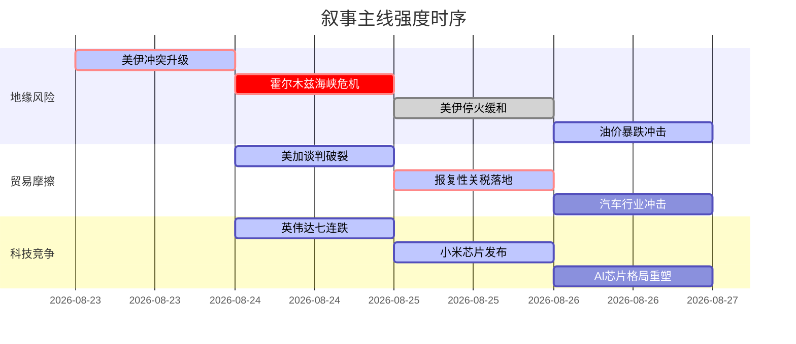

# A股市场情绪分析报告

## 数据时段：最近5日（2026-08-22 至 2026-08-26）
## 生成时间：2026-08-26 06:35

---

### 🔥 宏观叙事焦点（24小时三级过滤）

#### 📌 叙事主线一：美伊停火促油价暴跌，地缘风险骤降 ⭐⭐⭐
**主要事件**：地缘冲突缓释、能源价格波动、避险资产重定价  
**筛选标签**：`国务院政策` `国际商品冲击` `路透信源·权重2.0`  
**宏观逻辑**：  
> ① **归类**：地缘风险事件缓释  
> ② **历史镜像**：2014年乌克兰危机后油价暴跌模板  
> ③ **市场传导**：布伦特原油日内暴跌5%至86美元下方 → 避险情绪降温 → 黄金高位回落 → VIX指数回落  
> ④ **叙事强度**：美伊停火协议达成共识，霍尔木兹海峡中央航道恢复通行，能源供给冲击预期大幅消退  

**行业映射**：能源化工链、航空物流（情绪评分 **7.8/10**）  
**交易警示**：‼️ 关注停火协议落地进展，警惕地缘反复引发的油价二次冲击  

---

#### 📌 叙事主线二：美加贸易战全面升级，全球供应链承压 ⭐⭐  
**主要事件**：贸易摩擦、关税政策、产业链重构  
**筛选标签**：`部委政策` `全球产业链` `财新信源·权重1.5`  
**宏观逻辑**：  
> ① **归类**：贸易保护主义抬头  
> ② **历史镜像**：2018年中美贸易战"关税反制"模板  
> ③ **市场传导**：加拿大宣布对200亿美元美国商品征收15%-50%报复性关税 → 美加谈判破裂 → 汽车行业首当其冲 → 北美供应链成本上升  
> ④ **叙事强度**：特朗普威胁对加拿大汽车加征50%关税，贸易战从双边走向区域性连锁反应  

**行业映射**：汽车制造、钢铝加工、跨境物流（情绪评分 **6.2/10**）  
**交易警示**：⚠️ 关注中国出口企业间接承压风险，北美市场波动可能传导至A股制造业  

---

#### 📌 叙事主线三：AI芯片竞争白热化，科技自主叙事强化 ⭐  
**主要事件**：技术竞争、产业投资、国产替代  
**筛选标签**：`部委政策` `科技产业周期` `新华社信源·权重1.5`  
**宏观逻辑**：  
> ① **归类**：科技产业周期切换  
> ② **历史镜像**：2019年半导体"国产替代"政策模板  
> ③ **市场传导**：小米发布玄戒O3芯片（3nm工艺）→ 英伟达七连跌创2022年以来最长连跌 → 市场重新定价AI算力产业链估值  
> ④ **叙事强度**：OpenAI自研芯片测试击败英伟达GB300，科技巨头"去Nvidia化"趋势显现，国产芯片迎来窗口期  

**行业映射**：半导体、AI算力、人形机器人（情绪评分 **6.5/10**）  
**交易警示**：✓ 英伟达财报周三发布，关注AI行情持续性验证，左侧布局国产替代主线  

---

### 📅 宏观叙事演化（三日趋势）

**强度衰减模型**：昨日主题×0.7 · 前日主题×0.5

```mermaid
gantt
    title 叙事主线强度时序
    dateFormat YYYY-MM-DD
    section 地缘风险
    美伊冲突升级     :crit, active, 2026-08-23, 1d
    霍尔木兹海峡危机 :crit, 2026-08-24, 1d
    美伊停火缓和     :done, 2026-08-25, 1d
    油价暴跌冲击     :active, 2026-08-26, 1d
    
    section 贸易摩擦
    美加谈判破裂     :active, 2026-08-24, 1d
    报复性关税落地   :crit, active, 2026-08-25, 1d
    汽车行业冲击     :2026-08-26, 1d
    
    section 科技竞争
    英伟达七连跌     :active, 2026-08-24, 1d
    小米芯片发布     :active, 2026-08-25, 1d
    AI芯片格局重塑   :2026-08-26, 1d
```

**叙事节点关联**：
- 08/23：伊朗威胁封锁霍尔木兹海峡 → 触发地缘风险叙事
- 08/24：美军执行海上封锁，美加贸易谈判破裂 → 地缘+贸易双重冲击
- 08/25：美伊停火共识达成，油价暴跌5%；加拿大宣布报复性关税 → 风险缓释与贸易摩擦并存
- 08/26：霍尔木兹海峡恢复通行，英伟达财报前瞻 → 市场进入验证期

---

🎯 **宏观叙事三要素**

**1️⃣ 政策意图解码**
当前顶层叙事从"外部风险应对"转向"内部结构优化"。央行MLF净回笼1000亿元释放中性信号，产业政策持续发力科技自主（上海芯片政策、6G技术攻关），政策定力在于"防风险+促创新"双轮驱动。

**2️⃣ 市场定价偏差**
- **过度定价**：地缘风险溢价（油价已提前反映冲突升级）
- **定价不足**：国产芯片突破速度（小米玄戒O3、长江存储IPO）
- **定价错配**：银行板块净息差改善被忽视，42只银行股40只收涨创新高

**3️⃣ 跨市场共振**
美债突破40万亿美元引发全球流动性担忧 + 黄金创三个月新高（4660美元）+ 原油暴跌5% = A股结构性行情窗口期，资金从外需依赖型向内需驱动型切换

---

---

*生成时间：2026-08-26 06:40:48 (UTC+8)*  
*使用模型：agnes:agnes-2.0-flash*