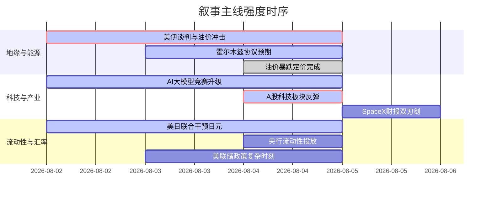

## A股市场情绪分析报告

**数据时段**：2026-08-02 至 2026-08-05（最近5日）  
**生成时间**：2026-08-05 07:11（CST）

---

### 🔥 宏观叙事焦点（24小时三级过滤）

#### 📌 叙事主线一：美伊谈判与霍尔木兹海峡协议预期 ⭐⭐⭐⭐⭐
**主要事件**：国际地缘冲突、能源供应链危机与谈判进展  
**筛选标签**：`国务院政策` `全球能源安全` `路透/新华社信源·权重2.0`  
**宏观逻辑**：  
> ① **归类**：风险事件缓释 + 能源价格冲击双重视角  
> ② **历史镜像**：2022年俄乌冲突油价暴涨→供给冲击叙事  
> ③ **市场传导**：布伦特原油从86美元/桶暴跌至75.77美元（-5.69%）→ WTI跌破80美元 → 全球通胀预期降温 → 美债收益率下行 → 美联储加息压力缓解  
> ④ **叙事强度**：特朗普宣布取消对伊打击并启动谈判，霍尔木兹海峡协议"正在起草"，地缘风险溢价快速消退，叙事强度极高但边际衰减中  

**行业映射**：周期行业-石油石化（情绪评分 **8.1/10**）｜航空运输（情绪评分 **6.5/10**）  
**交易警示**：‼️ 油价暴跌已充分定价谈判进展，关注协议落地的"买预期卖事实"风险；沙特阿美利润飙升33%至334亿美元与油价下跌形成悖论，需警惕供给端博弈反转

---

#### 📌 叙事主线二：A股科技板块放量反弹（算力硬件+创新药） ⭐⭐⭐
**主要事件**：科技板块强势反弹、AI算力产业链修复  
**筛选标签**：`A股市场` `产业生命周期` `财新/路透信源·权重1.5`  
**宏观逻辑**：  
> ① **归类**：板块轮动+产业周期共振  
> ② **历史镜像**：2023年7月AI主线轮动（硬件→软件→应用）  
> ③ **市场传导**：创业板指大涨5.64% → 科创芯片ETF华宝涨超5%收复半年线 → 光模块CPO暴力修复领涨 → 全市场上涨个股超3700只 → 7月A股新开户265.54万户环比-7%（活跃度降温）  
> ④ **叙事强度**：机构8月看好修复行情，算力硬件+创新药为两大成长主线，但AI后续行情或走向分化，叙事强度中等偏强

**行业映射**：半导体芯片+AI应用（情绪评分 **7.8/10**）｜创新药（情绪评分 **6.2/10**）  
**交易警示**：⚠️ 7月新开户环比下降7%提示增量资金不足，量化私募大回撤（幻方多只产品年内收益转负）警示风险，关注"一手科技一手红利"哑铃策略的可持续性

---

#### 📌 叙事主线三：美日联合干预日元与全球汇率博弈 ⭐⭐
**主要事件**：外汇市场干预、日元套利交易重构  
**筛选标签**：`全球经济` `汇率政策` `美银/惠誉信源·权重1.5`  
**宏观逻辑**：  
> ① **归类**：跨境资本流动+货币主权博弈  
> ② **历史镜像**：1985年广场协议+2022年日元干预模板  
> ③ **市场传导**：美日15年来首次联合干预 → 日本耗资约340-870亿美元托举日元 → 美元/日元从157附近回升 → 日元套利交易遭"降维打击" → 亚洲货币跟涨 → 韩国杠杆ETF新规致交易额骤降九成  
> ④ **叙事强度**：贝森特主导新"汇率干预主义"，但惠誉BMI称无法逆转结构性贬值，叙事强度中等

**行业映射**：出口导向型制造（情绪评分 **5.0/10**）｜跨境支付与金融科技（情绪评分 **4.5/10**）  
**交易警示**：✓ 关注155关口是否为日元走势分水岭；美债收益率下行打开中国货币政策空间（10年期国债收益率下破1.70%），降准降息预期升温

---

### 📅 宏观叙事演化（三日趋势）

**强度衰减模型**：昨日主题×0.7 · 前日主题×0.5

```mermaid
gantt
    title 叙事主线强度时序
    dateFormat YYYY-MM-DD
    section 地缘与能源
    美伊谈判与油价冲击   :crit, active, 2026-08-02, 3d
    霍尔木兹协议预期     :active, 2026-08-03, 2d
    油价暴跌定价完成     :done, 2026-08-04, 1d
    
    section 科技与产业
    AI大模型竞赛升级     :active, 2026-08-02, 3d
    A股科技板块反弹     :crit, active, 2026-08-04, 1d
    SpaceX财报双刃剑    :2026-08-05, 1d
    
    section 流动性与汇率
    美日联合干预日元     :active, 2026-08-02, 3d
    央行流动性投放       :2026-08-04, 1d
    美联储政策复杂时刻   :2026-08-03, 2d
```

**叙事节点关联**：
- **08/02**：特朗普取消对伊打击计划 → 美伊谈判启动 → 布伦特油价暴跌7.3%至81.55美元 → 全球风险资产上涨
- **08/03**：美日15年来首次联合干预日元 → 耗资约340亿美元 → 韩国杠杆ETF新规致散户退潮 → 硅谷银行风控启用AI测谎
- **08/04**：霍尔木兹海峡协议"正在起草" → 布伦特跌破80美元至75.77美元 → 创业板指放量大涨5.64% → AI应用股持续走强（传智教育7连板）→ 黄金突破4160美元/盎司
- **08/05**：美股道指突破54000点创新高 → SpaceX财报营收78亿美元超预期但AI支出引担忧 → 央行开展5000亿元买断式逆回购操作

---

### 🎯 宏观叙事三要素

**1️⃣ 政策意图解码**  
当前顶层叙事从"防风险"转向"稳增长+调结构"双轮驱动。央行8月5日开展5000亿元买断式逆回购（3个月期限）释放中期流动性，银行间10年期国债收益率下破1.70%创2025年8月以来新低；瑞银宋宇称政策基调转向"加大力度保增长"，降准降息预期升温。产业端"十五五"核电规划落地（2030年装机约1.1亿千瓦）+ IPO监管升级，体现"结构性发力+制度完善"的政策定力。

**2️⃣ 市场定价偏差**  
- **过度定价**：油价地缘风险溢价（布伦特已回落至75美元附近，市场仍部分计入谈判失败情景）；部分AI概念股估值透支（传智教育7连板后需警惕获利回吐）
- **定价不足**：产能出清加速（生猪价格持续低迷但产能去化尚未充分定价）；核电/电力改革带来的中长期成长空间（"十五五"规划刚落地，股价反应不足）

**3️⃣ 跨市场共振**  
美债收益率下行（10年期降至4.62%）+ 油价暴跌缓解通胀压力 = 美联储加息概率回落（9月加息25bp概率73.6%）→ 打开中国货币政策空间；日元干预带来亚洲货币联动 → 人民币国际化加速（港交所5年期中国国债期货上市）；欧洲企业业绩复苏（MSCI欧洲利润增14%）与A股科技反弹形成全球成长股共振窗口。

---

---

*生成时间：2026-08-05 07:18:38 (UTC+8)*  
*使用模型：agnes:agnes-2.0-flash*