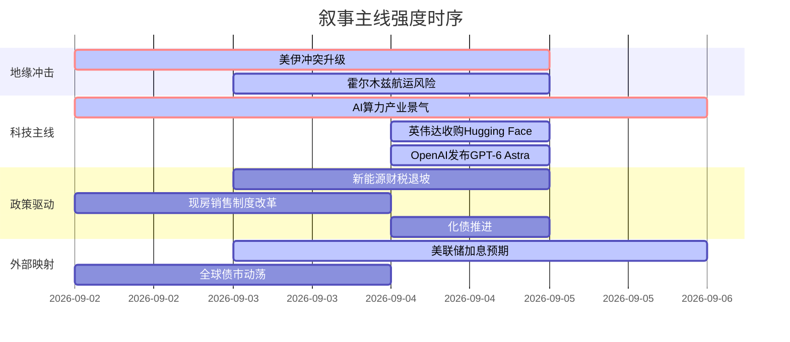

# A股市场情绪分析报告

## 数据时段：最近5日（2026/09/02-2026/09/05）
## 生成时间：2026-09-05 08:00:00

### 🔥 宏观叙事焦点（24小时三级过滤）

#### 📌 叙事主线一：美伊冲突升级与霍尔木兹海峡航运风险 ⭐⭐⭐
**主要事件**：地缘冲突升级、能源供应链冲击  
**筛选标签**：`地缘冲突` `霍尔木兹海峡` `路透信源·权重2.0`  
**宏观逻辑**：  
> ① **归类**：地缘风险事件  
> ② **历史镜像**：1990年海湾战争石油禁运模板  
> ③ **市场传导**：霍尔木兹海峡航运受阻→原油WTI突破90美元→全球通胀预期升温→美联储加息预期反弹至60%  
> ④ **叙事强度**：冲突烈度超预期，能源安全从边缘话题跃升为核心定价因子  

**行业映射**：油气、航运、军工（情绪评分 **7.5/10**）  
**交易警示**：‼️ 关注霍尔木兹海峡通航恢复进度，警惕能源价格二次冲击通胀预期  

---

#### 📌 叙事主线二：AI算力产业链景气度持续验证 ⭐⭐⭐
**主要事件**：英伟达129亿美元收购Hugging Face、OpenAI发布GPT-6 Astra  
**筛选标签**：`科技并购` `算力基础设施` `财新信源·权重1.8`  
**宏观逻辑**：  
> ① **归类**：科技产业投资周期  
> ② **历史镜像**：2000年互联网基础设施建设模板  
> ③ **市场传导**：AI应用层并购潮→算力硬件需求爆发→A股成交额重上2万亿→中京电子等涨停潮  
> ④ **叙事强度**：产业趋势明确，资金持续聚焦AI主线，龙头业绩验证期  

**行业映射**：算力硬件、PCB、CPO（情绪评分 **8.0/10**）  
**交易警示**：‼️ 关注英伟达收购后Hugging Face开源生态变化，警惕概念炒作退潮风险  

---

#### 📌 叙事主线三：中国新能源产业政策退坡与市场化转型 ⭐⭐
**主要事件**：新能源车财税优惠退出、光伏装机首超煤电  
**筛选标签**：`产业政策` `能源转型` `新华社信源·权重1.5`  
**宏观逻辑**：  
> ① **归类**：产业生命周期切换  
> ② **历史镜像**：2013年光伏"531"政策出清模板  
> ③ **市场传导**：购置税退坡+电池消费税恢复→新能源车迈向市场化竞争→光伏装机突破煤电→绿色能源主力电源确立  
> ④ **叙事强度**：政策从补贴驱动转向市场驱动，行业进入优胜劣汰新阶段  

**行业映射**：新能源汽车、光伏设备（情绪评分 **5.8/10**）  
**交易警示**：⚠️ 关注政策退坡对销量的实际影响，警惕产业链价格战超预期  

---

#### 📌 叙事主线四：美联储加息预期与全球债市动荡 ⭐⭐
**主要事件**：美国8月非农就业大增16.2万、美联储内部加息辩论公开化  
**筛选标签**：`货币政策` `全球债市` `路透信源·权重1.8`  
**宏观逻辑**：  
> ① **归类**：货币政策转向预期  
> ② **历史镜像**：2015年美联储首次加息周期模板  
> ③ **市场传导**：非农超预期→加息押注反弹至60%→美债收益率上行→全球债市抛售潮→日元跌破155关口  
> ④ **叙事强度**：就业数据与通胀粘性超预期，降息预期大幅推迟  

**行业映射**：贵金属、出口导向型制造业（情绪评分 **4.2/10**）  
**交易警示**：⚠️ 关注9月CPI数据是否进一步推高加息预期，警惕人民币汇率压力  

---

#### 📌 叙事主线五：中国房地产制度改革与化债推进 ⭐ 
**主要事件**：现房销售制度改革、20年超长特别国债溢价续发  
**筛选标签**：`房地产政策` `地方债务` `财联社信源·权重1.5`  
**宏观逻辑**：  
> ① **归类**：制度性改革与风险化解  
> ② **历史镜像**：2015年棚改货币化模板（反向参照）  
> ③ **市场传导**：现房销售制度落地→房地产交付风险缓释→240亿国债引来2800亿竞购→信用利差收窄预期  
> ④ **叙事强度**：政策底信号明确，但市场底仍需销售数据验证  

**行业映射**：房地产、基建（情绪评分 **5.0/10**）  
**交易警示**：✓ 叙事逻辑清晰，等待销售数据持续验证，关注化债进度  

---

### 📅 宏观叙事演化（三日趋势）

**强度衰减模型**：昨日主题×0.7 · 前日主题×0.5

```mermaid
gantt
    title 叙事主线强度时序
    dateFormat YYYY-MM-DD
    section 地缘冲击
    美伊冲突升级   :crit, active, 2026-09-02, 3d
    霍尔木兹航运风险   :active, 2026-09-03, 2d
    
    section 科技主线
    AI算力产业景气   :crit, active, 2026-09-02, 4d
    英伟达收购Hugging Face   :active, 2026-09-04, 1d
    OpenAI发布GPT-6 Astra   :active, 2026-09-04, 1d
    
    section 政策驱动
    新能源财税退坡   :2026-09-03, 2d
    现房销售制度改革   :2026-09-02, 2d
    化债推进   :2026-09-04, 1d
    
    section 外部映射
    美联储加息预期   :active, 2026-09-03, 3d
    全球债市动荡   :2026-09-02, 2d
```

**叙事节点关联**：
- 09/02：美伊冲突升级→霍尔木兹海峡航运受阻→原油突破95美元
- 09/03：非农数据公布→美联储加息预期反弹→全球债市抛售潮
- 09/04：英伟达宣布129亿美元收购Hugging Face→AI产业叙事强化
- 09/05：A股成交额重回2万亿→科技主线资金持续流入→港股恒指涨2%

**🎯 宏观叙事三要素**

1️⃣ **政策意图解码**  
当前顶层叙事从"刺激总量"转向"结构优化+风险化解"，新能源政策退坡与现房销售改革同步推进，体现"让市场定价"的政策定力。化债进入关键窗口期，财政发力预期升温。

2️⃣ **市场定价偏差**  
过度定价：消费复苏弹性（预期过于乐观）  
定价不足：AI算力产业链景气度持续性（资金持续聚焦）、产能出清速度（光伏/新能源车政策退出后的行业整合）

3️⃣ **跨市场共振**  
美伊冲突推高能源价格→全球通胀预期升温→美联储加息押注反弹→美元走强→A股北向资金压力；同时AI产业趋势独立于宏观周期，形成结构性行情主線。

---

**情绪综合评估**：  
- 地缘风险溢价：偏高（7.5/10）  
- 科技主线热度：高（8.0/10）  
- 政策预期：中性偏暖（5.5/10）  
- 外部扰动：高（6.8/10）  

**核心矛盾**：地缘冲突推高通胀预期 vs AI产业景气度支撑结构性行情；新能源政策退坡加速出清 vs 光伏装机突破煤电彰显转型决心。

---

*生成时间：2026-09-05 07:57:17 (UTC+8)*  
*使用模型：agnes:agnes-2.0-flash*