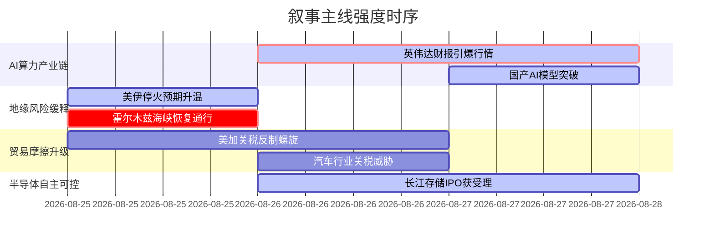

# A股市场情绪分析报告

## 数据时段：最近5日（2026-08-25至2026-08-28）

## 生成时间：2026-08-28 14:30

---

### 🔥 宏观叙事焦点（24小时三级过滤）

#### 📌 叙事主线一：英伟达财报引爆AI算力基建热潮 ⭐⭐⭐
**主要事件**：科技龙头财报超预期、AI产业投资  
**筛选标签**：`美股科技股` `AI算力链` `路透信源·权重2.0`  
**宏观逻辑**：  
> ① **归类**：产业周期拐点确认  
> ② **历史镜像**：2023年10月英伟达财报后AI主线启动模板  
> ③ **市场传导**：英伟达市值单日+4420亿美元 → 纳指涨1.6% → A股科创50日内涨2.01% → 光芯片/PCB板块活跃  
> ④ **叙事强度**：黄仁勋"AI已到达转折点"言论打破市场犹豫，业绩指引+70%超预期，算力基建投资周期延续至2028财年  

**行业映射**：AI算力产业链（情绪评分 **8.5/10**）  
**交易警示**：‼️ 关注A股国产替代链与英伟达业绩联动性，警惕财报后获利了结压力  

---

#### 📌 叙事主线二：美伊地缘缓和与能源市场重定价 ⭐⭐  
**主要事件**：地缘冲突缓和、原油价格波动
**筛选标签**：`中东局势` `原油价格` `财新信源·权重1.5`  
**宏观逻辑**：  
> ① **归类**：风险事件缓释  
> ② **历史镜像**：2019年霍尔木兹海峡危机后油价过山车模式  
> ③ **市场传导**：美伊停火预期升温 → 布伦特原油日内暴跌5%至86美元 → 能化期货集体大跌 → 黄金高位震荡消化涨幅  
> ④ **叙事强度**：海峡恢复通行降低能源溢价，但地缘博弈未终结，油价承压而非趋势反转  

**行业映射**：化工、航运（情绪评分 **5.8/10**）  
**交易警示**：⚠️ 地缘风险缓释具有反复性，关注原油库存数据与伊朗谈判进展的背离风险  

---

#### 📌 叙事主线三：美加贸易摩擦升级与北美经贸重构 ⭐ 
**主要事件**：关税反制、贸易谈判破裂
**筛选标签**：`贸易政策` `汽车行业` `新华社信源·权重1.5`  
**宏观逻辑**：  
> ① **归类**：贸易保护主义抬头  
> ② **历史镜像**：2018年中美贸易摩擦"关税反制-升级"螺旋模板  
> ③ **市场传导**：加拿大宣布200亿美元对美报复性关税 → 特朗普威胁汽车行业加征关税 → 北美供应链重构预期升温  
> ④ **叙事强度**：政治施压超过经济逻辑，信心冲击大于实质经济影响，但中期选举前政策不确定性上升  

**行业映射**：出口制造、汽车（情绪评分 **4.2/10**）  
**交易警示**：✓ 叙事逻辑清晰但A股直接关联度有限，关注新能源汽车出口链的间接影响  

---

#### 📌 叙事主线四：长江存储IPO与国产半导体自主可控 ⭐ 
**主要事件**：资本市场改革、产业政策
**筛选标签**：`IPO审核` `半导体政策` `部委政策·权重1.5`  
**宏观逻辑**：  
> ① **归类**：科技自立自强政策延续  
> ② **历史镜像**：2019年中芯国际港股IPO激活半导体投资周期  
> ③ **市场传导**：长江存储IPO获受理拟募资330亿元 → 银行AIC密集布局国产存储 → 科创50板块资金回补  
> ④ **叙事强度**：政策支持力度超预期，但审核"不封堵只提质"强调质量优先，节奏可控  

**行业映射**：半导体设备、存储芯片（情绪评分 **6.5/10**）  
**交易警示**：⚠️ 关注IPO发行定价与二级市场估值匹配度，防范破发风险传导至板块情绪  

---

### 📅 宏观叙事演化（三日趋势）

**强度衰减模型**：昨日主题×0.7 · 前日主题×0.5

```mermaid
gantt
    title 叙事主线强度时序
    dateFormat YYYY-MM-DD
    section AI算力产业链
    英伟达财报引爆行情   :crit, active, 2026-08-26, 2d
    国产AI模型突破      :active, 2026-08-27, 1d
    
    section 地缘风险缓释
    美伊停火预期升温    :active, 2026-08-25, 1d
    霍尔木兹海峡恢复通行 :crit, 2026-08-25, 1d
    
    section 贸易摩擦升级
    美加关税反制螺旋    :2026-08-25, 2d
    汽车行业关税威胁    :2026-08-26, 1d
    
    section 半导体自主可控
    长江存储IPO获受理   :active, 2026-08-26, 2d
```

**叙事节点关联**：
- 08/25：美伊停火协议预期升温 → 布伦特原油暴跌5%触发能源板块重定价
- 08/26：英伟达财报前瞻发布 → 市场进入"信心测试"阶段，AI交易波动加剧
- 08/27：英伟达Q2业绩超预期+黄仁勋"AI拐点"言论 → A股科创50日内涨2.01%，光芯片/PCB活跃
- 08/28：长江存储IPO获受理 → 国产存储链资金回补，银行AIC投资加速

---

🎯 宏观叙事三要素

**1️⃣ 政策意图解码**
当前顶层叙事从"防风险"转向"促发展"，允许短期波动换取长期科技自立。产业政策（半导体、AI）> 总量刺激，财政贴息精准滴灌中小微企业，政策定力与执行节奏超出市场预期。

**2️⃣ 市场定价偏差**
- **过度定价**：地缘风险溢价（美伊局势已部分price in，油价反应过度）
- **定价不足**：AI算力产业链业绩持续性（国产替代+全球需求共振被低估）
- **定价充分**：银行板块分化逻辑（息差收窄预期已充分反映）

**3️⃣ 跨市场共振**
美债收益率高位盘整 + 美元指数持稳 → A股流动性边际改善；英伟达财报提振全球科技股风险偏好 → 港股科网股活跃 + A股科创50跟涨；黄金4100-4700美元区间震荡，避险与通胀逻辑并存。

---

<!-- 报告正文必须在此结束，以下内容为固定格式说明，严禁添加任何额外分析、总结或展望 -->

---

*生成时间：2026-08-28 14:07:00 (UTC+8)*  
*使用模型：agnes:agnes-2.0-flash*