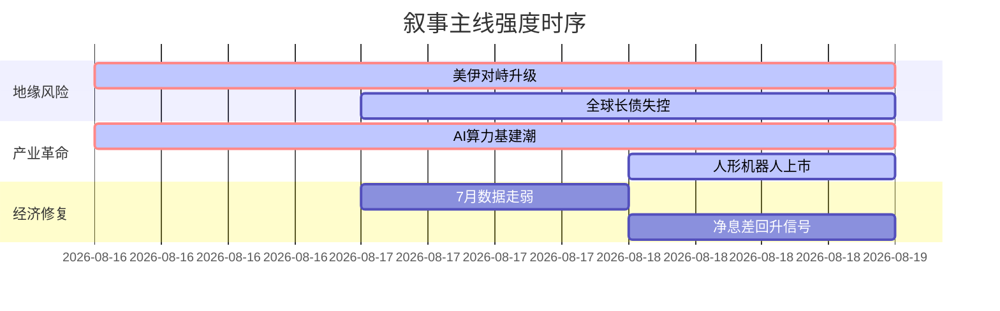

## A股市场情绪分析报告

**数据时段**：最近5日（2026年8月14日-8月18日）  
**生成时间**：2026年8月18日

---

### 🔥 宏观叙事焦点（24小时三级过滤）

#### 📌 叙事主线一：美伊对峙升级与全球能源危机 ⭐⭐⭐
**主要事件**：地缘冲突、霍尔木兹海峡航运中断、油价飙升  
**筛选标签**：`国际冲突` `能源安全` `路透信源·权重2.0`  
**宏观逻辑**：  
> ① **归类**：地缘风险事件  
> ② **历史镜像**：1973年石油禁运模板  
> ③ **市场传导**：布伦特原油逼近91美元 → 全球通胀预期升温 → 美债30年期收益率创19年新高（5.31%）→ 避险资产黄金突破4400美元  
> ④ **叙事强度**：霍尔木兹海峡通航量骤减，伊朗威胁"全面进攻性"政策，供应链冲击超预期  

**行业映射**：周期行业/能源化工（情绪评分 **6.8/10**）  
**交易警示**：‼️ 关注油价突破95美元对A股成本端压力，警惕全球滞胀交易升温  

---

#### 📌 叙事主线二：AI产业革命与算力基建竞赛 ⭐⭐⭐
**主要事件**：英伟达5000亿美元AI基建融资、Anthropic IPO前营收爆发、宇树科技科创板上市  
**筛选标签**：`产业趋势` `硬科技` `财新信源·权重1.8`  
**宏观逻辑**：  
> ① **归类**：技术革命驱动  
> ② **历史镜像**：2010年移动互联网基建潮模板  
> ③ **市场传导**：英伟达联合高盛等设立融资平台 → 算力租赁需求激增 → A股半导体/存储芯片板块爆发（中微半导涨16.81%）→ 科创50单日涨4.14%  
> ④ **叙事强度**：Anthropic年化营收破650亿美元，AI产业链从"概念炒作"进入"业绩验证"阶段  

**行业映射**：科技行业/半导体设备（情绪评分 **7.5/10**）  
**交易警示**：⚠️ 警惕OpenAI上市前高管震荡、ETF溢价风险（纳指科技ETF溢价2.87%），关注业绩兑现度  

---

#### 📌 叙事主线三：中国经济数据分化与政策托底 ⭐⭐
**主要事件**：7月社零同比0.6%弱于预期、商业银行净息差四年首次回升、发改委部署政策性金融工具  
**筛选标签**：`经济数据` `财政宽松` `国务院政策·权重1.5`  
**宏观逻辑**：  
> ① **归类**：弱复苏+政策对冲  
> ② **历史镜像**：2020年Q2数据触底+逆周期调节模板  
> ③ **市场传导**：固定资产投资降6.7% → 市场担忧内需不足 → 净息差回升至1.41%传递银行盈利修复信号 → 外资连续三个月增持中国国债  
> ④ **叙事强度**：数据底已现，政策底待验证，结构性亮点（一线城市房价环比五连涨）掩盖总量疲弱  

**行业映射**：大金融/消费复苏链（情绪评分 **5.2/10**）  
**交易警示**：✓ 关注9月政策窗口期（政治局会议），警惕预期差收窄带来的震荡  

---

### 📅 宏观叙事演化（三日趋势）

**强度衰减模型**：昨日主题×0.7 · 前日主题×0.5

```mermaid
gantt
    title 叙事主线强度时序
    dateFormat YYYY-MM-DD
    section 地缘风险
    美伊对峙升级   :crit, active, 2026-08-16, 3d
    全球长债失控   :active, 2026-08-17, 2d
    
    section 产业革命
    AI算力基建潮   :crit, active, 2026-08-16, 3d
    人形机器人上市 :active, 2026-08-18, 1d
    
    section 经济修复
    7月数据走弱   :2026-08-17, 1d
    净息差回升信号 :2026-08-18, 1d
```

**叙事节点关联**：
- **08/16**：美伊60天谈判期届满，伊朗威胁封锁霍尔木兹海峡 → 触发能源危机叙事
- **08/17**：A股科技股放量大涨（创业板指涨超3%），宇树科技科创板上市 → AI叙事强化
- **08/18**：7月经济数据发布（社零0.6%、固投-6.7%），商业银行净息差回升 → 政策托底预期升温

---

### 🎯 宏观叙事三要素

**1️⃣ 政策意图解码**  
当前顶层叙事从"稳增长"转向"防风险+调结构"双线并重。地缘冲突倒逼能源安全（油气"十五五"规划、战略储备基地），AI竞赛驱动科技自立（大基金二期现身股东名单），政策定力体现在允许短期数据阵痛换取长期质量升级。

**2️⃣ 市场定价偏差**  
- **过度定价**：消费复苏弹性（社零数据弱化但市场仍博弈政策加码）  
- **定价不足**：产能出清速度（半导体/存储芯片业绩超预期，净息差修复逻辑未充分定价）  
- **定价错误**：全球滞胀预期（美债收益率飙升已计入，但A股结构性机会被忽视）

**3️⃣ 跨市场共振**  
- 美债收益率上行 → 压制全球风险资产估值，但A股硬科技逆势走强（资金分化）  
- 黄金突破4400美元 + 人民币突破6.74 → 避险与信心并存，北向资金持续流入  
- 港股科技股回调 vs A股科技股反弹 → 内循环叙事强化，出海逻辑阶段性退潮

---

<!-- 报告正文必须在此结束，以下内容为固定格式说明，严禁添加任何额外分析、总结或展望 -->

---

*生成时间：2026-08-18 18:41:34 (UTC+8)*  
*使用模型：agnes:agnes-2.0-flash*