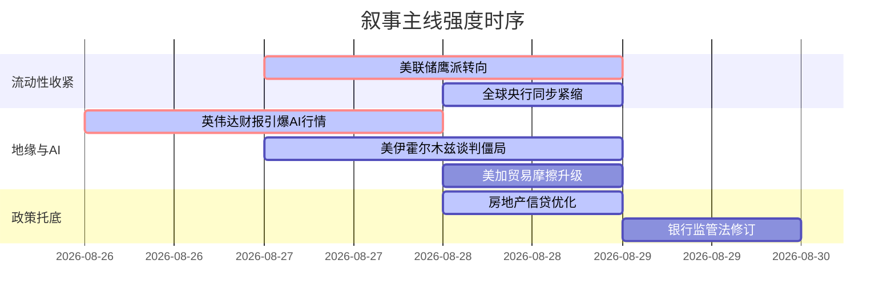

## A股市场情绪分析报告

**数据时段**：最近5日（2026-08-25 至 2026-08-29）  
**生成时间**：2026年8月29日

---

### 🔥 宏观叙事焦点（24小时三级过滤）

#### 📌 叙事主线一：美联储鹰派转向与全球流动性收紧预期 ⭐⭐⭐
**主要事件**：美联储主席沃什杰克逊霍尔演讲释放强鹰信号、全球央行同步紧缩  
**筛选标签**：`美联储政策` `全球流动性` `杰克逊霍尔·权重2.0`  
**宏观逻辑**：  
> ① **归类**：货币政策转向  
> ② **历史镜像**：2022年美联储激进加息模板  
> ③ **市场传导**：VIX指数低位隐含自满风险 → 美债收益率上行（5年期4.512%）→ 新兴市场资本外流压力加剧  
> ④ **叙事强度**：沃什首秀鹰于预期，通胀2%目标坚定不移，9月加息概率升至50%，欧央行同步鹰派

**行业映射**：科技成长股（情绪评分 **4.5/10**）  
**交易警示**：‼️ 关注PCE数据与沃什演讲的一致性，警惕流动性收紧超预期，美元走强压制A股风险偏好

---

#### 📌 叙事主线二：地缘博弈加剧与AI算力基建周期 ⭐⭐  
**主要事件**：美伊霍尔木兹海峡谈判僵局、英伟达财报引爆AI行情、美加贸易摩擦升级  
**筛选标签**：`地缘政治` `AI产业链` `英伟达财报·权重1.5`  
**宏观逻辑**：  
> ① **归类**：供给侧冲击与需求爆发并存  
> ② **历史镜像**：2000年互联网泡沫+2008年地缘危机双重叠加  
> ③ **市场传导**：原油地缘溢价消退（WTI跌破83美元）→ 黄金避险需求支撑（重回4600美元/盎司）→ AI算力资本开支激增（Anthropic 450亿美元租用Nscale算力）  
> ④ **叙事强度**：英伟达市值单日暴涨4420亿美元，但摩根士丹利披露2000亿美元表外风险敞口，AI叙事进入"信心测试"阶段

**行业映射**：AI算力链、贵金属（情绪评分 **6.8/10**）  
**交易警示**：⚠️ 地缘风险与AI估值泡沫并存，警惕英伟达财报后"买预期卖事实"，长江存储IPO 330亿注资国产算力底座

---

#### 📌 叙事主线三：中国房地产信贷优化与金融监管升级 ⭐ 
**主要事件**：两部门发文优化房贷政策、银行监管法修订二审、房企业绩分化加剧  
**筛选标签**：`部委政策` `房地产松绑` `财新信源·权重1.5`  
**宏观逻辑**：  
> ① **归类**：结构性政策托底  
> ② **历史镜像**：2014年房地产去库存政策模板  
> ③ **市场传导**：房贷收入比控制在50%以下 → 房企流动性压力阶段性缓解 → 银行资产质量分化加剧（9家银行8家投资收益负增长）  
> ④ **叙事强度**：政策决心大于市场定价，但万科上半年亏损149.5亿、富力再亏53亿，销售端仍未见明确企稳信号

**行业映射**：房地产、银行（情绪评分 **5.2/10**）  
**交易警示**：✓ 政策底已现，但市场底待确认，关注9月销售数据验证，预售资金监管强化是关键变量

---

### 📅 宏观叙事演化（三日趋势）

**强度衰减模型**：昨日主题×0.7 · 前日主题×0.5

```mermaid
gantt
    title 叙事主线强度时序
    dateFormat YYYY-MM-DD
    section 流动性收紧
    美联储鹰派转向   :crit, active, 2026-08-27, 2d
    全球央行同步紧缩   :active, 2026-08-28, 1d
    
    section 地缘与AI
    英伟达财报引爆AI行情   :crit, active, 2026-08-26, 2d
    美伊霍尔木兹谈判僵局   :active, 2026-08-27, 2d
    美加贸易摩擦升级   :2026-08-28, 1d
    
    section 政策托底
    房地产信贷优化   :active, 2026-08-28, 1d
    银行监管法修订   :2026-08-29, 1d
```

**叙事节点关联**：
- **8/25-8/26**：美伊霍尔木兹协议预期压制油价 → 英伟达财报前市场观望 → 长江存储IPO获受理（330亿）
- **8/27**：英伟达财报超预期（营收962亿美元，指引增70%）→ 黄金4600美元关口震荡 → 韩国央行加息至3.0%
- **8/28**：沃什杰克逊霍尔演讲鹰派 → 中概股受房地产政策提振（贝壳涨12%）→ AI算力资本布局加速（Anthropic 450亿）
- **8/29**：美联储9月加息概率升至50% → 银行股业绩分化（中金净利增89%vs中小券商承压）→ 黄金重回4600美元

**🎯 宏观叙事三要素**

**1️⃣ 政策意图解码**  
当前顶层叙事从"总量刺激"转向"结构优化+风险防控"，允许短期阵痛换取长期质量。产业出清>总量刺激，美联储鹰派重塑政策公信力，全球流动性收紧周期启动。

**2️⃣ 市场定价偏差**  
- **过度定价**：AI算力资本开支持续性（英伟达表外风险2000亿美元）、消费复苏弹性（茅台价格温和上涨但白酒板块分化）
- **定价不足**：产能出清速度（人形机器人估值泡沫出清、宇树科技市值缩水近2000亿）、房企流动性危机深度（万科、富力亏损扩大）

**3️⃣ 跨市场共振**  
美债收益率曲线趋平打开政策空间 + 美元指数走强（突破99）压制非美货币 = A股结构性行情窗口期，黄金避险与AI成长并行，银行股"买能力不买板块"分化加剧

---

*生成时间：2026-08-29 05:11:36 (UTC+8)*  
*使用模型：agnes:agnes-2.0-flash*