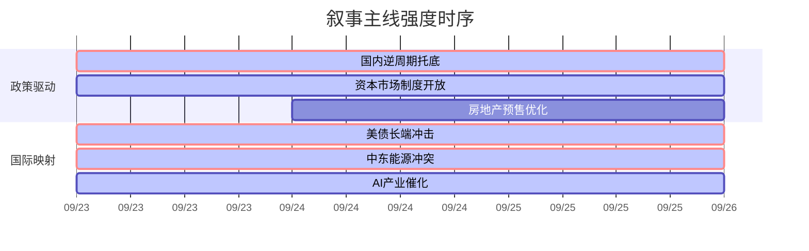

# A股市场情绪分析报告

- 数据时段：最近5日（BB有效新闻节点覆盖：2026-09-22至2026-09-25）
- 生成时间：2026-09-25 08:26:00 +08:00

## 🔥 宏观叙事焦点（24小时三级过滤）

#### 📌 叙事主线一：美债长端收益率创纪录与全球流动性紧缩 ⭐⭐⭐
**主要事件**：美联储再加息预期升温、美债长端收益率创纪录、全球债券抛售潮加剧  
**筛选标签**：`全球债市抛售` `沪深300影响` `华尔街见闻信源·权重2.0`  
**宏观逻辑**：  
> ① **归类**：外生流动性收紧与估值折现率上移  
> ② **历史镜像**：2013年“缩减恐慌” / 2022年长端利率上行压制成长估值模板  
> ③ **市场传导**：10年期美债5.11%→30年期5.44% → 美元指数101附近 → 港股科指跌1.11%、A股下跌个股超4300只 → 风险偏好收缩  
> ④ **叙事强度**：外部约束由“加息预期”升级为“长端供给冲击”，对A股成长估值形成清晰逆风  

**行业映射**：科技成长、券商（情绪评分 **3.8/10**）；红利低波相对占优（情绪评分 **5.5/10**）  
**交易警示**：‼️ 关注美债长端收益率与美元指数一致性，若30年期美债5.44%继续上冲，成长估值承压  

---

#### 📌 叙事主线二：中东冲突升级与能源安全冲击 ⭐⭐  
**主要事件**：伊朗局势激化、红海能源设施安全受扰、原油与柴油出口博弈升级  
**筛选标签**：`地缘冲突` `国际商品` `华尔街见闻信源·权重1.5`  
**宏观逻辑**：  
> ① **归类**：地缘能源供给冲击与通胀黏性强化  
> ② **历史镜像**：2022年俄乌冲突下能源价格冲击模板  
> ③ **市场传导**：霍尔木兹/红海风险升温 → 布伦特原油108美元、国内原油期货涨近7% → 油气上游盈利预期改善、化工/交运成本上行 → 周期内部再分化  
> ④ **叙事强度**：油价新高强化能源通胀交易，但美伊直接接触与元首外交带来脉冲式缓和  

**行业映射**：油气上游、航运、化工（情绪评分 **5.9/10**）  
**交易警示**：⚠️ 关注油价上行与外交缓和之间的背离，警惕地缘脉冲交易兑现后回撤  

---

#### 📌 叙事主线三：国内政策托底与资本市场制度型开放 ⭐  
**主要事件**：央行继续实施适度宽松货币政策、加大逆周期调节，北京推进现房销售，人民币柜台纳入港股通  
**筛选标签**：`中国政策` `沪深300影响` `华尔街见闻信源·权重1.5`  
**宏观逻辑**：  
> ① **归类**：国内政策托底与制度型开放  
> ② **历史镜像**：2024年9月增量政策组合下的“稳预期—稳信用—稳资产”模板  
> ③ **市场传导**：MLF 8000亿元+7天逆回购 → 大型银行服务实体经济 → 防范市场“羊群效应” → 预售管理优化、人民币柜台纳入港股通 → 金融、地产、消费、红利链预期修复  
> ④ **叙事强度**：政策底清晰，但成交与信用扩张验证不足，市场从普涨转向结构轮动  

**行业映射**：金融、地产、消费、央企红利（情绪评分 **6.2/10**）  
**交易警示**：⚠️ 关注政策力度与市场反应一致性，防范“宽货币、弱信用”导致修复斜率受限  

---

## 📅 宏观叙事演化（三日趋势）

**强度衰减模型**：昨日主题×0.7 · 前日主题×0.5

```mermaid
gantt
    title 叙事主线强度时序
    dateFormat  YYYY-MM-DD
    axisFormat  %m/%d
    section 政策驱动
    国内逆周期托底   :crit, active, 2026-09-23, 3d
    资本市场制度开放 :active, 2026-09-23, 3d
    房地产预售优化   :2026-09-24, 2d

    section 国际映射
    美债长端冲击     :crit, active, 2026-09-23, 3d
    中东能源冲突     :crit, active, 2026-09-23, 3d
    AI产业催化       :active, 2026-09-23, 3d
```

叙事节点关联：  
09/22：美伊接触与霍尔木兹海峡重开预期 + 美债收益率逼近5% + AI芯片7连阳 → 风险偏好出现分化  
09/23：美伊直接会谈、油价97美元附近 + 纳指创新高但10年期美债升至5.025% → 外部流动性压制与AI交易并存  
09/24：中东冲突升级、布伦特原油108美元、A股下跌个股超4300只 → 能源冲击成为短线情绪放大器  
09/25：中美元首互动释放稳定信号 + 央行继续适度宽松 → 国内托底叙事修复，但外部约束仍主导  

🎯 宏观叙事三要素  
1️⃣ **政策意图解码**  
国内政策意图从“稳预期”转向“稳信用 + 防风险 + 制度型开放”：央行适度宽松、银行服务实体经济、预售管理优化、人民币柜台纳入港股通共同构成托底组合；但海外美联储再加息与能源通胀使政策空间受外部约束。  

2️⃣ **市场定价偏差**  
过度定价：AI硬件、连板题材与高弹性交易预期，如AI芯片7连阳、热股7天6板等；定价不足：美债长端上行与中东油价冲击对成长估值、下游成本和风险偏好的二次压制。  

3️⃣ **跨市场共振**  
美债收益率上行 + 美元指数走强压制风险偏好；油价上行利多油气上游、压制化工/交运/消费成本；中美高层互动缓和与人民币柜台开放改善尾部风险，但尚未扭转外部流动性约束。

---

*生成时间：2026-09-25 08:30:28 (UTC+8)*  
*使用模型：openrouter:nex-agi/nex-n2.5-mini:free*