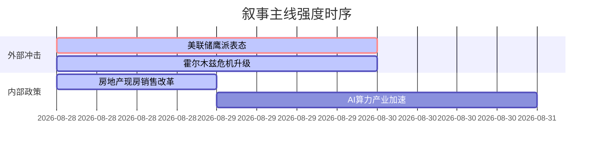

# A股市场情绪分析报告

**数据时段**：最近5日（2026-08-27 至 2026-08-31）
**生成时间**：2026-08-31

---

## 🔥 宏观叙事焦点（24小时三级过滤）

#### 📌 叙事主线一：美联储鹰派表态引发全球风险资产重估 ⭐⭐⭐
**主要事件**：美联储主席沃什杰克逊霍尔演讲释放鹰派信号，9月加息预期飙升
**筛选标签**：`央行货币政策` `全球市场联动` `路透信源·权重2.0`  
**宏观逻辑**：  
> ① **归类**：货币政策转向  
> ② **历史镜像**：2018年美联储鹰派转向模板  
> ③ **市场传导**：9月加息概率升至六成 → 美元走强 → 黄金暴跌3%失守4500美元 → 两年期美债收益率单日飙升11.8个基点至4.35%  
> ④ **叙事强度**：沃什明确"通胀2%目标不可动摇"，鹰派程度超预期，全球资产定价逻辑重估

**行业映射**：贵金属/出口依赖型行业（情绪评分 **4.5/10**）  
**交易警示**：‼️ 关注9月非农数据验证，警惕美元走强对A股北向资金压制

---

#### 📌 叙事主线二：霍尔木兹海峡危机推升能源风险溢价 ⭐⭐  
**主要事件**：伊朗革命卫队控制海峡通行，美军袭击伊朗南部武器设施
**筛选标签**：`地缘政治` `能源供应链` `财新信源·权重1.5`  
**宏观逻辑**：  
> ① **归类**：地缘风险事件  
> ② **历史镜像**：1980年代霍尔木兹封锁模板  
> ③ **市场传导**：伊朗阻止30艘违规船只 → 布伦特原油暗盘突破88美元 → 能源成本上升 → 全球通胀预期升温  
> ④ **叙事强度**：美伊博弈进入深水区，海峡通行不确定性持续发酵

**行业映射**：航运/石油石化（情绪评分 **6.8/10**）  
**交易警示**：⚠️ 关注海峡恢复通行进展，油价波动加剧A股周期板块分化

---

#### 📌 叙事主线三：房地产销售制度重大改革 ⭐  
**主要事件**：三部门提高商品房预售门槛，现房销售制度全面优化
**筛选标签**：`部委政策` `房地产调控` `新华社信源·权重1.5`  
**宏观逻辑**：  
> ① **归类**：供给侧改革深化  
> ② **历史镜像**：2016年房改2.0模板  
> ③ **市场传导**：新出让土地优先现房销售 → 开发商资金压力加大 → 行业集中度提升 → 优质房企估值修复  
> ④ **叙事强度**：政策决心明确，从"保交楼"转向"现房销售"制度性变革

**行业映射**：房地产开发/建材（情绪评分 **5.2/10**）  
**交易警示**：✓ 政策导向清晰，但房企流动性压力仍需时间消化

---

### 📅 宏观叙事演化（三日趋势）

**强度衰减模型**：昨日主题×0.7 · 前日主题×0.5

```mermaid
gantt
    title 叙事主线强度时序
    dateFormat YYYY-MM-DD
    section 外部冲击
    美联储鹰派表态   :crit, active, 2026-08-28, 2d
    霍尔木兹危机升级   :active, 2026-08-28, 2d
    
    section 内部政策
    房地产现房销售改革   :active, 2026-08-28, 1d
    AI算力产业加速   :2026-08-29, 2d
```

**叙事节点关联**：
- 08/28：沃什杰克逊霍尔首秀释放鹰派信号 → 黄金暴跌、美债收益率飙升
- 08/29：伊朗控制霍尔木兹海峡 → 原油暗盘突破88美元
- 08/29：三部门联合发文推进现房销售 → 房地产政策转向明确
- 08/30：A股机构研判"二次探底后反弹可期" → 市场情绪企稳

---

### 🎯 宏观叙事三要素

**1️⃣ 政策意图解码**
当前顶层叙事从"稳增长"转向"调结构"，房地产现房销售改革与AI算力产业扶持并行。外部美联储鹰派转向倒逼国内政策定力，允许短期阵痛换取长期质量。

**2️⃣ 市场定价偏差**
- **过度定价**：光伏/新能源产能出清速度（隆基绿能亏损36.84亿）
- **定价不足**：AI算力基础设施投资热潮（我国智算总规模达245万PFLOPS）
- **预期差**：券商分红潮（中期派现超273亿）与银行不良率压力并存

**3️⃣ 跨市场共振**
美联储鹰派 → 美元走强 → 黄金暴跌 + 新兴市场货币承压 = A股结构性行情窗口期。同时，西藏吉隆泥石流灾害引发避险情绪，但人道主义响应及时，灾害叙事对资本市场影响有限。

---

---

*生成时间：2026-08-31 08:30:58 (UTC+8)*  
*使用模型：agnes:agnes-2.0-flash*