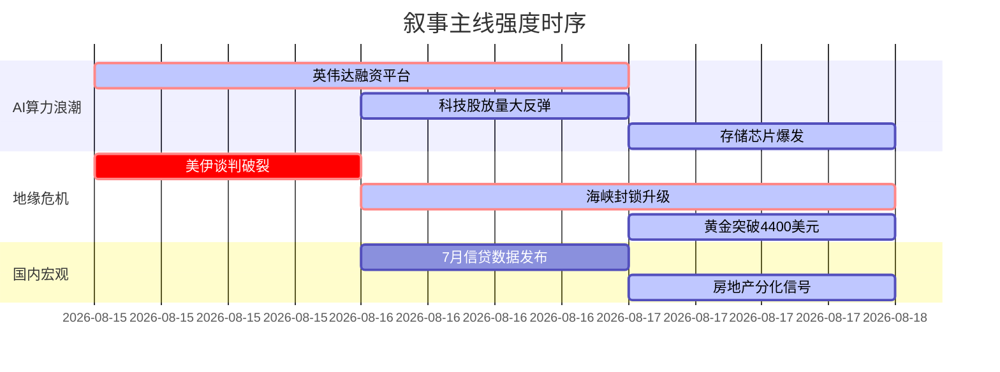

# A股市场情绪分析报告

**数据时段**：最近5日（2026-08-15 至 2026-08-17）  
**生成时间**：2026年8月17日 18:36

---

### 🔥 宏观叙事焦点（24小时三级过滤）

#### 📌 叙事主线一：AI算力资本化浪潮席卷全球 ⭐⭐⭐
**主要事件**：英伟达5000亿美元AI基建融资平台落地、OpenAI上市前夕高管震荡、A股科技股放量大反弹  
**筛选标签**：`科技产业投资` `A股硬科技` `路透信源·权重2.0`  
**宏观逻辑**：  
> ① **归类**：科技资本开支周期启动  
> ② **历史镜像**：2000年互联网泡沫基础设施投资模板  
> ③ **市场传导**：英伟达提供25%残值支持+高盛5000亿美元融资平台 → 存储芯片ETF涨幅前十包揽 → 科创50半日涨3%  
> ④ **叙事强度**：DeepSeek API最高涨幅1100%，智能体商业6-12个月爆发预期，产业趋势从超跌修复切换向趋势行情  

**行业映射**：半导体/算力硬件（情绪评分 **8.5/10**）  
**交易警示**：‼️ 关注机构分化信号：高毅清仓英伟达 vs 伯克希尔加仓Alphabet，警惕估值过热风险  

---

#### 📌 叙事主线二：霍尔木兹海峡地缘危机与能源安全 ⭐⭐  
**主要事件**：美伊60天谈判期期满、伊朗封锁海峡、中东多线冲突升级  
**筛选标签**：`地缘冲突` `能源供应` `新华社信源·权重1.8`  
**宏观逻辑**：  
> ① **归类**：地缘风险溢价重定价  
> ② **历史镜像**：1973年石油危机+2022年俄乌能源冲击模板  
> ③ **市场传导**：伊朗禁美军进入海峡+周末仅5艘船通过 → 布伦特原油暗盘跌破86美元 → 黄金剑指4500美元  
> ④ **叙事强度**：霍尔木兹海峡通航量骤减引发亚洲炼油商规避红海，能源成本冲击传导至PPI  

**行业映射**：油气运输/黄金/化工（情绪评分 **6.8/10**）  
**交易警示**：⚠️ 地缘叙事高度依赖局势走向，关注伊拉克日均出口200万桶对供需平衡的缓解作用  

---

#### 📌 叙事主线三：中国信贷走弱与房地产分化 ⭐  
**主要事件**：7月信贷时隔两月再转负、社融存量增7.4%、部分城市二手房价环比上涨  
**筛选标签**：`宏观经济数据` `房地产政策` `财新信源·权重1.5`  
**宏观逻辑**：  
> ① **归类**：需求端修复不及预期  
> ② **历史镜像**：2022年4月信贷数据疲弱时期  
> ③ **市场传导**：新增人民币贷款减少3400亿 → M2增速7.7% → 房贷利率低位运行 → 新型政策性金融工具加速投放  
> ④ **叙事强度**：广州二手房价环比涨0.4%居首，深圳新房成交增50%，一线城市分化迹象初现  

**行业映射**：银行/房地产/基建（情绪评分 **4.2/10**）  
**交易警示**：✓ 政策底已现（政策性金融工具+地方化债），市场底待验证，右侧信号需关注三季度财政发力  

---

### 📅 宏观叙事演化（三日趋势）

**强度衰减模型**：昨日主题×0.7 · 前日主题×0.5

```mermaid
gantt
    title 叙事主线强度时序
    dateFormat YYYY-MM-DD
    section AI算力浪潮
    英伟达融资平台    :crit, active, 2026-08-15, 2d
    科技股放量大反弹   :active, 2026-08-16, 1d
    存储芯片爆发     :active, 2026-08-17, 1d
    
    section 地缘危机
    美伊谈判破裂     :crit, 2026-08-15, 1d
    海峡封锁升级     :crit, active, 2026-08-16, 2d
    黄金突破4400美元  :active, 2026-08-17, 1d
    
    section 国内宏观
    7月信贷数据发布   :2026-08-16, 1d
    房地产分化信号   :active, 2026-08-17, 1d
```

叙事节点关联：
- 8/15：美伊谈判破裂+英伟达披露SpaceX持仓 → 地缘风险溢价与科技资本开支并存
- 8/16：A股放量反弹，科创50半日涨3% → AI叙事驱动风险偏好回升
- 8/17：7月信贷数据疲弱+黄金突破4410美元 → 避险与成长板块分化加剧

🎯 宏观叙事三要素

1️⃣ **政策意图解码**  
当前顶层叙事从"稳增长"转向"调结构"，产业出清>总量刺激。AI算力资本化获政策与市场双重共振，金融资源向硬科技倾斜（万亿险资转向半导体投资）。

2️⃣ **市场定价偏差**  
过度定价：消费复苏弹性（暑期档票房超预期但非主线）  
定价不足：地缘冲突持续性（霍尔木兹航运风险未充分计价）、AI基建融资规模（5000亿美元超预期）

3️⃣ **跨市场共振**  
美债收益率下行打开政策空间 + 美元指数高位缓释出口压力 + 人民币交投登顶 → A股结构性行情窗口期。港股资金流入751亿港元成为北向资金有效补充。

---

<!-- 报告正文必须在此结束，以下内容为固定格式说明，严禁添加任何额外分析、总结或展望 -->

---

*生成时间：2026-08-17 18:45:44 (UTC+8)*  
*使用模型：agnes:agnes-2.0-flash*