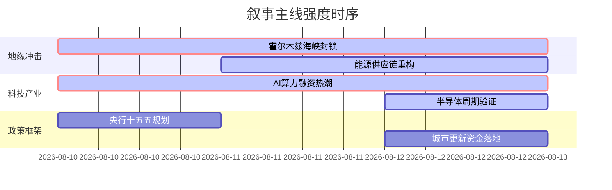

# A股市场情绪分析报告

**数据时段**：2026年8月10日-8月12日（最近5日）  
**生成时间**：2026-08-12 19:03

---

### 🔥 宏观叙事焦点（24小时三级过滤）

#### 📌 叙事主线一：霍尔木兹海峡封锁与能源供应链重构 ⭐⭐⭐
**主要事件**：地缘冲突、能源危机、国际油价飙升  
**筛选标签**：`地缘危机` `能源供应链` `路透信源·权重2.0`  
**宏观逻辑**：  
> ① **归类**：地缘风险溢价重定价  
> ② **历史镜像**：2019年霍尔木兹海峡危机模板  
> ③ **市场传导**：布伦特原油突破90美元/桶 → 欧洲天然气飙涨12% → 全球通胀预期升温 → 避险资金涌入黄金（现货突破4400美元/盎司）  
> ④ **叙事强度**：IEA上调2026年全球石油需求降幅至160万桶/日，供应缺口达180万桶/日，地缘博弈进入深水区  

**行业映射**：能源/石油石化（情绪评分 **8.1/10**）  
**交易警示**：‼️ 关注霍尔木兹协议谈判进展与油价波动，警惕地缘风险消退后的快速回调  

---

#### 📌 叙事主线二：AI算力产业链景气度验证与资本狂热 ⭐⭐⭐
**主要事件**：AI基建融资、算力硬件业绩验证  
**筛选标签**：`产业投资` `资本开支` `财新信源·权重1.5`  
**宏观逻辑**：  
> ① **归类**：技术革命资本化加速  
> ② **历史镜像**：2017年光伏产业链扩张+2020年半导体周期共振模板  
> ③ **市场传导**：英伟达联手六大金融巨头敲定5000亿美元AI基建融资 → 腾讯Q2资本支出527.8亿元大幅超预期 → 算力硬件产业链卷土重来 → 科创半导体ETF单日领涨4.12%  
> ④ **叙事强度**：CoreWeave Q2营收25.8亿美元超预期，待交付订单约1040亿美元，算力需求爆发支撑板块业绩但估值分化加剧  

**行业映射**：半导体/AI算力硬件（情绪评分 **7.8/10**）  
**交易警示**：⚠️ 关注业绩兑现与估值匹配度，存储芯片板块已现分化（1400亿龙头触及跌停）  

---

#### 📌 叙事主线三：中国央行"十五五"规划与结构性宽松 ⭐⭐
**主要事件**：货币政策框架升级、科技金融支持  
**筛选标签**：`央行政策` `科技金融` `新华社信源·权重1.5`  
**宏观逻辑**：  
> ① **归类**：货币政策框架升级  
> ② **历史镜像**：2015年供给侧改革+货币宽松双轮驱动模板  
> ③ **市场传导**：央行连续两天"零投放"敲打债市 → 10年国债在1.7%关口震荡 → 建设债券市场"科技板" → 结构性信贷向AI算力、人形机器人等硬科技倾斜  
> ④ **叙事强度**：央行部署"十五五"五大任务，淡化对贷款单一渠道关注，宽货币向宽信用传导仍需观察  

**行业映射**：创新药/硬科技（情绪评分 **6.5/10**）  
**交易警示**：✓ 创新药板块持续强势（药明康德A股突破上市8年新高），等待财政发力验证  

---

### 📅 宏观叙事演化（三日趋势）

**强度衰减模型**：昨日主题×0.7 · 前日主题×0.5

```mermaid
gantt
    title 叙事主线强度时序
    dateFormat YYYY-MM-DD
    section 地缘冲击
    霍尔木兹海峡封锁   :crit, active, 2026-08-10, 3d
    能源供应链重构     :active, 2026-08-11, 2d
    
    section 科技产业
    AI算力融资热潮     :crit, active, 2026-08-10, 3d
    半导体周期验证     :active, 2026-08-12, 1d
    
    section 政策框架
    央行十五五规划     :2026-08-10, 1d
    城市更新资金落地   :2026-08-12, 1d
```

**叙事节点关联**：
- 08/10：伊朗单方面公布霍尔木兹海峡通行草案 → 触发地缘危机叙事
- 08/11：布伦特原油突破90美元 + 英伟达5000亿美元AI融资 → 能源+科技双主线共振
- 08/12：央行"零投放"敲打债市 + 腾讯资本支出超预期 → 政策与产业验证期

**🎯 宏观叙事三要素**

1️⃣ **政策意图解码**  
当前顶层叙事从"总量刺激"转向"结构性精准滴灌"，央行"十五五"规划明确科技金融优先，允许短期阵痛换取长期质量。产业出清>总量宽松，政策定力超预期。

2️⃣ **市场定价偏差**  
过度定价：消费复苏弹性（7月乘用车零售同比-20.9%验证疲软）  
定价不足：产能出清速度（创新药板块调研热度超越半导体）+ 能源供应链重构持续性

3️⃣ **跨市场共振**  
美债30年期收益率飙至5.27%（19年新高）+ 日元成G10垫底货币 + 黄金突破4400美元 = A股结构性行情窗口期，红利低波与硬科技并存

---

---

*生成时间：2026-08-12 19:11:38 (UTC+8)*  
*使用模型：agnes:agnes-2.0-flash*