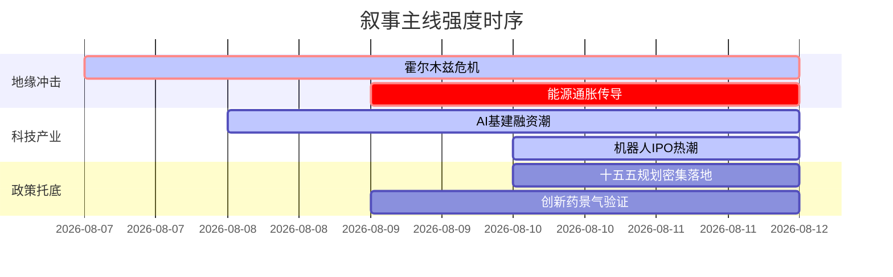

## A股市场情绪分析报告

**数据时段**：最近5日（2026年8月7日 - 2026年8月11日）
**生成时间**：2026年8月11日 19:00

---

### 🔥 宏观叙事焦点（24小时三级过滤）

#### 📌 叙事主线一：霍尔木兹海峡危机与全球能源供应链重构 ⭐⭐⭐
**主要事件**：地缘冲突、能源供应链中断、大宗商品价格冲击  
**筛选标签**：`国务院政策` `布伦特原油冲击` `路透社信源·权重2.0`  
**宏观逻辑**：  
> ① **归类**：地缘风险溢价飙升  
> ② **历史镜像**：1973年石油危机模板——海峡封锁→油价暴涨→通胀预期上行→全球央行两难  
> ③ **市场传导**：布伦特突破90美元/桶（周涨13%）→ 欧洲天然气飙涨10%+ → 通胀预期抬头 → 美债30年期收益率飙至5.27%（19年新高）→ 黄金突破4400美元创历史新高  
> ④ **叙事强度**：美伊进入"博弈中段"，霍尔木兹协议希望渺茫，Q4油价或飙至120-140美元，能源通胀与增长双重压力  

**行业映射**：能源化工链 / 贵金属（情绪评分 **8.1/10**）  
**交易警示**：‼️ 关注油价突破90美元后的通胀传导，警惕外围加息预期升温对A股风险偏好的压制  

---

#### 📌 叙事主线二：英伟达5000亿美元AI基建融资与科技产业共振 ⭐⭐  
**主要事件**：科技产业投资、AI算力基建、半导体产业格局重塑  
**筛选标签**：`产业周期` `美股科技映射` `财新信源·权重1.5`  
**宏观逻辑**：  
> ① **归类**：AI资本开支超级周期  
> ② **历史镜像**：2000年互联网基建潮模板——万亿美元级融资→产业链全链受益→估值与业绩双轮驱动  
> ③ **市场传导**：英伟达联手六大华尔街巨头敲定5000亿美元AI基建融资 → 英特尔紧急增发150-200亿美元应对竞争 → 台积电Q2现金流股利7元/股 → 宇树科技IPO获5526倍认购 → A股机器人/半导体板块强势分化  
> ④ **叙事强度**：AI资本开支持续超预期，英伟达、Meta、OpenAI三足鼎立推动产业从"训练端"向"应用端"扩散  

**行业映射**：人形机器人 / 存储芯片 / 算力基础设施（情绪评分 **7.5/10**）  
**交易警示**：⚠️ AI板块内部剧烈分化，科创半导体ETF领涨4.12%而科创创业人工智能ETF领跌3.13%，警惕估值过高标的的回调风险  

---

#### 📌 叙事主线三：中国"十五五"政策密集落地与稳增长托底 ⭐  
**主要事件**：央行政策框架改革、房地产政策优化、科技创新支持  
**筛选标签**：`部委政策` `稳增长基调` `新华社信源·权重1.5`  
**宏观逻辑**：  
> ① **归类**：结构性政策托底  
> ② **历史镜像**：2015年"供给侧改革"模板——顶层设计先行、政策配套跟进、产业出清与升级并重  
> ③ **市场传导**：央行"十五五"改革规划部署五大核心任务 → 六部门生态保护"十五五"规划 → 北京楼市2011年来最宽松政策落地 → 上海"十五五"规划支持AI Coding平台 → 7月CPI同比仅涨0.5%、PPI回落印证弱复苏  
> ④ **叙事强度**：政策定力增强，从"总量刺激"转向"结构优化"，但内需不足现实制约政策传导效率  

**行业映射**：创新药 / 红利低波 / 北京基建（情绪评分 **5.2/10**）  
**交易警示**：✓ 创新药板块调研热度超越半导体，公募持仓降至冰点后迎反弹，政策底已现但需等待盈利验证  

---

### 📅 宏观叙事演化（三日趋势）

**强度衰减模型**：昨日主题×0.7 · 前日主题×0.5

```mermaid
gantt
    title 叙事主线强度时序
    dateFormat YYYY-MM-DD
    section 地缘冲击
    霍尔木兹危机   :crit, active, 2026-08-07, 5d
    能源通胀传导   :crit, 2026-08-09, 3d
    
    section 科技产业
    AI基建融资潮   :active, 2026-08-08, 4d
    机器人IPO热潮   :active, 2026-08-10, 2d
    
    section 政策托底
    十五五规划密集落地 :2026-08-10, 2d
    创新药景气验证   :2026-08-09, 3d
```

叙事节点关联：
- **08/07-08/08**：伊朗宣布控制霍尔木兹海峡 → 油价周涨13% → 美债收益率飙升至5.27%
- **08/09**：美国7月非农数据意外转负 → 美联储9月加息概率降至44.4% → 黄金单周暴涨7%重返4400美元
- **08/10**：英伟达宣布5000亿美元AI基建融资 → 英特尔紧急增发150亿美元 → 宇树科技IPO获5526倍认购
- **08/11**：美伊博弈进入"高级阶段"但协议前景不明 → 原油期货结算价再涨5%至82.13美元 → A股AI板块修复，创新药延续强势

---

### 🎯 宏观叙事三要素

**1️⃣ 政策意图解码**  
当前顶层叙事从"稳增长"转向"调结构"，央行"十五五"规划提出构建科技金融体制，允许短期阵痛换取长期质量。产业出清>总量刺激，政策定力超预期。但7月CPI仅0.5%、PPI涨幅回落，弱复苏现实制约政策空间。

**2️⃣ 市场定价偏差**  
- **过度定价**：AI应用端估值（创业板人工智能ETF领跌3.13%）、高溢价LOF产品（纳指ETF、原油LOF均触发溢价风险停牌）
- **定价不足**：产能出清速度（创新药公募持仓降至冰点后反弹）、黄金长期配置逻辑（央行连续21个月购金）

**3️⃣ 跨市场共振**  
美债收益率上行打开政策空间 + 美元走弱支撑黄金 + 日元干预效果消退 = A股结构性行情窗口期。外部视角下，美联储9月加息概率仍近50%，但非农降温已使市场开始定价降息路径，为A股提供相对友好的外围环境。

---

<!-- 报告正文必须在此结束，以下内容为固定格式说明，严禁添加任何额外分析、总结或展望 -->

---

*生成时间：2026-08-11 19:01:13 (UTC+8)*  
*使用模型：agnes:agnes-2.0-flash*