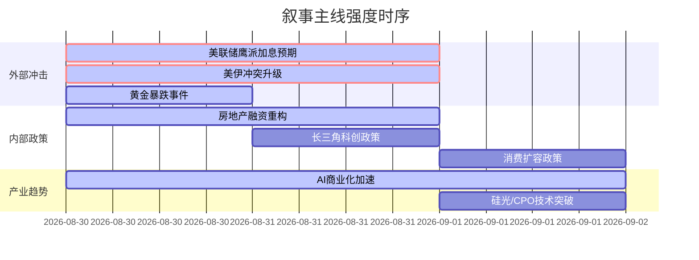

## A股市场情绪分析报告

**数据时段**：2026年8月30日 - 2026年9月1日（最近5日）
**生成时间**：2026年9月1日

### 🔥 宏观叙事焦点（24小时三级过滤）

#### 📌 叙事主线一：美联储鹰派讲话引爆全球加息预期 ⭐⭐⭐
**主要事件**：沃什杰克逊霍尔演讲释放强硬通胀信号，9月加息概率跳升
**筛选标签**：`美联储政策` `全球流动性收紧` `路透信源·权重2.0`  
**宏观逻辑**：  
> ① **归类**：货币政策转向紧缩  
> ② **历史镜像**：2018年2月美联储点阵图上修模板  
> ③ **市场传导**：美债收益率飙升+11.8bps → 黄金暴跌失守4500美元 → 新兴市场货币承压 → 风险资产重估  
> ④ **叙事强度**：鹰派信号超预期，市场定价从"暂停"转向"连续加息"路径  

**行业映射**：黄金/有色（情绪评分 **4.2/10**），出口导向型制造业（情绪评分 **5.8/10**）  
**交易警示**：‼️ 关注9月非农数据验证，警惕流动性收紧超预期引发的流动性冲击  

---

#### 📌 叙事主线二：美伊军事冲突升级与霍尔木兹海峡危机 ⭐⭐⭐
**主要事件**：美军再袭伊朗设施，伊朗革命卫队封锁海峡，中国船只通行量归零
**筛选标签**：`地缘冲突` `能源供应中断` `新华社信源·权重2.0`  
**宏观逻辑**：  
> ① **归类**：地缘风险事件  
> ② **历史镜像**：1979年伊朗革命后霍尔木兹封锁模板  
> ③ **市场传导**：布伦特原油突破90美元/桶 → 全球通胀预期升温 → 航运成本飙升 → 能源板块逆势领涨  
> ④ **叙事强度**：冲突实质性升级，海峡通行风险骤增，供应中断预期强化  

**行业映射**：能源/石油石化（情绪评分 **8.5/10**），航运（情绪评分 **6.2/10**）  
**交易警示**：⚠️ 关注伊朗报复行动升级风险，警惕油价冲击A股通胀预期传导链  

---

#### 📌 叙事主线三：中国房地产融资机制历史性重构 ⭐⭐
**主要事件**：五大部委联合推出房地产融资新规，转向项目制封闭运行新模式
**筛选标签**：`部委政策` `房地产金融改革` `财新信源·权重1.5`  
**宏观逻辑**：  
> ① **归类**：产业政策调整  
> ② **历史镜像**：2015年房地产去库存政策模板  
> ③ **市场传导**：预售资金推迟到账 → 房企现金流重构 → 行业K型分化加剧 → 红利低波ETF半日成交5.58亿领跑  
> ④ **叙事强度**：政策决心明确，从"保交楼"转向"制度重塑"，长效机制建设加速  

**行业映射**：头部房企/建材（情绪评分 **6.8/10**），银行/券商（情绪评分 **5.5/10**）  
**交易警示**：✓ 政策落地效果待观察，关注龙头房企融资成本变化  

---

### 📅 宏观叙事演化（三日趋势）

**强度衰减模型**：昨日主题×0.7 · 前日主题×0.5

```mermaid
gantt
    title 叙事主线强度时序
    dateFormat YYYY-MM-DD
    section 外部冲击
    美联储鹰派加息预期   :crit, active, 2026-08-30, 2d
    美伊冲突升级       :crit, active, 2026-08-30, 2d
    黄金暴跌事件       :active, 2026-08-30, 1d
    
    section 内部政策
    房地产融资重构     :active, 2026-08-30, 2d
    长三角科创政策     :2026-08-31, 1d
    消费扩容政策       :2026-09-01, 1d
    
    section 产业趋势
    AI商业化加速       :active, 2026-08-30, 3d
    硅光/CPO技术突破   :2026-09-01, 1d
```

**叙事节点关联**：
- **08/30**：沃什杰克逊霍尔演讲 → 鹰派信号引爆市场，黄金单日暴跌3%，美债收益率飙升
- **08/31**：美伊军事摩擦升级 → 霍尔木兹海峡通行受阻，布伦特原油突破88美元
- **09/01**：房地产融资新规落地 + AI产业持续升温 → 政策驱动与产业趋势并行

**🎯 宏观叙事三要素**

1️⃣ **政策意图解码**  
当前外部核心矛盾从"通胀担忧"转向"加息路径重估"，沃什讲话标志着美联储政策范式转换。内部政策从"刺激需求"转向"制度重构"，房地产融资新规体现防风险与促转型并重。

2️⃣ **市场定价偏差**  
**过度定价**：美联储9月加息确定性（市场定价65%，实际存在分歧）  
**定价不足**：中国房地产政策效力（机构看好红利低波，但板块估值仍处低位）  
**忽略风险**：霍尔木兹海峡长期封锁概率（当前油价尚未充分反映地缘风险溢价）

3️⃣ **跨市场共振**  
美债收益率上行压制全球风险资产 + 原油价格冲击通胀预期 + 人民币汇率韧性支撑 = A股结构性行情分化加剧，AI/能源 vs 出口/黄金的K型分化格局确立

---

*生成时间：2026-09-01 09:14:51 (UTC+8)*  
*使用模型：agnes:agnes-2.0-flash*