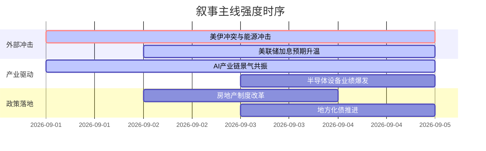

## A股市场情绪分析报告

**数据时段**：2026年9月1日-9月4日（最近5日）  
**生成时间**：2026年9月4日

### 🔥 宏观叙事焦点（24小时三级过滤）

#### 📌 叙事主线一：美伊冲突升级与能源价格冲击 ⭐⭐⭐
**主要事件**：地缘冲突、油价飙升、通胀预期  
**筛选标签**：`地缘冲突` `原油价格` `路透信源·权重2.0`  
**宏观逻辑**：  
> ① **归类**：外部风险事件冲击  
> ② **历史镜像**：2022年俄乌冲突初期能源危机模板  
> ③ **市场传导**：WTI突破90美元→欧元区通胀回升至3.3%→ 美联储加息概率升至68%→ 全球债市收益率创2008年以来新高  
> ④ **叙事强度**：冲突持续升级，霍尔木兹海峡通行受阻，市场避险情绪主导  

**行业映射**：能源/航运（情绪评分 **6.8/10**）  
**交易警示**：‼️ 关注油价突破100美元临界点，警惕全球滞胀风险蔓延  

---

#### 📌 叙事主线二：AI产业链景气度与科技竞争 ⭐⭐  
**主要事件**：技术发布、产业投资
**筛选标签**：`科技产业` `AI应用` `财新信源·权重1.5`  
**宏观逻辑**：  
> ① **归类**：产业技术迭代  
> ② **历史镜像**：2023年ChatGPT发布引爆AI投资潮模板  
> ③ **市场传导**：GPT-6 Astra发布→ 英伟达140亿美元收购Hugging Face → 半导体设备板块中报业绩爆发 → AI算力需求持续旺盛  
> ④ **叙事强度**：从模型层向基础设施层传导，商业化落地加速，叙事持续性较强  

**行业映射**：半导体设备、AI应用（情绪评分 **7.0/10**）  
**交易警示**：⚠️ 部分概念股已偏离基本面，关注业绩兑现能力  

---

#### 📌 叙事主线三：中国房地产制度改革与化债进展 ⭐ 
**主要事件**：政策调控、地方债务
**筛选标签**：`房地产政策` `地方债务` `新华社信源·权重1.5`  
**宏观逻辑**：  
> ① **归类**：国内结构性政策推进  
> ② **历史镜像**：2021年"三道红线"后行业出清模板  
> ③ **市场传导**：现房销售制度改革落地 → 二手房成交活跃（前8月近100万套，同比+6.3%）→ 地方隐债化解加速 → 市场预期逐步修复  
> ④ **叙事强度**：政策决心明确，但房地产长期需求逻辑仍待验证  

**行业映射**：房地产链、基建（情绪评分 **5.2/10**）  
**交易警示**：✓ 政策底信号清晰，等待销售数据持续验证  

---

### 📅 宏观叙事演化（三日趋势）

**强度衰减模型**：昨日主题×0.7 · 前日主题×0.5

```mermaid
gantt
    title 叙事主线强度时序
    dateFormat YYYY-MM-DD
    section 外部冲击
    美伊冲突与能源冲击   :crit, active, 2026-09-01, 4d
    美联储加息预期升温   :active, 2026-09-02, 3d
    
    section 产业驱动
    AI产业链景气共振     :active, 2026-09-01, 4d
    半导体设备业绩爆发   :2026-09-03, 2d
    
    section 政策落地
    房地产制度改革       :2026-09-02, 2d
    地方化债推进         :2026-09-03, 2d
```

叙事节点关联：
- 09/01：美军空袭伊朗→ 伊朗誓言报复 → 油价破90美元，触发能源冲击叙事
- 09/02：美伊冲突持续 → 全球债市遭抛售 → 美联储加息概率升至68%
- 09/03：现房销售制度改革落地 → 二手房成交回暖 → 房地产政策叙事强化
- 09/04：OpenAI发布GPT-6 Astra → AI产业链叙事再升温

🎯 宏观叙事三要素
1️⃣ 政策意图解码  
当前外部风险（美伊冲突）主导市场定价，内部政策聚焦"防风险+促转型"双目标。房地产制度改革从"限制端"转向"供给侧"，允许短期阵痛换取长期健康。

2️⃣ 市场定价偏差  
过度定价：美联储激进加息（市场已定价68%概率）  
定价不足：中国内需修复韧性（PMI连续位于扩张区间，新经济指数创历史新高）

3️⃣ 跨市场共振  
美债收益率上行 + 日元避险升值 + 原油价格冲击 = A股外部压力加大，但内部AI产业链景气度提供结构性支撑

---

*生成时间：2026-09-04 08:07:07 (UTC+8)*  
*使用模型：agnes:agnes-2.0-flash*