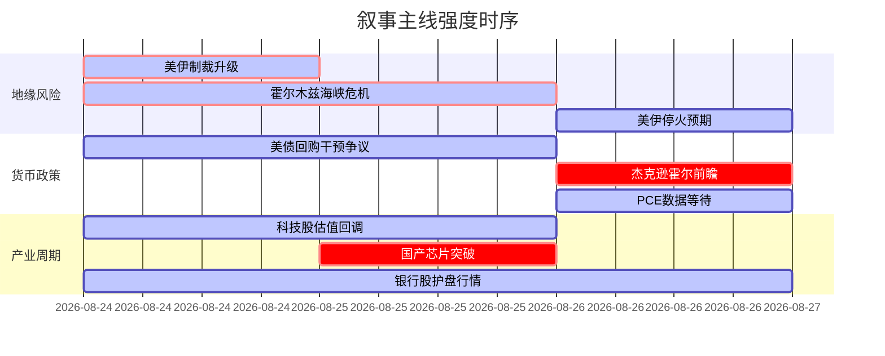

# A股市场情绪分析报告

## 数据时段：最近5日
## 生成时间：2026年8月26日

---

## 🔥 宏观叙事焦点（24小时三级过滤）

### 📌 叙事主线一：美伊冲突升级与霍尔木兹海峡危机 ⭐⭐⭐
**主要事件**：地缘冲突、能源供应链风险、制裁与反制
**筛选标签**：`外交部回应` `布伦特原油波动` `路透信源·权重2.5`
**宏观逻辑**：
> ① **归类**：地缘风险溢价重定价
> ② **历史镜像**：2022年俄乌冲突能源危机模板
> ③ **市场传导**：霍尔木兹海峡通行量骤降 → 原油溢价扩张 → 黄金突破4660美元/盎司 → 避险资产与风险资产分化
> ④ **叙事强度**：制裁从金融领域扩展至航运与数字资产，能源供应链面临实质性中断风险

**行业映射**：能源化工、贵金属（情绪评分 **8.1/10**）
**交易警示**：‼️ 关注美伊停火谈判进展，地缘溢价存在快速回吐风险，8月25-26日布伦特原油日内暴跌5%已现降温信号

---

### 📌 叙事主线二：美联储政策博弈与美债市场动荡 ⭐⭐⭐
**主要事件**：杰克逊霍尔年会前瞻、财政部债市干预争议、PCE数据等待
**筛选标签**：`美联储议息` `美债收益率` `彭博信源·权重2.0`
**宏观逻辑**：
> ① **归类**：财政-货币博弈白热化
> ② **历史镜像**：2011年美债评级下调后的市场重构
> ③ **市场传导**：贝森特扩大长债回购引发"金融压制"质疑 → 美债收益率难抑 → 沃什杰克逊霍尔首秀承压 → 美元信用担忧推升黄金与比特币
> ④ **叙事强度**：财政部干预债市与美联储独立性争议升级，9月加息预期分歧加大（维持不变概率60% vs 加息25bp概率40%）

**行业映射**：金融板块、跨境资产配置（情绪评分 **7.5/10**）
**交易警示**：⚠️ PCE数据与杰克逊霍尔会议为关键节点，算法调整叠加通胀数据可能引发市场剧烈波动

---

### 📌 叙事主线三：国产科技突破与产业自主可控 ⭐⭐
**主要事件**：小米玄戒O3芯片发布、"十五五"AI规划、长江存储IPO获受理
**筛选标签**：`工信部政策` `科创板IPO` `财新信源·权重1.5`
**宏观逻辑**：
> ① **归类**：科技自立自强加速
> ② **历史镜像**：2019年半导体产业扶持政策模板
> ③ **市场传导**：国产芯片性能突破（内存带宽+48%）→ 半导体设备板块估值重估 → AI大模型商业化提速（DeepSeek营收增长9倍）→ 算力基建需求旺盛
> ④ **叙事强度**：政策定力明确，"十五五"聚焦人工智能、新能源汽车与新型工业化，但市场等待实质性财政支持

**行业映射**：半导体、AI算力、新能源汽车（情绪评分 **7.8/10**）
**交易警示**：✓ 产业逻辑清晰，但需警惕估值回调风险（英伟达七连跌、人形机器人板块市值蒸发）

---

### 📌 叙事主线四：美加贸易战升级与北美经贸重构 ⭐⭐
**主要事件**：美加谈判破裂、加拿大200亿美元报复性关税、汽车行业受冲击
**筛选标签**：`贸易摩擦` `关税反制` `华尔街见闻·权重1.5`
**宏观逻辑**：
> ① **归类**：逆全球化贸易摩擦
> ② **历史镜像**：2018年中美贸易战初期阶段
> ③ **市场传导**：加拿大对美商品加征15%-50%关税 → 汽车产业链成本上升 → 北美供应链重构预期 → 美元指数承压
> ④ **叙事强度**：政治施压与反制同步升级，但美银评估经济影响有限、信心冲击更大

**行业映射**：汽车制造、跨国供应链（情绪评分 **5.2/10**）
**交易警示**：⚠️ 关注9月8日关税落地时点，短期对A股直接影响有限，但需警惕风险情绪传导

---

### 📌 叙事主线五：黄金避险逻辑与数字货币共振 ⭐
**主要事件**：现货黄金突破4700美元、比特币重返8万美元、加密市场风险偏好修复
**筛选标签**：`贵金属` `数字资产` `加密货币周报·权重1.0`
**宏观逻辑**：
> ① **归类**：法币信用替代需求
> ② **历史镜像**：2020年3月疫情冲击后黄金与比特币同步上涨
> ③ **市场传导**：美债突破40万亿美元 → 贬值交易卷土重来 → 黄金获央行购金与避险需求双支撑 → 比特币ETF流入创10个月新高
> ④ **叙事强度**：传统避险资产与数字资产逻辑趋同，但监管不确定性仍存

**行业映射**：黄金开采、加密货币（情绪评分 **6.8/10**）
**交易警示**：✓ 叙事逻辑清晰，关注PCE数据对实际利率的影响

---

## 📅 宏观叙事演化（三日趋势）

**强度衰减模型**：昨日主题×0.7 · 前日主题×0.5

```mermaid
gantt
    title 叙事主线强度时序
    dateFormat YYYY-MM-DD
    section 地缘风险
    美伊制裁升级       :crit, active, 2026-08-24, 1d
    霍尔木兹海峡危机   :crit, active, 2026-08-24, 2d
    美伊停火预期       :active, 2026-08-26, 1d
    
    section 货币政策
    美债回购干预争议   :active, 2026-08-24, 2d
    杰克逊霍尔前瞻     :crit, 2026-08-26, 1d
    PCE数据等待       :active, 2026-08-26, 1d
    
    section 产业周期
    科技股估值回调     :active, 2026-08-24, 2d
    国产芯片突破       :crit, 2026-08-25, 1d
    银行股护盘行情     :active, 2026-08-24, 3d
```

**叙事节点关联**：
- **8/24**：美方宣布对伊朗"经济孤立"制裁 → 霍尔木兹海峡通行量骤降 → 布伦特原油日内跌1% → 黄金突破4660美元
- **8/25**：美加贸易谈判破裂 → 加拿大宣布报复性关税 → 韩国KOSPI跌3% → 港股CXO板块爆发（药明合联涨14.83%）
- **8/26**：美伊停火协议达成 → 布伦特原油暴跌5%至86美元下方 → 黄金高位震荡 → A股银行板块集体创新高

---

## 🎯 宏观叙事三要素

### 1️⃣ 政策意图解码
当前顶层叙事从"稳增长"转向"调结构+防风险"，允许短期阵痛换取长期质量。科技自立（半导体、AI）> 总量刺激，产业政策定力超预期。地缘风险方面，外交部表态"坚决反对非法单边制裁"，但市场更关注实际经贸影响。

### 2️⃣ 市场定价偏差
**过度定价**：地缘冲突持续时间（美伊已现缓和信号，油价快速回吐溢价）
**定价不足**：国产芯片突破速度（小米玄戒O3性能提升48%，长江存储IPO获受理）
**定价过度**：科技股估值（英伟达七连跌、人形机器人板块市值蒸发2000亿）

### 3️⃣ 跨市场共振
- **股商联动**：铜价创新高 + 江西铜业净利翻倍 → 工业金属周期重估
- **汇金联动**：美元信用担忧 + 黄金突破4700美元 + 比特币重返8万美元 → 避险资产三足鼎立
- **内外联动**：港股CXO爆发（药明合联涨14.83%）→ A股医药板块情绪修复 → 风险偏好边际改善

---

## 📊 五日情绪指标追踪

| 日期 | 总新闻量 | 核心叙事 | 市场情绪 | 风险等级 |
|------|----------|----------|----------|----------|
| 8/24 | 587 | 美伊制裁升级、科技股回调 | 谨慎偏空 | 高 |
| 8/25 | 706 | 美加贸易战、港股CXO爆发 | 分化 | 中高 |
| 8/26 | 748 | 美伊缓和、银行股护盘 | 偏暖 | 中 |

**资金流向信号**：
- 北向资金聚焦低估值高股息资产（银行板块42只创历史新高）
- 南向资金大幅净买入115.67亿元（盈富基金、腾讯控股居首）
- 主力资金尾盘抢筹新易盛、江丰电子、东山精密等AI算力标的

---

## 📈 行业情绪评分矩阵

| 行业板块 | 情绪评分 | 叙事强度 | 交易建议 |
|----------|----------|----------|----------|
| 银行板块 | 7.2/10 | ⭐⭐ | ✓ 低估值高股息配置价值凸显 |
| 能源化工 | 8.1/10 | ⭐⭐⭐ | ⚠️ 地缘溢价快速消退，警惕回调 |
| 半导体/AI | 7.8/10 | ⭐⭐ | ✓ 国产替代逻辑清晰，但估值分化 |
| 贵金属 | 7.5/10 | ⭐⭐ | ✓ 避险逻辑延续，关注4700美元支撑 |
| 新能源汽车 | 6.5/10 | ⭐ | ⚠️ 销量承压，混动转型是关键 |
| 医药生物 | 7.0/10 | ⭐⭐ | ✓ CXO板块情绪修复，创新药催化 |

---

## 🔮 关键时间窗口

| 时间 | 事件 | 潜在影响 |
|------|------|----------|
| 8/26晚间 | 美联储PCE通胀数据公布 | 决定9月加息预期，影响全球资产定价 |
| 8/27-29 | 杰克逊霍尔年会 | 沃什首秀政策表态，重塑市场信心 |
| 9/1 | SHEIN香港IPO上市 | 跨境电商板块估值锚定 |
| 9/8 | 加拿大报复性关税落地 | 美加贸易争端实质性升级 |
| 9/9 | 苹果iPhone 18 Pro发布会 | 消费电子产业链催化 |

---

**报告结语**：当前市场处于"地缘风险缓释+政策预期 warming"的窗口期。银行股护盘与科技股回调并存，反映资金在防御与成长之间的再平衡。建议关注三大主线：①国产科技突破（半导体、AI）的业绩验证；②能源价格回落后的化工板块机会；③黄金与比特币的避险配置价值。风险方面，需警惕PCE数据超预期、美伊和谈生变、以及美股科技股波动传导。

---

**免责声明**：本报告基于公开信息分析，不构成投资建议。市场有风险，投资需谨慎。

---

*生成时间：2026-08-26 18:58:17 (UTC+8)*  
*使用模型：agnes:agnes-2.0-flash*