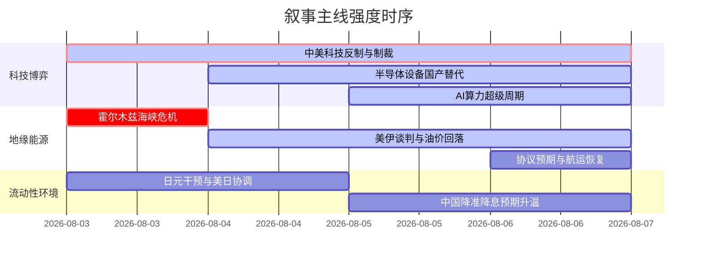

# A股市场情绪分析报告

**数据时段**：最近5日（2026-08-03 至 2026-08-06）  
**生成时间**：2026年8月6日

---

## 🔥 宏观叙事焦点（24小时三级过滤）

#### 📌 叙事主线一：中美科技博弈全面升级 ⭐⭐⭐
**主要事件**：商务部对6家美国实体采取反制措施，美方拟禁止中国数据中心设备进口  
**筛选标签**：`中美经贸博弈` `半导体供应链` `国家安全监管` `工信部政策`  
**宏观逻辑**：  
> ① **归类**：科技竞争与供应链重构  
> ② **历史镜像**：2018年贸易摩擦初期模板，但此次聚焦AI算力基础设施  
> ③ **市场传导**：中科曙光等市值一度跌超千亿 → A股半导体板块逆市放量上涨 → 科创50涨超5%  
> ④ **叙事强度**：反制措施升级但市场风险偏好未损，科技自主叙事强化，国产替代加速期  

**行业映射**：半导体设备、算力硬件、AI大模型（情绪评分 **8.5/10**）  
**交易警示**：‼️ 关注政策落地节奏与海外市场反应，注意短期情绪高潮后的分化风险

---

#### 📌 叙事主线二：霍尔木兹海峡局势缓和与能源价格回落 ⭐⭐⭐
**主要事件**：美伊接近达成海峡航行协议，布伦特原油跌破80美元  
**筛选标签**：`地缘政治缓和` `原油价格` `供应链恢复` `路透信源·权重2.0`  
**宏观逻辑**：  
> ① **归类**：风险事件缓释  
> ② **历史镜像**：2022年俄乌冲突油价峰值后回落模板  
> ③ **市场传导**：WTI暴跌5.69% → 集运欧线期货跌7% → 航空股走高 → 通胀预期降温  
> ④ **叙事强度**：地缘溢价快速消退，但协议达成时间不确定，油价波动仍存  

**行业映射**：航空、化工、航运（情绪评分 **6.8/10**）  
**交易警示**：⚠️ 关注协议最终形态与执行进度，防止预期反复引发油价二次波动

---

#### 📌 叙事主线三：AI算力投资狂潮与半导体超级周期 ⭐⭐
**主要事件**：SpaceX AI资本开支飙升550%至184亿美元，存储芯片价格一年暴涨8.8倍  
**筛选标签**：`AI产业趋势` `半导体周期` `科创板` `财新信源·权重1.5`  
**宏观逻辑**：  
> ① **归类**：产业革命驱动型景气上行  
> ② **历史镜像**：2020年5G建设周期初期模板，但本轮规模与速度更甚  
> ③ **市场传导**：SpaceX财报引发AI资本开支担忧 → 费城半导体指数涨超7% → A股科创半导体设备ETF成交额破18亿元  
> ④ **叙事强度**：AI军备竞赛持续升级，存储芯片供需紧平衡延续，龙头业绩验证期

**行业映射**：存储芯片、半导体设备、光模块（情绪评分 **7.9/10**）  
**交易警示**：⚠️ 关注资本开支增速与盈利兑现的时间差，警惕短期过热后的估值回调

---

### 📅 宏观叙事演化（三日趋势）

**强度衰减模型**：昨日主题×0.7 · 前日主题×0.5

```mermaid
gantt
    title 叙事主线强度时序
    dateFormat YYYY-MM-DD
    section 科技博弈
    中美科技反制与制裁   :crit, active, 2026-08-03, 4d
    半导体设备国产替代   :active, 2026-08-04, 3d
    AI算力超级周期   :active, 2026-08-05, 2d
    
    section 地缘能源
    霍尔木兹海峡危机   :crit, 2026-08-03, 1d
    美伊谈判与油价回落   :active, 2026-08-04, 3d
    协议预期与航运恢复   :2026-08-06, 1d
    
    section 流动性环境
    日元干预与美日协调   :2026-08-03, 2d
    中国降准降息预期升温   :2026-08-05, 2d
```

**叙事节点关联**：
- 08/03：美伊谈判启动信号释放 → 油价暴跌5%+，地缘风险溢价快速消退
- 08/04：商务部反制美国6家实体 → 半导体板块逆势放量，科创50涨超5%
- 08/05：SpaceX财报显示AI资本开支飙升 → 全球半导体设备迎"逻辑重估"
- 08/06：美伊接近达成海峡协议 → 布伦特跌破80美元，化工板块跟随反弹

---

## 🎯 宏观叙事三要素

### 1️⃣ 政策意图解码
当前顶层叙事聚焦"科技自立自强+稳内需"双轮驱动。产业政策从"防风险"转向"促发展"，半导体设备、AI算力、存储芯片成为政策与资本双重聚焦方向。货币政策层面，央行5000亿元买断式逆回购释放流动性，降准降息预期升温，稳增长政策加码信号明确。

### 2️⃣ 市场定价偏差
**过度定价**：地缘冲突升级风险（美伊协议预期已大幅压缩风险溢价）  
**定价不足**：AI算力资本开支持续性（SpaceX 184亿美元CAPEX仅冰山一角）、存储芯片超级周期长度（价格涨幅8.8倍未充分反映供需缺口）  
**定价合理**：半导体国产替代叙事（政策确定性高，订单可见性强）

### 3️⃣ 跨市场共振
- **美债收益率下行**（10年期降至4.62%）→ 打开中国货币政策空间
- **日元干预**（美日联合耗资870亿美元）→ 亚洲货币联动，人民币中间价稳定
- **黄金突破4200美元**（避险+抗通胀双重驱动）→ 贵金属板块受关注
- **亚太股市大涨**（日经+3.7%，韩国+3.8%）→ A股科技股情绪共振

---

<!-- 报告正文必须在此结束，以下内容为固定格式说明，严禁添加任何额外分析、总结或展望 -->

### 📊 核心数据快照
| 指标 | 数值 | 变化 |
|------|------|------|
| 科创50 | 涨超5% | 放量反弹 |
| 半导体设备ETF | 涨近7% | 成交额破18亿 |
| 布伦特原油 | 跌破80美元 | 跌5.69% |
| 现货黄金 | 突破4200美元 | 涨3.0% |
| 比特币 | 65000美元 | 守住关口 |
| 美元指数 | 99.676 | 下跌 |
| 10年国债收益率 | 1.70% | 创新低 |

---

*生成时间：2026-08-06 07:13:05 (UTC+8)*  
*使用模型：agnes:agnes-2.0-flash*