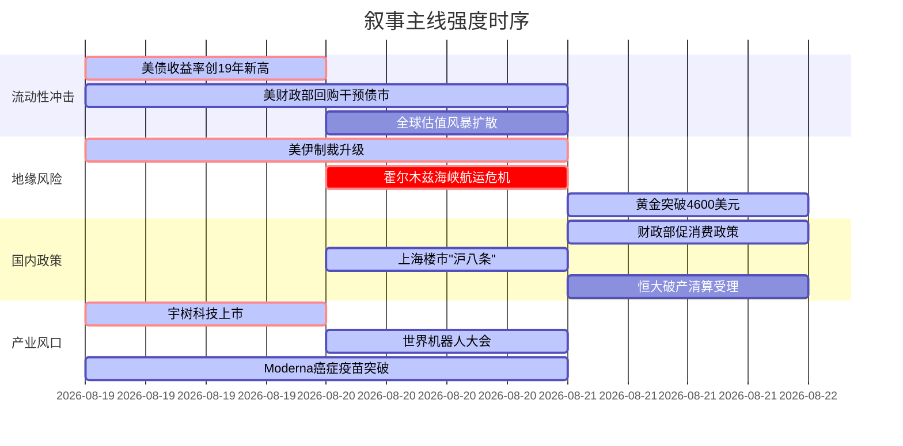

# A股市场情绪分析报告

**数据时段**：最近5日（2026年8月19日-2026年8月21日）  
**生成时间**：2026年8月21日

---

## 🔥 宏观叙事焦点（24小时三级过滤）

### 📌 叙事主线一：美债回购干预引发全球流动性重定价 ⭐⭐⭐
**主要事件**：美财政部扩大长期国债回购规模，贝森特化身"美国首席债券交易员"干预债市  
**筛选标签**：`美联储政策` `美债收益率创19年新高` `全球估值风暴` `路透信源·权重2.0`  
**宏观逻辑**：  
> ① **归类**：货币政策与流动性博弈  
> ② **历史镜像**：2019年9月美债回购危机模板  
> ③ **市场传导**：美30年期收益率冲破5.33%→A股科技板块重挫（创业板跌6.26%，科创50跌近7%）→美元指数跌破99→人民币逼近6.72  
> ④ **叙事强度**：财政部干预效果"有效期仅一天"，长债收益率重返高位，市场定价流动性范式切换  

**行业映射**：AI算力/半导体/光模块（情绪评分 **4.2/10**）  
**交易警示**：‼️ 美债收益率趋势性上行风险未消，科技股估值承压，警惕二次探底  

---

### 📌 叙事主线二：美伊冲突升级引爆地缘风险溢价 ⭐⭐⭐
**主要事件**：特朗普宣布对伊朗实施"史上最严厉经济制裁"，霍尔木兹海峡航运危机  
**筛选标签**：`地缘政治` `原油供应中断风险` `黄金破4600美元` `新华社信源·权重2.0`  
**宏观逻辑**：  
> ① **归类**：地缘风险事件  
> ② **历史镜像**：2019年霍尔木兹海峡危机模板  
> ③ **市场传导**：美军引导65艘商船改道→布伦特原油维持91美元/桶上方→现货黄金突破4600美元→集运欧线期货一周暴涨21.93%  
> ④ **叙事强度**：伊朗革命卫队警告"使用破坏力更强武器"，霍尔木兹海峡通行量下降，能源供应链风险重定价  

**行业映射**：原油、黄金、航运（情绪评分 **7.8/10**）  
**交易警示**：⚠️ 地缘风险叙事升温，避险资产定价充分，关注油价突破95美元后的通胀传导  

---

### 📌 叙事主线三：中国财政金融协同促内需政策发力 ⭐⭐
**主要事件**：财政部下半年财政政策三方向发力，上海出台楼市"沪八条"  
**筛选标签**：`财政部政策` `上海楼市新政` `财政金融协同` `财新网信源·权重1.5`  
**宏观逻辑**：  
> ① **归类**：财政刺激与房地产政策优化  
> ② **历史镜像**：2020年疫情后财政扩张模板  
> ③ **市场传导**：财政部发布《财政金融协同促内需政策通知》→上海公积金新政炸场→地产股全面反弹→医药生物板块主力净流入超208亿元  
> ④ **叙事强度**：政策从"稳增长"转向"调结构"，财政发力与楼市松绑形成共振  

**行业映射**：房地产、医药生物（情绪评分 **6.5/10**）  
**交易警示**：✓ 政策底信号明确，但需等待市场底确认，右侧交易更为稳妥  

---

### 📌 叙事主线四：恒大破产清算与房地产风险处置 ⭐
**主要事件**：广州中院受理恒大地产破产清算案，许家印被判无期徒刑  
**筛选标签**：`房地产风险` `司法宣判` `债务重组` `彭博信源·权重1.5`  
**宏观逻辑**：  
> ① **归类**：房企债务风险出清  
> ② **历史镜像**：2021年永煤事件后信用收缩模板  
> ③ **市场传导**：许家印无期徒刑宣判→恒大系列案一审落地→万科A称公开债已全部完成展期→地产板块分化加剧  
> ④ **叙事强度**：头部房企风险进入司法处置深水区，市场定价趋于充分  

**行业映射**：房地产开发（情绪评分 **3.8/10**）  
**交易警示**：⚠️ 政策托底与风险出清并行，关注优质房企估值修复机会  

---

### 📌 叙事主线五：宇树科技上市引爆机器人产业叙事 ⭐
**主要事件**：宇树科技科创板上市首日暴涨460%，市值突破3400亿元  
**筛选标签**：`硬科技IPO` `人形机器人` `产业风口` `36氪信源·权重1.5`  
**宏观逻辑**：  
> ① **归类**：新兴产业资本化  
> ② **历史镜像**：2020年宁德时代上市模板  
> ③ **市场传导**：宇树科技上市→创始人王兴兴身家超千亿→37家险企打新浮盈超47亿元→2026世界机器人大会论坛在沪举行  
> ④ **叙事强度**：具身智能产业化临界点临近，快则2-3年迎爆发  

**行业映射**：人形机器人、智能制造（情绪评分 **7.5/10**）  
**交易警示**：✓ 产业趋势明确，但短期炒作退潮后需关注业绩兑现  

---

## 📅 宏观叙事演化（五日趋势）

**强度衰减模型**：昨日主题×0.7 · 前日主题×0.5

```mermaid
gantt
    title 叙事主线强度时序
    dateFormat YYYY-MM-DD
    section 流动性冲击
    美债收益率创19年新高   :crit, active, 2026-08-19, 1d
    美财政部回购干预债市   :active, 2026-08-19, 2d
    全球估值风暴扩散       :2026-08-20, 1d
    
    section 地缘风险
    美伊制裁升级           :crit, active, 2026-08-19, 2d
    霍尔木兹海峡航运危机   :crit, 2026-08-20, 1d
    黄金突破4600美元       :active, 2026-08-21, 1d
    
    section 国内政策
    财政部促消费政策       :active, 2026-08-21, 1d
    上海楼市"沪八条"       :active, 2026-08-20, 1d
    恒大破产清算受理       :2026-08-21, 1d
    
    section 产业风口
    宇树科技上市           :crit, active, 2026-08-19, 1d
    世界机器人大会         :active, 2026-08-20, 1d
    Moderna癌症疫苗突破    :active, 2026-08-19, 2d
```

**叙事节点关联**：
- **08/19**：美30年期收益率创近20年新高→A股双创指数暴跌超6%→宇树科技上市首日暴涨460%
- **08/20**：美财政部扩大国债回购→美元跌破99→上海出台"沪八条"→恒大案一审宣判
- **08/21**：黄金突破4600美元→财政部促消费政策发布→集运欧线期货一周暴涨21.93%

---

## 🎯 宏观叙事三要素

**1️⃣ 政策意图解码**
当前顶层叙事从"稳增长"转向"调结构"，财政金融协同发力，允许短期阵痛换取长期质量。产业风口（机器人、AI）>总量刺激，政策定力超预期。

**2️⃣ 市场定价偏差**
- **过度定价**：AI算力板块估值（美债收益率反弹后急跌）
- **定价不足**：地产政策放松弹性（"沪八条"催化后反弹）、黄金牛市持续性

**3️⃣ 跨市场共振**
美债收益率波动→美元指数走弱→人民币升值→A股结构性行情窗口期。地缘风险溢价推升黄金、原油，避险资产与风险资产分化加剧。

---

*生成时间：2026-08-21 18:41:39 (UTC+8)*  
*使用模型：agnes:agnes-2.0-flash*