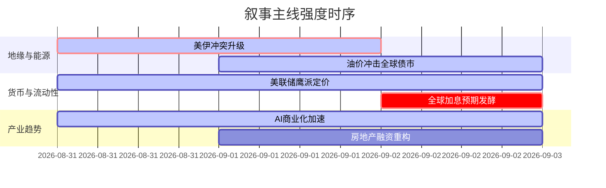

## A股市场情绪分析报告

**数据时段**：最近5日（2026年8月31日-9月2日）  
**生成时间**：2026年9月2日

---

### 🔥 宏观叙事焦点（24小时三级过滤）

#### 📌 叙事主线一：美伊冲突升级推高全球能源与通胀风险 ⭐⭐⭐
**主要事件**：地缘军事冲突、原油市场
**筛选标签**：`地缘政治` `原油价格突破90美元` `路透信源·权重2.0`  
**宏观逻辑**：  
> ① **归类**：地缘政治风险事件  
> ② **历史镜像**：1990年海湾危机油价冲击模板  
> ③ **市场传导**：霍尔木兹海峡油轮遇袭→WTI突破90美元→全球债市收益率升至2008年来最高→美联储加息概率升至68%→欧美股市重挫  
> ④ **叙事强度**：中东冲突强度超预期，能源价格冲击正在向通胀端快速传导，欧央行加息概率升温

**行业映射**：能源/航运（情绪评分 **6.8/10**）  
**交易警示**：‼️ 关注油价突破96美元后的通胀二次传导，警惕避险情绪外溢至A股开盘

---

#### 📌 叙事主线二：美联储鹰派转向与全球流动性收紧 ⭐⭐⭐
**主要事件**：央行政策、货币政策
**筛选标签**：`美联储加息` `沃什鹰派讲话` `彭博信源·权重1.8`  
**宏观逻辑**：  
> ① **归类**：货币政策转向  
> ② **历史镜像**：2018年美联储加息周期尾声模板  
> ③ **市场传导**：9月加息概率68%→美债10年期收益率逼近4.75%→日元跌破160关口→全球债市抛售蔓延  
> ④ **叙事强度**：沃什讲话后鹰派预期快速定价，巴克莱预测9月、12月各加息25基点，流动性收紧预期升温

**行业映射**：金融/出口（情绪评分 **4.2/10**）  
**交易警示**：⚠️ 关注9月FOMC会议前后北向资金流向，美元走强压制新兴市场风险偏好

---

#### 📌 叙事主线三：AI产业繁荣与A股结构性行情 ⭐⭐ 
**主要事件**：技术发布、产业投资
**筛选标签**：`AI并购` `英伟达` `财联社信源·权重1.5`  
**宏观逻辑**：  
> ① **归类**：产业周期上行  
> ② **历史镜像**：2020年半导体产业投资周期模板  
> ③ **市场传导**：英伟达洽购Hugging Face（140亿美元）→燧原科技IPO募资61.2亿元→Anthropic 350亿美元算力合作→AI应用赛道领涨，芒果超媒连续"20cm"涨停  
> ④ **叙事强度**：AI商业化加速，智谱8月ARR达16亿美元，中国AI企业收入规模快速追赶，叙事持续性较强

**行业映射**：AI应用/半导体（情绪评分 **7.5/10**）  
**交易警示**：✓ AI主线景气度确定性高，但关注连板股风险（金健米业12天7板或停牌核查），警惕游资退潮

---

### 📅 宏观叙事演化（三日趋势）

**强度衰减模型**：昨日主题×0.7 · 前日主题×0.5

```mermaid
gantt
    title 叙事主线强度时序
    dateFormat  YYYY-MM-DD
    section 地缘与能源
    美伊冲突升级         :crit, active, 2026-08-31, 2d
    油价冲击全球债市      :active, 2026-09-01, 2d
    
    section 货币与流动性
    美联储鹰派定价        :active, 2026-08-31, 3d
    全球加息预期发酵      :crit, 2026-09-02, 1d
    
    section 产业趋势
    AI商业化加速         :active, 2026-08-31, 3d
    房地产融资重构        :2026-09-01, 2d
```

**叙事节点关联**：
- 08/31：美军再袭伊朗设施→霍尔木兹海峡通行风险骤升→油价开始上行
- 09/01：WTI原油突破90美元→美联储加息概率升至65.4%→全球债市收益率飙升
- 09/02：美伊冲突全面升级（伊朗导弹袭击约旦美军基地）→油价突破96美元→美联储加息概率升至68%→美股暴跌超400点

**叙事强度时间序列**：
| 日期 | 美伊冲突 | 美联储加息 | AI产业 | 房地产融资 |
|------|---------|-----------|--------|-----------|
| 08/31 | ⭐⭐ | ⭐⭐ | ⭐⭐⭐ | ⭐⭐ |
| 09/01 | ⭐⭐⭐ | ⭐⭐⭐ | ⭐⭐ | ⭐⭐⭐ |
| 09/02 | ⭐⭐⭐ | ⭐⭐⭐ | ⭐⭐ | ⭐ |

🎯 **宏观叙事三要素**

**1️⃣ 政策意图解码**
- 外层：美联储从"观望"转向"激进加息"，地缘冲突倒逼货币政策收紧
- 内层：中国五大部委重构房地产融资机制，隐债化解快于预期，结构性政策发力

**2️⃣ 市场定价偏差**
- 过度定价：消费复苏弹性（白酒、消费板块持续承压，业绩与预期背离）
- 定价不足：AI产业商业化速度（智谱、Anthropic收入规模超预期，但A股AI估值分化严重）

**3️⃣ 跨市场共振**
- 油价飙升→全球通胀预期→美联储鹰派→美元走强→新兴市场资本流出压力
- A股结构性行情窗口：AI/芯片主线独立于宏观压制，新能源/智能驾驶持续景气，白酒/消费链承压

---

---

*生成时间：2026-09-02 22:16:35 (UTC+8)*  
*使用模型：agnes:agnes-2.0-flash*