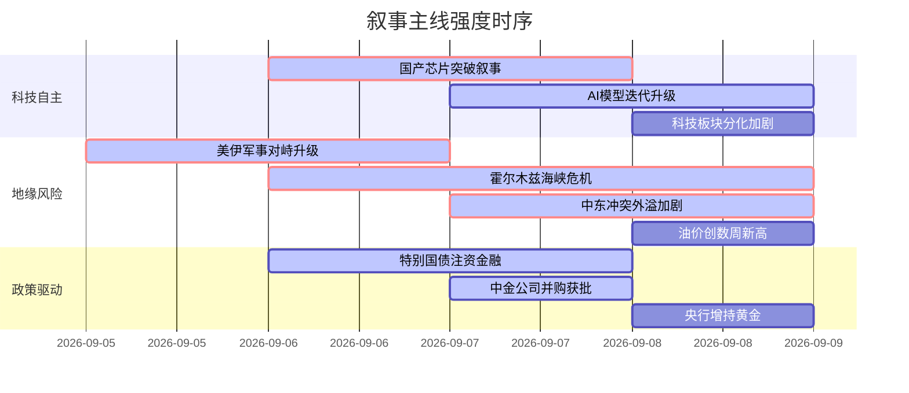

## A股市场情绪分析报告

**数据时段**：2026年9月6日 - 2026年9月8日（最近5日）
**生成时间**：2026年09月08日 22:17

---

### 🔥 宏观叙事焦点（24小时三级过滤）

#### 📌 叙事主线一：国产芯片突破与科技自主叙事 ⭐⭐⭐
**主要事件**：华为麒麟9050 Pro发布，逻辑折叠技术实现高性能芯片差异化突围；DeepSeek V4.1 Flash多模态AI模型内测开启；瑞银称中美AI差距缩窄至3-6个月  
**筛选标签**：`国务院政策` `科技自主可控` `新华社信源·权重2.0`  
**宏观逻辑**：
> ① **归类**：科技产业政策突破  
> ② **历史镜像**：2019年华为Mate 30发布带动国产替代主线模板  
> ③ **市场传导**：半导体板块集体拉升（源杰科技涨超13%）→ 科技主线凸显，但摩尔线程解禁首日暴跌20%暴露高估值压力  
> ④ **叙事强度**：技术突破叙事持续强化，但分化明显，资金从纯算力股向芯片设计端切换

**行业映射**：半导体芯片、AI算力、消费电子（情绪评分 **7.5/10**）  
**交易警示**：‼️ 关注解禁压力与产业突破的情绪博弈，警惕算力板块资金面踩踏风险

---

#### 📌 叙事主线二：中东地缘冲突升级与能源供应链风险 ⭐⭐⭐
**主要事件**：胡塞武装再袭沙特阿美吉赞石油设施，油价创数周新高；伊朗革命卫队称打击3艘美国船只及3艘油轮，威胁宣布霍尔木兹海峡"禁区"；布伦特原油盘中升至97美元  
**筛选标签**：`国际冲突` `能源供应链` `路透信源·权重1.5`  
**宏观逻辑**：
> ① **归类**：地缘风险冲击  
> ② **历史镜像**：2022年俄乌冲突初期能源价格飙升模板  
> ③ **市场传导**：霍尔木兹海峡日均过境900万桶油气受阻 → 布伦特原油突破97美元 → LME铜创纪录高位14533美元/吨 → 通胀预期升温 → 美联储9月加息概率回升至近60%  
> ④ **叙事强度**：冲突外溢风险快速升级，市场风险定价存在滞后，能源-有色-通胀链条传导加速

**行业映射**：能源化工、有色金属、航运（情绪评分 **6.8/10**）  
**交易警示**：⚠️ 中东局势存在急剧升级可能，油价突破100美元将显著压制A股风险偏好

---

#### 📌 叙事主线三：财政注资金融体系与券商并购重组 ⭐⭐
**主要事件**：财政部通过特别国债向7家银行和4家险企合计注资3570亿元；中金公司"三合一"吸收合并东兴证券、信达证券获证监会批复；央行连续22个月增持黄金  
**筛选标签**：`部委政策` `金融供给侧改革` `新华社信源·权重1.5`  
**宏观逻辑**：
> ① **归类**：金融体系资本补充  
> ② **历史镜像**：2020年国有大行特别国债补充资本模板  
> ③ **市场传导**：财政注资增强金融系统韧性 → 券商并购重组加速（万亿券商诞生）→ ETF规模突破5万亿元 → 增量资金持续入市  
> ④ **叙事强度**：政策决心明确，但市场定价相对充分，对A股提振偏结构性而非系统性

**行业映射**：券商、保险、银行（情绪评分 **6.2/10**）  
**交易警示**：✓ 金融供给侧改革逻辑清晰，关注中金合并后券商板块估值重塑机会

---

### 📅 宏观叙事演化（三日趋势）

**强度衰减模型**：昨日主题×0.7 · 前日主题×0.5

```mermaid
gantt
    title 叙事主线强度时序
    dateFormat YYYY-MM-DD
    section 科技自主
    国产芯片突破叙事   :crit, active, 2026-09-06, 2d
    AI模型迭代升级     :active, 2026-09-07, 2d
    科技板块分化加剧   :2026-09-08, 1d
    
    section 地缘风险
    美伊军事对峙升级   :crit, active, 2026-09-05, 2d
    霍尔木兹海峡危机   :crit, active, 2026-09-06, 3d
    中东冲突外溢加剧   :crit, active, 2026-09-07, 2d
    油价创数周新高     :2026-09-08, 1d
    
    section 政策驱动
    特别国债注资金融   :active, 2026-09-06, 2d
    中金公司并购获批   :active, 2026-09-07, 1d
    央行增持黄金       :2026-09-08, 1d
```

**叙事节点关联**：
- 09/06：财政部3570亿元注资落地 → 金融供给侧改革叙事启动；美伊海上封锁升级，霍尔木兹风险初显
- 09/07：华为麒麟9050 Pro发布 → 国产芯片叙事强化；伊朗威胁宣布海峡"禁区"，油价突破97美元
- 09/08：胡塞武装再袭沙特设施 → 能源供应链风险外溢；伦铜创历史新高，全球通胀预期升温

---

### 🎯 宏观叙事三要素

**1️⃣ 政策意图解码**
当前顶层叙事从"稳增长"转向"强安全+促创新"双轮驱动。财政注资金融体系体现系统性风险防范意图，国产芯片突破体现科技自立自强战略定力，政策组合拳兼具托底与突围双重逻辑。

**2️⃣ 市场定价偏差**
- **过度定价**：中东冲突升级对A股的持续压制效应（历史镜像显示能源冲击更多影响外围市场）
- **定价不足**：国产芯片产业链的业绩兑现空间（瑞银评估中美AI差距缩窄至3-6个月，政策催化持续）
- **定价扭曲**：算力板块解禁压力已被部分消化，但芯片设计端估值仍有重估空间

**3️⃣ 跨市场共振**
日元突破154反弹 → 日本央行9月加息预期升温（利率升至1.25%）→ 全球流动性边际收紧 + 布伦特原油逼近97美元 → 通胀预期回潮 → 美联储9月加息概率升至近60% → 美元指跌破98形成对冲 = A股在外部扰动中寻找结构性行情窗口期

---

<!-- 报告正文必须在此结束，以下内容为固定格式说明，严禁添加任何额外分析、总结或展望 -->

---

*生成时间：2026-09-08 22:21:04 (UTC+8)*  
*使用模型：agnes:agnes-2.0-flash*