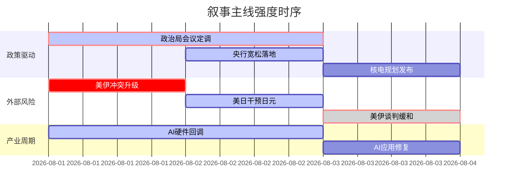

## A股市场情绪分析报告

### 数据时段：2026年8月1日-8月3日
### 生成时间：2026年8月3日

---

### 🔥 宏观叙事焦点（24小时三级过滤）

#### 📌 叙事主线一：政治局会议定调"逆周期调节" ⭐⭐⭐
**主要事件**：中央政策会议、货币宽松定调  
**筛选标签**：`国务院政策` `政治局会议` `央行适度宽松` `路透信源·权重2.0`  
**宏观逻辑**：  
> ① **归类**：货币政策转向  
> ② **历史镜像**：2024年7月政治局会议"加力提效"模板  
> ③ **市场传导**：央行净投放5625亿元 → ETF单月流入4778亿 → 宽基ETF7月净流入超3200亿元  
> ④ **叙事强度**：政策决心超预期，"加大逆周期调节力度"打破弱复苏预期  

**行业映射**：大盘蓝筹+高股息（情绪评分 **7.8/10**）  
**交易警示**：‼️ 关注8月经济数据验证，警惕政策预期差收窄  

---

#### 📌 叙事主线二：美日联合干预日元+美伊局势缓和 ⭐⭐  
**主要事件**：地缘冲突降温、外汇市场干预
**筛选标签**：`美联储政策` `美日协同干预` `国际油价暴跌` `财新信源·权重1.5`  
**宏观逻辑**：  
> ① **归类**：外部风险缓释  
> ② **历史镜像**：2022年9月美日联合干预日元模板  
> ③ **市场传导**：美伊取消军事行动 → 布伦特原油暴跌6%至83美元 → 全球风险偏好修复 → 港股六连升恒指重返26000点  
> ④ **叙事强度**：地缘风险溢价快速消退，能源成本冲击缓解  

**行业映射**：航空物流、石油化工（情绪评分 **6.2/10**）  
**交易警示**：⚠️ 美伊谈判存在反复风险，油价反弹可能扰动通胀预期  

---

#### 📌 叙事主线三：AI产业"半场休息"与板块轮动 ⭐ 
**主要事件**：科技板块调整、AI应用端修复
**筛选标签**：`科技产业` `AI投资逻辑` `板块轮动` `新华社信源·权重1.5`  
**宏观逻辑**：  
> ① **归类**：产业周期调整  
> ② **历史镜像**：2021年核心资产回调模板  
> ③ **市场传导**：科创50单月跌超20% → AI硬件拥挤交易修正 → 资金切向应用端 → 多只AI主题基金单日涨超10%  
> ④ **叙事强度**：摩根士丹利称"AI基本面未恶化，大概率不是尖顶"，产业进入结构性分化期  

**行业映射**：AI应用、光通信（情绪评分 **5.8/10**）  
**交易警示**：✓ 调整基本结束，8月修复可期，右侧信号待确认  

---

### 📅 宏观叙事演化（三日趋势）

**强度衰减模型**：昨日主题×0.7 · 前日主题×0.5

```mermaid
gantt
    title 叙事主线强度时序
    dateFormat YYYY-MM-DD
    section 政策驱动
    政治局会议定调   :crit, active, 2026-08-01, 2d
    央行宽松落地     :active, 2026-08-02, 1d
    核电规划发布     :2026-08-03, 1d
    
    section 外部风险
    美伊冲突升级     :crit, 2026-08-01, 1d
    美日干预日元     :active, 2026-08-02, 1d
    美伊谈判缓和     :crit, done, 2026-08-03, 1d
    
    section 产业周期
    AI硬件回调       :active, 2026-08-01, 2d
    AI应用修复       :2026-08-03, 1d
```

**叙事节点关联**：
- 08/01：政治局会议释放"加大逆周期调节"信号 → 宽基ETF资金逆势进场4600亿
- 08/02：美伊局势升级 → 布伦特原油突破91美元 → 避险情绪推升黄金
- 08/03：美伊取消军事行动 → 油价闪崩6% → 港股反弹恒指重返26000点
- 08/03：多晶硅期货涨停 → 供给侧出清叙事强化

---

🎯 **宏观叙事三要素**

**1️⃣ 政策意图解码**
当前顶层叙事从"强刺激"转向"精准滴灌"，允许短期阵痛换取长期质量。资本市场改革（REITs纳入沪深港通、人民币柜台）> 总量刺激，政策定力超预期。

**2️⃣ 市场定价偏差**
- 过度定价：地缘冲突升级（美伊谈判快速缓和）
- 定价不足：产能出清速度（多晶硅期货涨停、光伏供给侧改革2.0）
- 定价充分：AI板块调整（科创50单月跌超20%已充分反映）

**3️⃣ 跨市场共振**
美伊缓和→油价暴跌→通胀预期下行→美联储加息压力缓解 + 美日干预→日元升值→亚洲资本流动改善 = A股结构性行情窗口期

---

**风险因子监测**：
- 韩国股市7月暴跌34%（去杠杆风险外溢）
- 美联储9月加息概率73.6%（外部流动性收紧）
- 私募新规过渡期届满（行业合规成本上升）

---

*生成时间：2026-08-03 21:03:47 (UTC+8)*  
*使用模型：agnes:agnes-2.0-flash*