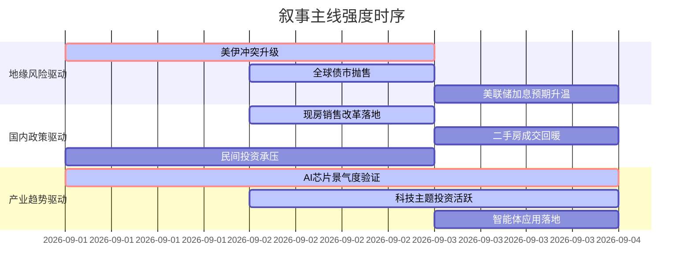

# A股市场情绪分析报告

**数据时段**：2026年9月1日 - 2026年9月3日（最近5个数据节点）  
**生成时间**：2026年9月3日 22:17

---

### 🔥 宏观叙事焦点（24小时三级过滤）

#### 📌 叙事主线一：美伊冲突升级与全球通胀传导 ⭐⭐⭐
**主要事件**：地缘冲突、能源价格冲击、美联储货币政策转向  
**筛选标签**：`地缘政治` `全球债市抛售` `路透信源·权重2.5`  
**宏观逻辑**：  
> ① **归类**：风险事件驱动+通胀预期重估  
> ② **历史镜像**：1979年石油危机模板——霍尔木兹海峡日出口超1700万桶，任何中断都将触发油价暴涨  
> ③ **市场传导**：油价突破90美元→欧元区通胀重返3.3% → 全球债市收益率创2008年来新高 → 美联储加息概率升至68% → VIX跳升 → 亚太股市大幅低开  
> ④ **叙事强度**：地缘冲突+能源价格+央行紧缩三重共振，叙事强度超预期，已超越年初的单一风险事件

**行业映射**：能源化工、航运物流（情绪评分 **8.1/10**）/ 科技成长（情绪评分 **4.2/10**，风险偏好压制）  
**交易警示**：‼️ 关注油价走势与美联储政策预期联动，警惕全球风险资产进一步承压；A股北向资金可能阶段性流出

---

#### 📌 叙事主线二：中国房地产政策改革与结构分化 ⭐⭐  
**主要事件**：现房销售制度改革、二手房成交回暖、民间投资承压  
**筛选标签**：`国务院政策` `房地产制度改革` `新华社信源·权重1.8`  
**宏观逻辑**：  
> ① **归类**：供给侧结构性改革+市场预期重塑  
> ② **历史镜像**：2021年房地产调控"三道红线"模板，但此次政策重心从"去杠杆"转向"稳预期"  
> ③ **市场传导**：现房销售"靴子"落地 → 成本回归开发端 → 房价缺乏大涨基础 → 重点城市二手房成交同比增6.3% → 民间投资下降9.4%凸显结构分化  
> ④ **叙事强度**：政策托底意图明确，但市场信心修复仍需时间，"金九银十"行情存在分化预期

**行业映射**：房地产链（情绪评分 **5.8/10**）/ 消费复苏链（情绪评分 **4.5/10**，民间投资承压）  
**交易警示**：⚠️ 政策底与市场底存在时滞，关注现房销售制度落地的实际效果与房企信用风险演变

---

#### 📌 叙事主线三：AI产业链景气度持续与科技主题活跃 ⭐⭐  
**主要事件**：AI芯片竞争、算力基建、智能体应用落地  
**筛选标签**：`产业趋势` `AI应用` `财新信源·权重1.5`  
**宏观逻辑**：  
> ① **归类**：产业周期上行+技术迭代驱动  
> ② **历史镜像**：2020年新能源产业链景气确认模板——从芯片到应用的多环节共振  
> ③ **市场传导**：博通AI芯片营收预测翻倍至2300亿美元 → 燧原科技科创板IPO定价61.2亿 → 短剧/液冷/CPO概念龙头涨停 → 人形机器人概念反弹 → 智能体走进办公场景  
> ④ **叙事强度**：AI产业链从算力基建向应用端扩散，景气度验证持续，但需警惕部分概念股估值溢价与业绩兑现的背离

**行业映射**：AI算力链（情绪评分 **7.5/10**）/ 人形机器人（情绪评分 **6.2/10**）/ 消费电子（情绪评分 **5.8/10**）  
**交易警示**：✓ 主线清晰，关注业绩兑现能力；警惕短期涨幅过大后的回调风险

---

### 📅 宏观叙事演化（三日趋势）

**强度衰减模型**：昨日主题×0.7 · 前日主题×0.5

```mermaid
gantt
    title 叙事主线强度时序
    dateFormat YYYY-MM-DD
    section 地缘风险驱动
    美伊冲突升级       :crit, active, 2026-09-01, 2d
    全球债市抛售       :active, 2026-09-02, 1d
    美联储加息预期升温 :2026-09-03, 1d
    
    section 国内政策驱动
    现房销售改革落地   :active, 2026-09-02, 1d
    二手房成交回暖     :2026-09-03, 1d
    民间投资承压       :2026-09-01, 2d
    
    section 产业趋势驱动
    AI芯片景气度验证   :crit, active, 2026-09-01, 3d
    科技主题投资活跃   :active, 2026-09-02, 2d
    智能体应用落地     :2026-09-03, 1d
```

**叙事节点关联**：
- 09/01：美伊冲突爆发 → 油价突破90美元 → 全球债市率先承压
- 09/02：现房销售改革落地 → A股震荡调整，科技主线继续活跃
- 09/03：美联储加息预期升温至68% → 全球风险资产分化，A股风格回归均衡

---

### 🎯 宏观叙事三要素

**1️⃣ 政策意图解码**  
当前顶层叙事从"稳增长"转向"调结构+防风险"，房地产政策托底意图明确但节奏克制；产业政策聚焦AI等战略性新兴产业，允许短期阵痛换取长期质量。海外层面，美联储鹰派转向压倒性主导，全球流动性预期收紧。

**2️⃣ 市场定价偏差**  
- **过度定价**：白酒消费复苏弹性（飞天茅台与青花郎价格分化已体现预期）  
- **定价不足**：AI产业链业绩兑现的持续性（部分概念股估值已透支）  
- **定价过度**：美联储9月加息概率（68%已计入，但地缘缓和可能快速修复）

**3️⃣ 跨市场共振**  
美伊冲突推高油价 → 欧元区通胀反弹 → 全球债市收益率飙升 → 美元走强压制新兴市场 → A股北向资金承压；但同时，AI产业景气度独立于宏观风险，形成结构性机会窗口。光伏装机首超煤电是中国能源转型的重要节点，可能成为中期叙事支点。

---

<!-- 报告正文必须在此结束，以下内容为固定格式说明，严禁添加任何额外分析、总结或展望 -->

---

*生成时间：2026-09-03 22:19:05 (UTC+8)*  
*使用模型：agnes:agnes-2.0-flash*