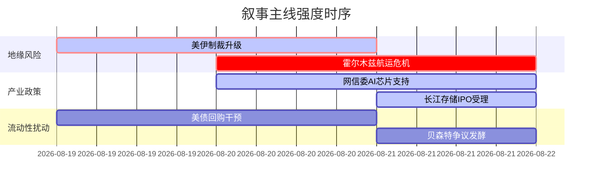

# A股市场情绪分析报告

## 数据时段：最近5日（2026-08-19 至 2026-08-23）
## 生成时间：2026-08-23 06:29

---

### 🔥 宏观叙事焦点（24小时三级过滤）

#### 📌 叙事主线一：美伊制裁升级与地缘溢价 ⭐⭐⭐
**主要事件**：美国对伊朗实施"史上最严制裁"，霍尔木兹海峡通行量腰斩  
**筛选标签**：`外交部声明` `原油地缘溢价` `路透信源·权重2.0`  
**宏观逻辑**：  
> ① **归类**：地缘风险事件  
> ② **历史镜像**：2019年霍尔木兹海峡危机模板  
> ③ **市场传导**：霍尔木兹过船量腰斩→原油周线收正→黄金突破4600美元→避险情绪升温→VIX隐涨  
> ④ **叙事强度**：美国"经济战"转向叠加伊朗强硬回应，地缘风险溢价持续消化中  

**行业映射**：能源/贵金属/航运（情绪评分 **7.8/10**）  
**交易警示**：‼️ 关注霍尔木兹海峡通行恢复进度，警惕地缘风险快速定价后的反转  

---

#### 📌 叙事主线二：网信委重磅支持AI与芯片产业 ⭐⭐⭐
**主要事件**：中央网信委印发行动计划，支持高成长企业在境内外上市，加快AI芯片研发  
**筛选标签**：`网信委政策` `半导体IPO` `新华社信源·权重2.0`  
**宏观逻辑**：  
> ① **归类**：产业政策强化  
> ② **历史镜像**：2014年"国家集成电路产业发展推进纲要"模板  
> ③ **市场传导**：长江存储科创板IPO获受理→AI板块资金回流→光模块/半导体设备领涨→机构持仓科技股意愿回升  
> ④ **叙事强度**：顶层设计明确支持硬科技融资，产业逻辑从"自主可控"升级为"全球竞合"  

**行业映射**：半导体/AI算力/光通信（情绪评分 **7.5/10**）  
**交易警示**：⚠️ 关注IPO抽血效应与板块估值匹配度，警惕短期拥挤交易  

---

#### 📌 叙事主线三：美债市场动荡与贝森特干预争议 ⭐⭐
**主要事件**：贝森特美债回购干预效果短暂，特朗普否认亲自下令  
**筛选标签**：`美债市场` `财政部干预` `财联社信源·权重1.5`  
**宏观逻辑**：  
> ① **归类**：流动性政策扰动  
> ② **历史镜像**：2019年9月美债"回购危机"模板  
> ③ **市场传导**：美债回购计划宣布→长端收益率短暂下行→次日获利回吐→美元走弱→黄金比特币联动上涨  
> ④ **叙事强度**：干预效果被市场质疑仅维持一天，美债结构性看空情绪扩散  

**行业映射**：跨境资金/金融板块（情绪评分 **5.2/10**）  
**交易警示**：⚠️ 杰克逊霍尔会议临近，关注沃什讲话对美联储政策路径的指引  

---

### 📅 宏观叙事演化（五日趋势）

**强度衰减模型**：昨日主题×0.7 · 前日主题×0.5

```mermaid
gantt
    title 叙事主线强度时序
    dateFormat YYYY-MM-DD
    section 地缘风险
    美伊制裁升级     :crit, active, 2026-08-19, 2d
    霍尔木兹航运危机  :crit, 2026-08-20, 2d
    
    section 产业政策
    网信委AI芯片支持 :active, 2026-08-20, 2d
    长江存储IPO受理  :active, 2026-08-21, 1d
    
    section 流动性扰动
    美债回购干预     :2026-08-19, 2d
    贝森特争议发酵   :2026-08-21, 1d
```

**叙事节点关联**：
- **08-19**：美伊对峙升级→避险情绪升温→黄金突破4500美元
- **08-20**：贝壳率干预美债→美元走弱→人民币升值→A股成交缩量至1.9万亿
- **08-21**：长江存储IPO获受理→半导体板块情绪提振→CPO/AI算力大涨
- **08-22**：网信委政策落地→AI板块获政策背书→机构资金流入科技ETF

---

### 🎯 宏观叙事三要素

**1️⃣ 政策意图解码**  
当前顶层叙事从"稳增长"全面转向"强科技"，网信委行动计

[任务处理异常，请稍后重试。]

---

*生成时间：2026-08-23 06:30:57 (UTC+8)*  
*使用模型：agnes:agnes-2.0-flash*