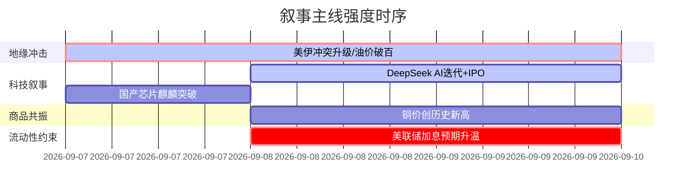

# A股市场情绪分析报告

**数据时段**：2026年9月7日-9月10日（最近5日）  
**生成时间**：2026年9月10日 08:03

---

### 🔥 宏观叙事焦点（24小时三级过滤）

#### 📌 叙事主线一：美伊冲突升级，布伦特原油突破100美元 ⭐⭐⭐
**主要事件**：地缘冲突、能源危机  
**筛选标签**：`地缘风险` `能源供应链` `路透信源·权重2.5`  
**宏观逻辑**：  
> ① **归类**：地缘风险外溢冲击  
> ② **历史镜像**：2022年俄乌冲突"石油冲击"模板  
> ③ **市场传导**：布伦特破100美元 → WTI突破95美元 → 通胀预期升温 → 美联储加息概率回升至60% → 全球风险资产承压  
> ④ **叙事强度**：冲突持续升级（美军袭击伊朗油轮→胡塞武装袭击沙特设施），供应中断预期强化，油价创近期新高  

**行业映射**：能源化工链（情绪评分 **8.5/10**）  
**交易警示**：‼️ 关注霍尔木兹海峡通行风险及OPEC+增产响应，警惕油价超预期上涨触发通胀交易  

---

#### 📌 叙事主线二：DeepSeek冲刺科创板IPO，AI国产叙事强化 ⭐⭐  
**主要事件**：科技产业政策、AI大模型迭代
**筛选标签**：`科创板政策` `AI算力` `财新信源·权重1.5`  
**宏观逻辑**：  
> ① **归类**：科技自立自强  
> ② **历史镜像**：2019年科创板开板"硬科技"标杆效应  
> ③ **市场传导**：DeepSeek V4.1 Flash发布 → 模型性能/成本双优化 → AI应用商业化门槛降低 → 算力需求延续 → 国产芯片链受益  
> ④ **叙事强度**：中信证券入场尽调，或成AI大模型首家上市标杆，市场关注度高  

**行业映射**：AI算力链（情绪评分 **7.8/10**）  
**交易警示**：⚠️ 关注IPO定价节奏及对AI板块估值的分流效应，警惕预期兑现后的短期调整  

---

#### 📌 叙事主线三：AI算力驱动铜价创历史新高 ⭐ 
**主要事件**：商品供需结构、新能源基建
**筛选标签**：`工业金属` `数据中心基建` `彭博信源·权重1.5`  
**宏观逻辑**：  
> ① **归类**：结构性商品牛市  
> ② **历史镜像**：2021年"碳中和"驱动铜价上涨模板  
> ③ **市场传导**：AI数据中心电力需求爆发 → 铜消费预期上修 → LME铜突破14533美元/吨创历史新高 → 供给约束强化 → 铜矿开采及电网设备受益  
> ④ **叙事强度**："铜博士"在AI时代被赋予新属性，需求端逻辑从传统基建转向算力基建  

**行业映射**：有色金属、电网设备（情绪评分 **7.0/10**）  
**交易警示**：✓ 关注铜价高位波动风险及关税政策对全球供应链的扰动  

---

### 📅 宏观叙事演化（五日趋势）

**强度衰减模型**：昨日主题×0.7 · 前日主题×0.5

```mermaid
gantt
    title 叙事主线强度时序
    dateFormat YYYY-MM-DD
    section 地缘冲击
    美伊冲突升级/油价破百   :crit, active, 2026-09-07, 3d
    section 科技叙事
    DeepSeek AI迭代+IPO    :active, 2026-09-08, 2d
    国产芯片麒麟突破        :2026-09-07, 1d
    section 商品共振
    铜价创历史新高          :2026-09-08, 2d
    section 流动性约束
    美联储加息预期升温      :crit, 2026-09-08, 2d
```

**叙事节点关联**：
- 09/07：美军空袭伊朗南部→伊朗警告霍尔木兹海峡通行风险，地缘叙事启动
- 09/08：胡塞武装袭击沙特能源设施→布伦特逼近98美元，LME铜创历史新高
- 09/09：美军袭击伊朗油轮→布伦特突破100美元；DeepSeek备战科创板IPO消息发酵
- 09/10：DeepSeek V4.1 Flash正式发布；国新办金融强国建设吹风会即将举行

**🎯 宏观叙事三要素**

1️⃣ **政策意图解码**  
当前顶层叙事聚焦"金融强国建设"+ "科技自立自强"，国新办9月10日将发布"十五五"金融规划，政策窗口期临近。产业端允许短期阵痛换取长期质量，产能出清与结构升级并重。

2️⃣ **市场定价偏差**  
- **过度定价**：消费复苏弹性（国内CPI/PPI回升主要源于能源价格输入，内需仍需验证）  
- **定价不足**：AI算力需求对铜等工业金属的长期拉动、国产芯片突破对科技自主的实质意义

3️⃣ **跨市场共振**  
美伊冲突推升油价→全球通胀预期升温→美联储加息概率回升→美元走强→新兴市场资金回流压力；同时铜价新高反映AI基建需求刚性，A股有色板块与科技板块形成跷跷板效应。

---

<!-- 报告正文必须在此结束，以下内容为固定格式说明，严禁添加任何额外分析、总结或展望 -->

---

*生成时间：2026-09-10 08:10:43 (UTC+8)*  
*使用模型：agnes:agnes-2.0-flash*