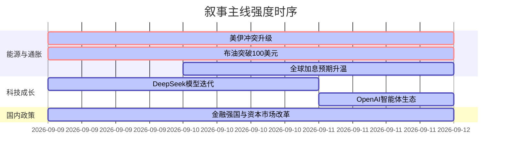

# A股市场情绪分析报告

**数据时段：** 最近5日（2026年9月7日—9月11日）  
**生成时间：** 2026年9月11日 07:59（北京时间）

## 🔥 宏观叙事焦点（24小时三级过滤）

#### 📌 叙事主线一：美伊冲突升级与布油突破107美元 ⭐⭐⭐
**主要事件**：地缘冲突、能源供应冲击、全球通胀再定价  
**筛选标签**：`地缘冲突` `能源安全` `重要事件·权重2.0`  
**宏观逻辑**：  
> ① **归类**：地缘供给冲击与再通胀  
> ② **历史镜像**：2022年俄乌冲突引发能源危机模板  
> ③ **市场传导**：沙特日产量骤降190万桶 → 布伦特涨6.34%至107.63美元 → 美油破百、欧洲天然气升至2022年以来高位 → 美国10年期国债收益率逼近5%、加息概率升至71% → 全球股市及高估值资产承压  
> ④ **叙事强度**：冲突长期化预期与供应收缩相互强化，五日持续升级，最新市场情绪已转为“偏空”  

**行业映射**：油气开采、油服、化工与航运（情绪评分 **8.8/10**）  
**交易警示**：‼️ 上游价格受益与中下游成本冲击并存，警惕油价冲高回落及航运通道风险反复  

---

#### 📌 叙事主线二：AI模型降本与智能体生态加速落地 ⭐⭐
**主要事件**：技术发布、AI资本开支、消费电子创新  
**筛选标签**：`科技产业` `AI资本开支` `产业趋势·权重1.8`  
**宏观逻辑**：  
> ① **归类**：产业技术迭代与应用商业化  
> ② **历史镜像**：2023年全球AI基础设施投资周期模板  
> ③ **市场传导**：模型推理成本下降 → Agents API降低开发门槛 → 企业调用量扩张 → 算力、光模块、线缆、液冷、电力及铜需求重估；同时单位任务对HBM和SSD的消耗下降  
> ④ **叙事强度**：DeepSeek V4.1 Flash、OpenAI Agents API与苹果折叠屏连续催化，产业趋势由算力竞赛向“能效＋应用变现”扩散  

**行业映射**：AI算力、半导体、软件应用与消费电子（情绪评分 **7.8/10**）  
**交易警示**：⚠️ 海外技术限制、模型价格战及高估值风险并存，关注收入转化与资本开支兑现  

---

#### 📌 叙事主线三：资本市场制度供给与金融强国建设 ⭐
**主要事件**：证监会改革、结构性货币工具、金融“十五五”政策预期  
**筛选标签**：`证监会政策` `资本市场改革` `政策预期·权重1.7`  
**宏观逻辑**：  
> ① **归类**：国内政策托底与资本市场供给侧改革  
> ② **历史镜像**：2019年科创板注册制改革模板  
> ③ **市场传导**：发行、上市及并购重组包容性提升 → 优质企业回归与券商投行业务改善；结构性工具支持金融“五篇大文章”＋境外人民币金融资产超11万亿元 → 中长期资金预期修复  
> ④ **叙事强度**：政策方向持续清晰，但外部再通胀、IPO供给与缩量交易制约风险偏好，仍需成交量和盈利预期验证  

**行业映射**：证券、硬科技与高股息资产（情绪评分 **6.6/10**）  
**交易警示**：✓ 政策底信号明确，关注政策落地与资金面、IPO节奏之间的平衡  

---

### 📅 宏观叙事演化（三日趋势）

**强度衰减模型：昨日主题×0.7 · 前日主题×0.5**

```mermaid
gantt
    title 叙事主线强度时序
    dateFormat  YYYY-MM-DD
    section 能源与通胀
    美伊冲突升级       :crit, active, 2026-09-09, 3d
    布油突破100美元    :crit, active, 2026-09-09, 3d
    全球加息预期升温   :active, 2026-09-10, 2d
    
    section 科技成长
    DeepSeek模型迭代   :active, 2026-09-09, 2d
    OpenAI智能体生态   :active, 2026-09-11, 1d

    section 国内政策
    金融强国与资本市场改革 :active, 2026-09-09, 3d
```
叙事节点关联：
09/09：布伦特突破100美元、黄金与铜价走高 → 能源通胀叙事接管市场，A股午后转弱  
09/10：冲突与供应风险延续，布油收于101.21美元；两市成交额超1.5万亿元但缩量2146亿元 → 能源叙事强化，总量情绪出现背离；DeepSeek V4.1 Flash与苹果折叠屏支撑AI结构性方向  
09/11：布油升至107.63美元、沙特产量骤降，10年期美债收益率升至4.943% → 能源通胀叙事达到阶段峰值，AI与资本市场改革转向防御性结构配置  

🎯 宏观叙事三要素
1️⃣ 政策意图解码
外部再通胀压缩全球宽松空间，国内则以金融强国、结构性工具和资本市场制度改革稳定预期，形成“外紧内稳、结构托底”的政策组合。
2️⃣ 市场定价偏差
过度定价：油价上涨与冲突长期化的线性外推
定价不足：AI智能体降本带来的调用量弹性，以及资本市场制度供给的中长期红利
3️⃣ 跨市场共振
布油突破100美元推升通胀预期 + 美债收益率逼近5%压制估值 + 人民币资产吸引力增强 = A股能源防御与AI结构性机会并存，但总量情绪偏空

---

---

*生成时间：2026-09-11 08:08:53 (UTC+8)*  
*使用模型：openrouter:nex-agi/nex-n2.5-pro:free*